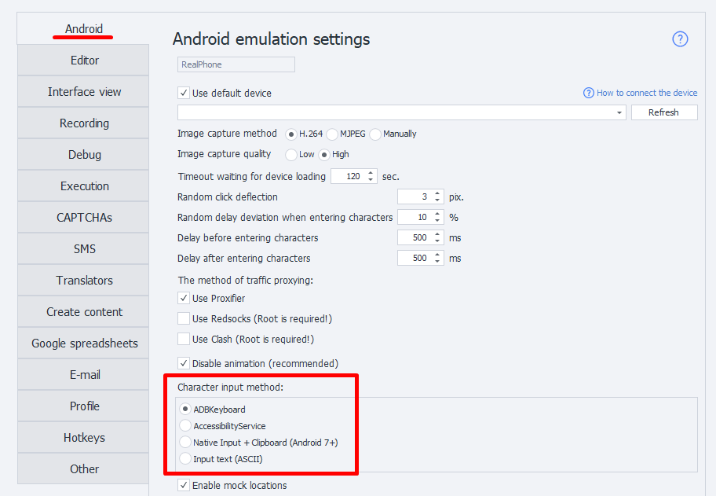

:::info Please check out the [*Rules for using materials on this resource*](../Disclaimer).
:::
_______________________________________________
## Project Recording

This tab contains the settings that get activated when project recording is turned on.

_______________________________________________
## Automatically Insert Directory Macro
:::tip This setting works even *when project recording is off*.
:::

ZennoDroid has [**environment variables**](../pm/Creating/Variables). For example, `{-Project.Directory-}`, which stores the path to the directory where your project file is saved.
:::info If the project isn’t saved to disk, the variable contains an empty string.
:::

When you turn on this setting, ProjectMaker will automatically insert the **project directory macro** wherever possible while creating a project. For example, in other settings or actions. The chosen path should either be in the same folder as the project file, or in one of its subfolders.
_______________________________________________
## Recording Actions by Coordinates
This setting controls whether all clicks inside the [**Emulator Window**](../pm/Interface/DeviceWindow) get recorded along with their coordinates when recording your project. The project will include [**touch emulation actions**](../Android/ProLite/Touch_Emulation) with the click coordinates filled in automatically.
:::warning The emulator’s resolution must be the same when creating and running your project!
:::
_______________________________________________
## Recording Clicks Using Image Search
When you turn on this option, every click inside the [**Emulator Window**](../pm/Interface/DeviceWindow) will be saved to your project as a [**touch action**](../Android/ProLite/RunEvent) using [**Image Search**](../pm/Creating/SearchByPic).
### Color mode
Image search will use one of the following modes by default:
- **RGB**. Search by colored image.
- **Gray**. Grayscale only.
- **Black**. Black and white only.

:::tip Our advice
*To speed up the search, use either **Gray** or **Black** mode*
:::

### Search area
Choose the default area for image search:
- Entire screen
- Selected area of the screen

:::info To reduce CPU load, it’s better to search only in a designated screen area.
:::
_______________________________________________
## Delay Between Character Inputs
Used in [**Keyboard Emulation**](../Android/ProLite/Keyboard) and [**Set Value**](../Android/ProLite/SetValue) actions as the *default* setting.
_______________________________________________
## Element Waiting Time
Used in [**Set Value**](../Android/ProLite/SetValue), [**Get Value**](../Android/ProLite/GetValue), and [**Run Event**](../Android/ProLite/RunEvent) as the *default* for the field ***“Wait for element no more than (sec)”***.
_______________________________________________
## Element Search Timeout
Used in the [**Image Search**](../pm/Creating/SearchByPic) action as the *default* value for  
***“Wait for element no more than (sec)”***.
_______________________________________________
## Input Methods
The program has **4 ways** to input characters from the keyboard.

Different devices handle character input differently, so having several options lets you pick what works best. The first three let you enter any symbols, including emojis; the last one handles only ASCII.
_______________________________________________
### Details
#### ADBKeyboard
This uses a third-party keyboard that installs automatically when you connect your device. With it, you can type characters as if you were using a virtual keyboard.
#### AccessibilityService
Uses [***UiAutomator2***](https://github.com/appium/appium-uiautomator2-driver). Lets you set any value for the field that’s currently focused.
Technically, it doesn’t input characters—it just changes the field’s **Text** property to what you want.
:::tip Keep in mind
*This won’t work in apps that don’t have a standard element tree. For example, in games.*
:::

#### Native input + Clipboard
Inputs characters via the **IInputManager** and **IClipboard** interfaces. This method is pretty quick.
:::info Note
*Inputting Cyrillic/emojis only works on Android 7 and up. ASCII works on any device.*
:::

#### Input text
Similar to the ***input text*** command, but includes all necessary text conversions so that special characters `< > | ) (` and others get entered correctly. Only supports **ASCII characters**.
:::info Recommendation
*Character-by-character entry is slow, so it’s better to choose an input method with **no delay** enabled.*
:::
_______________________________________________
### What if ADBKeyboard didn’t install?
1. You need to install the ***com.android.adbkeyboard.apk*** app on your phone (*the file is in the main program folder*). For example, use the [**Install App**](../Android/ProLite/App#установка-приложения) action.
2. On your phone, go to your language input settings and enable ***AdbKeyboard***.
3. Run the [**Start VM**](../Android/ProLite/action#как-запустить-или-перезапустить-устройство) action. This activates the keyboard. It’ll pop up in any field where you need to enter text—you’ll see a small `Adb keyboard ON` notification at the bottom.