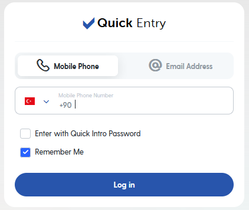

:::info **Please read the [*Material Usage Rules on this site*](../Disclaimer).**
:::
_______________________________________________
## Description
Some sites require you to enter a mobile phone number to confirm your registration, so they can send you a verification code.

|    |
| :--------: |
| **Examples of SMS login requests.** |

That’s where third-party SMS services come in handy. Our goal is to make working with them easy.
_______________________________________________
## How to connect?

### Secret key
Usually, to use a service, you’ll need what’s called an **API key**. That’s a *unique string of random characters* that lets the service recognize you. For example, it might look like this: `8fc9b30e544885b8480fb590dfcbdd71`.

To get your API key, go to the website of the SMS service you picked and look over their terms. Once you’ve chosen, sign up for the SMS service and get your *API key* from your personal account.

### Additional parameters
Here, you enter the **URL address (domain)** for sending API requests. This is preset in the program by default and **you don’t need to change it unless you have to**. If the URL isn’t filled in, check the documentation for your chosen service.

### Balance
Once you’re logged in to the service, you’ll see your current balance in this field.

:::warning If this field is still empty after you enter your API key, something’s gone wrong.
Possible reasons: wrong key, service issues, or the key has been banned.
:::
_______________________________________________
## Available services
- [5SIM Five Sim](http://5sim.net/);
- [GetSmsOnline](http://getsms.online/);
- [Give-SMS](http://give-sms.com/);
- [SIMsmsOrg](http://simsms.org/);
- [SMSAcktiwator](http://sms-acktiwator.ru/);
- [SMS Activate](http://sms-activate.ru/ru/);
- [SmsHub](https://smshub.org/);
- [SMSpvaCom](http://smspva.com/);
- [SMS-REG](http://sms-reg.com/);
- [VAK-SMS](http://vak-sms.com/);
- [virtualSMS](http://virtualsms.ru/);
_______________________________________________
## Your own service
### Add your own service (module)
You can also add your own SMS receiving service based on the APIs of popular providers.

### Required parameters
:::tip If you’re not sure what to enter,
please check with your service provider.
:::
#### Module name
Enter the name of your new service, **up to 20 characters**.

#### API

Choose the service’s API this module will be based on.

#### API-key
Enter the service’s key. This is the same as the **Secret key** you use when connecting a service.

#### Server
The URL address (domain) to send SMS receiving requests to.

#### Icon
The chosen image will be displayed next to your module.

Supported formats: `jpg`, `bmp`, `gif`, `png`.

### Working with your added service
After adding your module, you can select it in the [**Working with SMS Services**](../Data/SMS_Services) action. From there, just use it like any of the built-in services.

### Removing a module
To remove a module you created from the program, **you’ll need to delete two files**:
- `c:\Users\USERNAME\AppData\Roaming\ZennoLab\Configs\ModuleName.dll.config`
- `c:\Users\USERNAME\AppData\Roaming\ZennoLab\CustomModules\Sms\ModuleName.dll`

:::warning We recommend closing ZennoDroid and ProjectMaker before deleting these files.
:::