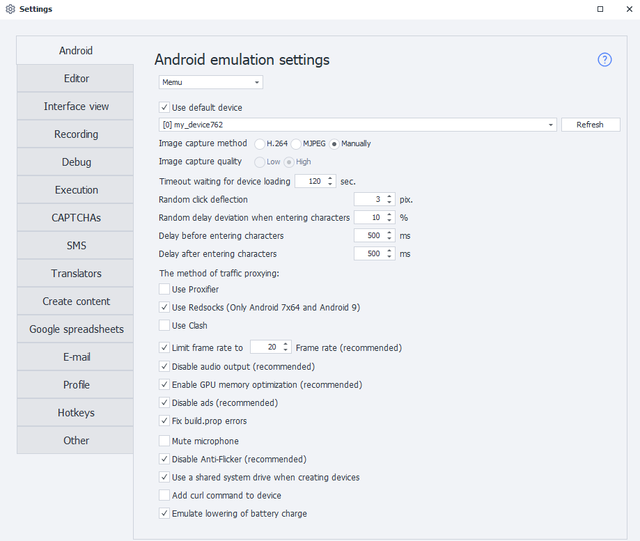
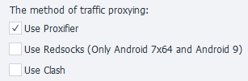

:::info **Please read the [*Material Usage Rules for this resource*](../Disclaimer).**
:::
_______________________________________________
## Description.
This tab contains various settings for configuring Android in Memu and LDPlayer emulators.

_______________________________________________
### Use default device.
This setting lets you choose the device that Project Maker will use by default—as long as no other device is selected. ZennoDroid will ignore this device when randomly picking from the available list.

If you want to use the selected device for running projects in ZennoDroid, turn off this setting, otherwise you’ll get the ***Device is busy in Project Maker*** error.
:::info **The ‘Refresh’ button updates the device list**
:::

### Use MJPEG for image capture.
An alternative way to capture the device image. Only enable this if whenever you start the device through ZennoDroid it always crashes, and the log shows ***Failed to capture image***.
_______________________________________________
### Device boot timeout.
This is the amount of time the emulator gets to boot up. If the device doesn’t boot within this time, execution will fail with an error.
_______________________________________________
### Random click offset.
Allows clicks to happen with a slight offset from the set parameters. Used in these actions:
- [**Image Search**](../pm/Creating/SearchByPic). The screen will be tapped not at the exact spot, but with a slight shift.
- [**Run Event**](../Android/ProLite/RunEvent). If you choose **Center** as the tap coordinates, it’ll click the element slightly off-center.

_______________________________________________
### Random character input offset.
Used in the [**Keyboard Emulation**](../Android/ProLite/Keyboard) and [**Set Value**](../Android/ProLite/SetValue) actions. Lets you set deviation for the input delay.

For example, if the delay is set to 150 ms and the deviation is 10%, the actual delay for each character will be anywhere from 135 ms to 165 ms.
_______________________________________________
### Delay before and after character input.
Just like the previous setting, used in [**Keyboard Emulation**](../Android/ProLite/Keyboard) and [**Set Value**](../Android/ProLite/SetValue) actions to set the delay.
_______________________________________________
### Traffic proxying (Proxifier and Redsocks).
ZennoDroid lets you choose how to proxy traffic for the [**Set Proxy**](../Android/ProLite/setting#как-поставить-прокси) action. By default, Proxifier is used.

_______________________________________________
### Limit frame rate.
This changes the FPS of the running emulators. If enabled, all emulators will be forced to run at the set frame rate.
_______________________________________________
### Mute sound and disable microphone.
Lets you turn off sound and microphone in the emulators. Muting sound reduces CPU usage.
_______________________________________________
### Enable GPU memory optimization.
It’s best to always keep this on, as it reduces the load on your graphics card.
_______________________________________________
### Turn off Anti-Flicker.
This fixes screen flickering issues and improves image display.
:::info **Our advice.**
*When running multiple emulators at the same time, **it’s better to turn off** Anti-Flicker to reduce system load.*
:::
_______________________________________________
### Disable ads.
Memu launcher has ads built in. They can mess up your templates since the ads show up over all windows. It’s always best to turn them off.
_______________________________________________
### Use shared system disk.
When you create a new emulator, it’ll use the shared system disk. You can use this disk for all emulators at once, which saves a lot of space. For example, a single Android 9 system disk is about 2GB.

The shared disk is read-only — you can’t write to it (and usually you don’t need to anyway).

You can change how the disk is connected for already created emulators with a special action.
_______________________________________________
### Add cURL command to device.
In newer Memu versions, this utility is already added by default, but only for Android 7.1. This setting lets you add cURL to older emulator versions, including Android 5.1 based emulators.
_______________________________________________
### Simulate battery drain.
By default, the battery is always ***Charging*** and stays at 100%. If you turn this on, the battery will discharge (down to ~20%), and then charge again (up to ~70%).
_______________________________________________
## Useful links.
- [**Installing Memu**](../ProLite/Memu_Install).
- [**Device settings**](../Android/ProLite/setting).