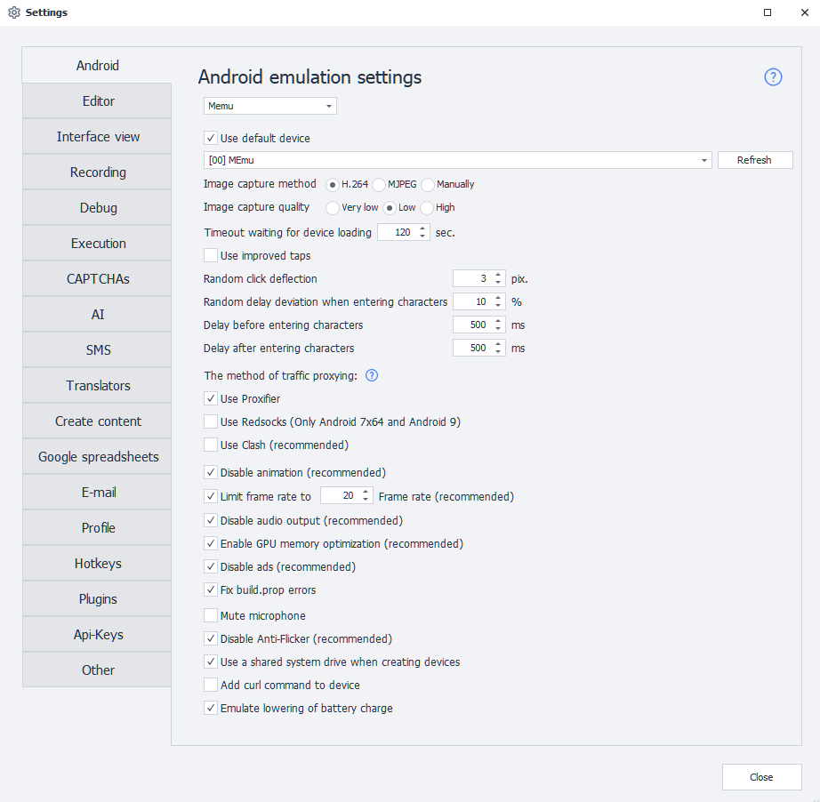
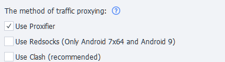

import DisclaimerNotice from '@site/src/components/DisclaimerNotice';

# Android Settings (Lite/Pro)
<DisclaimerNotice />

## Description.
This tab contains various settings for configuring Android in Memu and LDPlayer emulators.

_______________________________________________
### Emulator type.
The list above the settings picks the emulator ZennoDroid works with: **Memu**, **LDPlayer9** or **LDPlayer14**. Only the emulators installed on the computer are listed, and some of the settings below depend on the type you pick.
:::info **While at least one device is running the list is locked, and the hint *It is necessary to stop all running devices* shows up next to it**
:::
_______________________________________________
### Use default device.
This setting lets you choose the device that Project Maker will use by default—as long as no other device is selected. ZennoDroid will ignore this device when randomly picking from the available list.

If you want to use the selected device for running projects in ZennoDroid, turn off this setting, otherwise you'll get the ***Device is busy in Project Maker*** error.
:::info **The 'Refresh' button updates the device list**
:::

### Image capture method.
Sets how ZennoDroid gets the picture from the emulator:
- **H.264** — the default one, the picture comes over as a video stream.
- **MJPEG** — an alternative method. You should only pick it if running the device through ZennoDroid always ends in an error and the log shows ***`Failed to capture image`***.
- **Manually** — nothing is captured continuously, the picture is only refreshed on demand: with the refresh button in the [**Device window**](../pm/Interface/DeviceWindow) or the [**RefreshScreen**](../API/Screen#refreshscreen) method. Handy when you don't need the picture all the time, as it saves computer resources.
:::info The capture method can also be set when the device starts, with the [Start](../API/Action#start) method
:::
_______________________________________________
### Image capture quality.
Three levels: **Very low**, **Low** and **High**. The lower the quality, the lighter the load on the CPU — which tells when you run a lot of threads.

The setting is unavailable while the capture method is **Manually**. In code the quality is changed with the [**SetCaptureScreenQuality**](../API/Screen#setcapturescreenquality) method.
_______________________________________________
### Timeout waiting for device loading.
This is the amount of time the emulator gets to boot up. If the device doesn't boot within this time, execution will fail with an error.
_______________________________________________
### Use improved taps.
Turns on the emulation of real screen taps: they are injected through the kernel input layer, so they are visible to `getevent`, have a size of their own and work on protected pages.

In code the mode is turned on with the [**SetNativeEventMode**](../API/Input#setnativeeventmode) method — before connecting to the device.
_______________________________________________
### Random click deflection.
Allows clicks to happen with a slight offset from the set parameters. Used in these actions:
- [**Image Search**](../pm/Creating/SearchByPic). The screen will be tapped not at the exact spot, but with a slight shift.
- [**Run Event**](../Android/pro-lite/RunEvent). If you choose **Center** as the tap coordinates, it'll click the element slightly off-center.

_______________________________________________
### Random delay deviation when entering characters.
Used in the [**Keyboard Emulation**](../Android/pro-lite/Keyboard) and [**Set Value**](../Android/pro-lite/SetValue) actions. Lets you set deviation for the input delay.

For example, if the delay is set to 150 ms and the deviation is 10%, the actual delay for each character will be anywhere from 135 ms to 165 ms.
_______________________________________________
### Delay before and after character input.
Just like the previous setting, used in [**Keyboard Emulation**](../Android/pro-lite/Keyboard) and [**Set Value**](../Android/pro-lite/SetValue) actions to set the delay.
_______________________________________________
### The method of traffic proxying.
ZennoDroid lets you choose how to proxy traffic for the [**Set Proxy**](../Android/pro-lite/setting#how-to-set-up-a-proxy) action. By default, Proxifier is used.

- **Proxifier** — the traffic of the emulator is routed to the computer and proxied there.
- **Redsocks** — a transparent redirector of TCP/UDP connections into a proxy, on the device itself. Works on Android 7x64, 9 and 12 only.
- **Clash** — rule-based proxying that wraps the whole of the UDP traffic.

Every method is described in detail in [**Traffic Proxying**](./Proxy_Traffic).
_______________________________________________
### Disable animation.
This option lets you turn off all system animations. We recommend checking this box since smooth transitions really slow the device down.
_______________________________________________
### Limit frame rate.
This changes the FPS of the running emulators. If enabled, all emulators will be forced to run at the set frame rate.
_______________________________________________
### Disable audio output.
Lets you turn off sound in the emulators. Muting sound reduces CPU usage.
_______________________________________________
### Enable GPU memory optimization.
It's best to always keep this on, as it reduces the load on your graphics card.
_______________________________________________  
### Disable ads.
Memu launcher has ads built in. They can mess up your templates since the ads show up over all windows. It's always best to turn them off.  
_______________________________________________  
### Fix build.prop errors.
In an emulator some of the device properties are left as `unknown`. With this setting on, ZennoDroid takes the manufacturer, the brand, the model, the board, the `hardware`, the baseband and the fingerprint from the emulator configuration before the first boot completes and writes them into `build.prop`, so that apps and sites do not see `unknown` among the device properties.
_______________________________________________  
### Mute microphone.  
Lets you turn off microphone in the emulators.  
_______________________________________________
### Disable Anti-Flicker.
This fixes screen flickering issues and improves image display.
:::info **Our advice.**
*When running multiple emulators at the same time, **it's better to turn off** Anti-Flicker to reduce system load.*
:::
_______________________________________________
### Use a shared system drive when creating devices.
When you create a new emulator, it'll use the shared system disk. You can use this disk for all emulators at once, which saves a lot of space. For example, a single Android 9 system disk is about 2GB.

The shared disk is read-only — you can't write to it (and usually you don't need to anyway).

You can change how the disk is connected for already created emulators with a special action.
_______________________________________________
### Add cURL command to device.
In newer Memu versions, this utility is already added by default, but only for Android 7.1. This setting lets you add cURL to older emulator versions, including Android 5.1 based emulators.
_______________________________________________
### Emulate lowering of battery charge.
By default, the battery is always ***Charging*** and stays at 100%. If you turn this on, the battery will discharge (down to ~20%), and then charge again (up to ~70%).
_______________________________________________
## Useful links.
- [**Installing Memu**](../pro-lite/Memu_Install).
- [**Device settings**](../Android/pro-lite/setting).
- [**Traffic Proxying**](./Proxy_Traffic).