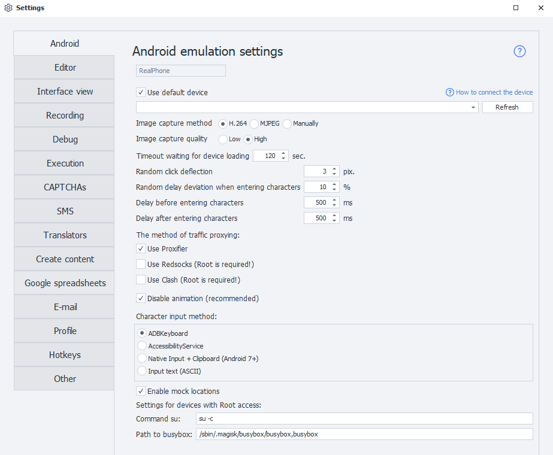
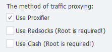

:::info Please review the [*Terms of Use for the materials on this site*](../Disclaimer).
:::

_______________________________________________  
## Description  
This tab has various options for configuring a real Android device. They're also suitable if you're working with a Bluestacks emulator.

_______________________________________________     
### Use default device  
This setting lets you pick the device that will be used by default in Project Maker, as long as you haven't chosen another device. When selected, this device will be ignored by ZennoDroid when randomly picking from the available list.

If you want ZennoDroid to use the device you selected while running projects, you'll need to turn this setting off — otherwise you could get the error ***Device is busy in Project Maker***.
:::info The "Refresh" button lets you update the list of available devices
:::

### Use MJPEG for image capture  
This is an alternative method of capturing images from the device. You should only enable this if running the device through ZennoDroid always ends in an error and the log shows ***Failed to capture image***.
_______________________________________________ 
### Device boot timeout  
This setting lets you set a timeout for connecting to the device.
_______________________________________________ 
### Random click offset  
Lets you make clicks with a slight offset from the set coordinates. It's used in these actions:
- [**Image search**](../pm/Creating/SearchByPic) — clicking on the screen will be a bit offset rather than exactly where you specified.
- [**Perform event**](../Android/ProLite/RunEvent) — if you pick **Center** for click coordinates, the tap on the element won't be 100% precise, it'll have a small random offset.
_______________________________________________
### Random delay when entering characters  
Used in [**Keyboard emulation**](../Android/ProLite/Keyboard) and [**Set value**](../Android/ProLite/SetValue) actions. Lets you set a variation in the delay from the specified value.

For example, if you set a 150 ms delay and a 10% offset, the actual delay per character will range from 135 ms to 165 ms.
_______________________________________________ 
### Delay before and after entering characters  
Just like the previous setting, this one is used in [**Keyboard emulation**](../Android/ProLite/Keyboard) and [**Set value**](../Android/ProLite/SetValue) actions to set up delays.
_______________________________________________ 
### Traffic proxying (Proxifier and Redsocks)  
ZennoDroid lets you pick how to proxy traffic for the [**Set proxy**](../Android/ProLite/setting#как-поставить-прокси) action. By default, it uses Proxifier.

_______________________________________________ 
### Animation disabling  
This option lets you turn off all system animations. We recommend checking this box since smooth transitions really slow the device down.
_______________________________________________ 
### Character input method  
Lets you pick the best way to emulate text input:
- **ADBKeyboard**
- **AccessibilityService**
- **Native input + Clipboard**
- **Input text**
:::info The first three methods can enter any characters, including Cyrillic and emojis. The last one supports only ASCII characters.
:::
_______________________________________________
### Use mock locations  
This option is used for setting a custom device location with the [**Set Geo-location**](../Android/Enterprise/Utilities_Ent#установка-geo-позиции) action.
_______________________________________________
### Settings for Rooted devices  
These settings are needed for the [**Save/Restore app data**](../Android/Enterprise/App#сохранить-данные-приложения) actions. We don't recommend changing them unless necessary.

The `su` command lets you set the path and parameters for running commands with superuser privileges. Default: `su -c`.

The **busybox path** setting lets you specify where busybox is.  
Default: `/sbin/.magisk/busybox/busybox`.
_______________________________________________  
## Useful links
- [**Connecting a real device (ZDE)**](../Enterprise/Connection)