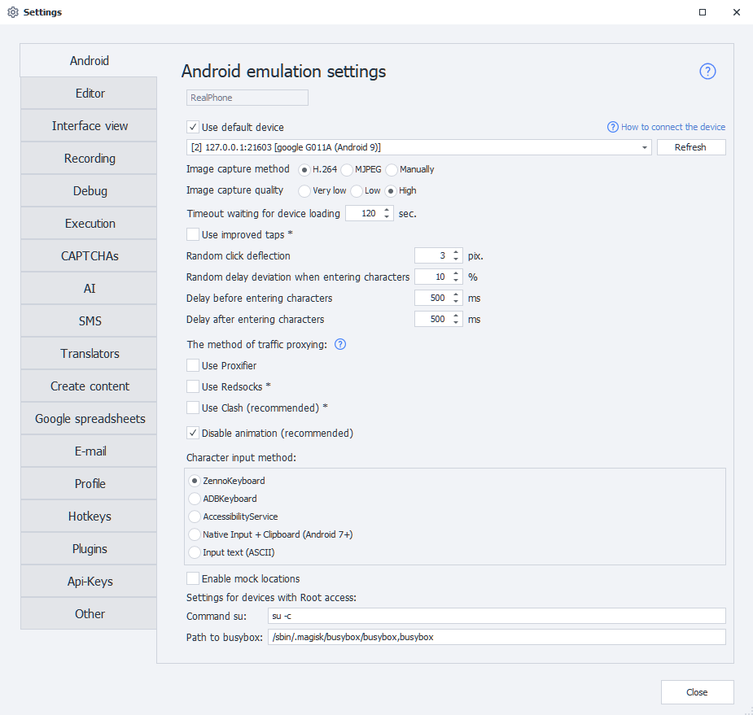
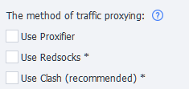

import DisclaimerNotice from '@site/src/components/DisclaimerNotice';

# Android Settings (Enterprise)
<DisclaimerNotice />

## Description  
This tab has various options for configuring a real Android device. They're also suitable if you're working with a Bluestacks emulator.

:::info An asterisk `*` next to a setting means it only works on rooted devices
:::
_______________________________________________     
### Use default device  
This setting lets you pick the device that will be used by default in Project Maker, as long as you haven't chosen another device. When selected, this device will be ignored by ZennoDroid when randomly picking from the available list.

If you want ZennoDroid to use the device you selected while running projects, you'll need to turn this setting off — otherwise you could get the error ***Device is busy in Project Maker***.
:::info The "Refresh" button lets you update the list of available devices
:::

### Image capture method  
Sets how ZennoDroid gets the picture from the device:
- **H.264** — the default one, the picture comes over as a video stream.
- **MJPEG** — an alternative method. You should only pick it if running the device through ZennoDroid always ends in an error and the log shows ***`Failed to capture image`***.
- **Manually** — nothing is captured continuously, the picture is only refreshed on demand: with the refresh button in the [**Device window**](../pm/Interface/DeviceWindow) or the [**RefreshScreen**](../API/Screen#refreshscreen) method. Handy when you don't need the picture all the time, as it saves both computer resources and bandwidth.
:::info The capture method can also be set when the device starts, with the [Start](../API/Action#start) method
:::
_______________________________________________ 
### Image capture quality  
Three levels: **Very low**, **Low** and **High**. The lower the quality, the lighter the load on the CPU and on the connection — which tells when you run a lot of threads.

The setting is unavailable while the capture method is **Manually**. In code the quality is changed with the [**SetCaptureScreenQuality**](../API/Screen#setcapturescreenquality) method.
_______________________________________________ 
### Timeout waiting for device loading  
This setting lets you set a timeout for connecting to the device.
_______________________________________________ 
### Use improved taps  
Turns on the emulation of real screen taps: they are injected through the kernel input layer, so they are visible to `getevent`, have a size of their own and work on protected pages. They also work on devices with no display (touchpad).

In code the mode is turned on with the [**SetNativeEventMode**](../API/Input#setnativeeventmode) method — before connecting to the device.
:::warning Only works on devices with root access
:::
_______________________________________________ 
### Random click deflection  
Lets you make clicks with a slight offset from the set coordinates. It's used in these actions:
- [**Image search**](../pm/Creating/SearchByPic) — clicking on the screen will be a bit offset rather than exactly where you specified.
- [**Perform event**](../Android/pro-lite/RunEvent) — if you pick **Center** for click coordinates, the tap on the element won't be 100% precise, it'll have a small random offset.
_______________________________________________
### Random delay deviation when entering characters  
Used in [**Keyboard emulation**](../Android/pro-lite/Keyboard) and [**Set value**](../Android/pro-lite/SetValue) actions. Lets you set a variation in the delay from the specified value.

For example, if you set a 150 ms delay and a 10% offset, the actual delay per character will range from 135 ms to 165 ms.
_______________________________________________ 
### Delay before and after entering characters  
Just like the previous setting, this one is used in [**Keyboard emulation**](../Android/pro-lite/Keyboard) and [**Set value**](../Android/pro-lite/SetValue) actions to set up delays.
_______________________________________________ 
### The method of traffic proxying  
ZennoDroid lets you pick how to proxy traffic for the [**Set proxy**](../Android/Enterprise/setting#how-to-set-up-a-proxy) action. By default, it uses Proxifier.

- **Proxifier** — the traffic is routed to the computer and proxied there.
- **Redsocks** — a transparent redirector of TCP/UDP connections into a proxy, on the device itself.
- **Clash** — rule-based proxying that wraps the whole of the UDP traffic.

Every method is described in detail in [**Traffic Proxying (Enterprise)**](./Proxy_Traffic_Ent).
_______________________________________________ 
### Disable animation 
This option lets you turn off all system animations. We recommend checking this box since smooth transitions really slow the device down.
_______________________________________________ 
### Character input method  
Lets you pick the best way to emulate text input:
- **ZennoKeyboard** — the default method
- **ADBKeyboard**
- **AccessibilityService**
- **Native input + Clipboard**
- **Input text**
:::info The first four methods can enter any characters, including Cyrillic and emojis. The last one supports only ASCII characters.
:::

Every method is described in detail in [**Input Methods**](./InputMethods).
_______________________________________________
### Enable mock locations  
This option is used for setting a custom device location with the [**Set Geo-location**](../Android/Enterprise/Utilities_Ent#set-geo-location) action.
_______________________________________________
### Settings for devices with root access
These settings are needed for the [**Save/Restore app data**](../Android/Enterprise/App#save-applications-data) actions. We don't recommend changing them unless necessary.

The `su` command lets you set the path and parameters for running commands with superuser privileges. Default: `su -c`.

The **busybox path** setting lets you specify where busybox is.  
Default: `/sbin/.magisk/busybox/busybox`.
_______________________________________________  
## Useful links
- [**Connecting a real device (ZDE)**](../Enterprise/Connection)
- [**Input Methods (Enterprise)**](./InputMethods)
- [**Traffic Proxying (Enterprise)**](./Proxy_Traffic_Ent)