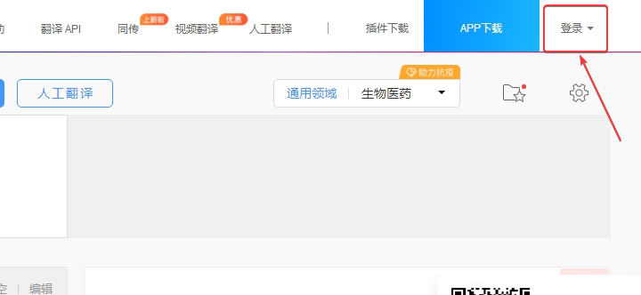
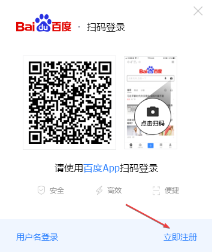
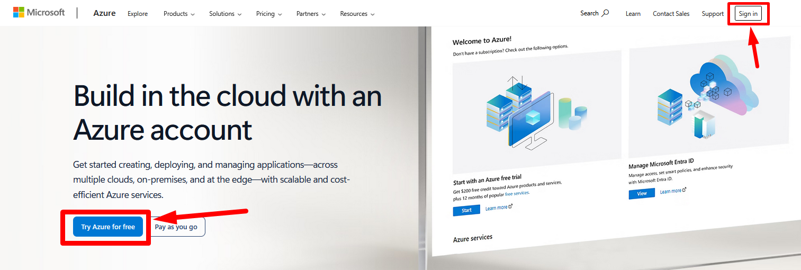

:::info **Please read the [*Material Usage Rules on this site*](../Disclaimer).**
:::
_______________________________________________
## Description.
In this settings section, you enter the information needed to use automatic translation services in your projects.
**They’re needed for:**
- *translating articles;*
- *translating message text into the recipient’s language;*
- *translating pre-made text for autobot replies.*

_______________________________________________
## Baidu Translate.

:::info **The platform’s native language is Chinese.**
For easier setup, we recommend using a browser with a built-in translator.
:::

### How to get your secret key.
#### 1. Go to the [service website](https://fanyi.baidu.com/).
#### 2. Hover your cursor over the indicated character:

#### 3. A pop-up window for login will appear:

#### 4. Log in to the service.

**1**. Enter your username and password here.
**2**. Button to log in.
**3**. Password recovery.
**4**. Go back to app login.
**5**. Create an account.

#### 5. Create a new account.
In the login window, click **Register**:

A page will open for entering your data to create an account:

**1**. Username.
**2**. Mobile number without country code.
:::info **Only Chinese numbers are accepted.**
:::
**3**. Password that meets the service requirements.
**4**. Button to send authentication SMS.
**5**. Field for SMS code.
**6**. Agree to the terms of service.
**7**. Register.

After registering, you’ll be able to copy the key from your account and paste it in the **ZennoDroid Settings**.
_______________________________________________
## Deepl Translate.

:::info **The service is temporarily unavailable to citizens and companies from Russia.**
But if you have a valid payment method from the EU, Switzerland, UK, USA, Canada, or Japan, you can get access to DeepL Pro by entering that info during payment.
:::

### Getting your secret key.
#### 1. Go to the [service site](https://www.deepl.com/ru/translator) and click the three-bar menu in the top right corner.

#### 2. Click on the **Pricing** tab.

#### 3. Select **DeepL API** and then choose one of the two plans: DeepL API Free *(free)* or DeepL API Pro *(4.99€)*.

#### 4. Now enter your **email** and create a **password**.

#### 5. Next, fill in your personal details *(country, address, first and last name)*.

#### 6. Then enter your card details.

Even if you choose the free plan, your card still has to be valid in order for the registration to go through.
#### 7. Once you’ve finished signing up, go to your Personal Account → API Keys.

Copy your API key and paste it into the ZennoDroid settings.
_______________________________________________
## Google Translate via API
:::info **The service is temporarily unavailable to citizens and companies from Russia.**
:::

:::tip **We recommend reviewing the rates and fees before using.**
:::

### Getting your secret key.
#### 1. First, sign in to your Google account.

#### 2. Then create your first project on the [**Google Cloud**](https://console.cloud.google.com/projectcreate) platform.

#### 3. Now, select your project and add [**Cloud Translation API**](https://console.cloud.google.com/apis/library/translate.googleapis.com?inv=1&invt=AbeTEA&project=sonic-verbena-438109-p0).

:::info **You’ll need to set up a billing account first.**
:::

#### 4. Get your API key and add it to ZennoDroid’s settings.
_______________________________________________
## Google Translate Web Interface.
No setup needed for this method, just use the [**online translator**](https://translate.google.com/) in your browser.

:::tip **Works for free.**
:::
_______________________________________________
## Microsoft Translation.
:::info **The service is temporarily unavailable to citizens and companies from Russia.**
:::

:::tip **We recommend reviewing the rates and fees before using.**
:::

### Getting your API key.
#### 1. Go to [**Microsoft Azure**](https://azure.microsoft.com/en-gb/pricing/purchase-options/azure-account/), log in, or create a new account.

:::tip **A 30-day trial is available.**
:::

#### 2. After you get the trial period, go to the [Azure Services](https://portal.azure.com/) page and **create your resource**.

#### 3. Use the search bar to find Translator, open it, and click Create.

#### 4. Get your API key and paste it into ZennoDroid.
_______________________________________________
## Yandex Translate.

### Getting your secret key.
#### 1. Sign up at [**Yandex Cloud**](https://yandex.cloud/ru/services/translate).

:::tip **A welcome grant is awarded to test out the platform.**
:::

#### 2. After logging in, go to your [**personal dashboard**](https://console.yandex.cloud/folders/) and create a billing account.

#### 3. Now you need to create a [**service account**](https://yandex.cloud/ru/docs/iam/concepts/users/service-accounts).

#### 4. Next, on your [**dashboard**](https://console.yandex.cloud/folders/), go to the Access Rights section.
Next to the needed account, click the **three dots → Edit Roles → Add Role → `ai.translate.user`**.

#### 5. Go to the service account and generate an API key.

:::warning **API key value can be viewed only once—immediately after creation.**
:::
_______________________________________________
## Example of use.
While working on a project, you can translate any content you’re using. For example, you can translate a phrase from Russian to English to send in a message.

1. Get the text string from a [**List**](../Project%20Editor/Lists%20and%20Google%20Sheets/Lists).
2. Add the [**Text Processing**](../Data/Text) action.
3. Set up the translation function, selecting the desired service and options.
4. Send the translated message to the recipient.