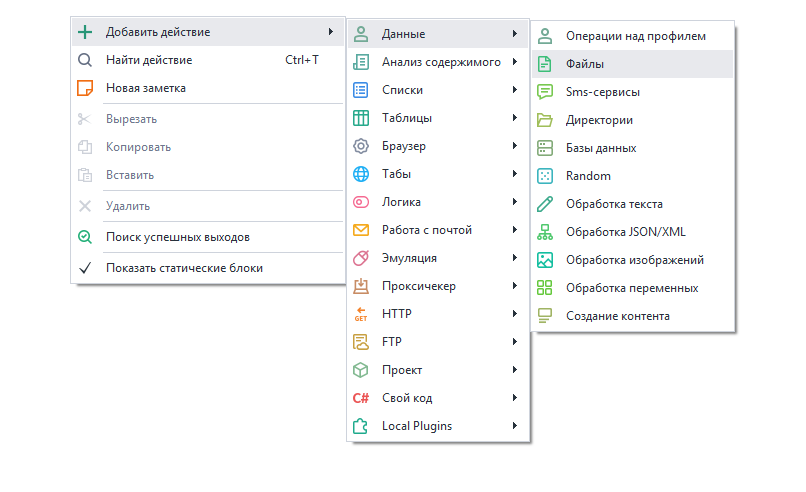

:::info **Пожалуйста, ознакомьтесь с [*Правилами использования материалов на данном ресурсе*](../Disclaimer).**
:::

> 🔗 **[Оригинальная страница](https://zennolab.atlassian.net/wiki/spaces/RU/pages/486309948)** — Источник данного материала

_______________________________________________  
# Файлы

## Описание

ZennoPoster позволяет автоматизировать работу с файлами. 

## Где это можно применить?

- Вставить заготовленный текст из файла при постинге на форумах,
- Размещении объявлений на различных сайтах
- Добавлении автоматических комментариев
- Записывать данные в файлы при парсинге сайтов
- Вести подробное логирование в файл
- Удаление, перемещение ненужных файлов

## Как добавить экшен в проект?

Через контекстное меню **Добавить действие** → **Данные**→ **Файлы**



Либо воспользуйтесь [умным поиском](https://zennolab.atlassian.net/wiki/spaces/RU/pages/506200090/ProjectMaker+7#%D0%A3%D0%BC%D0%BD%D1%8B%D0%B9-%D0%BF%D0%BE%D0%B8%D1%81%D0%BA-%D0%B4%D0%B5%D0%B9%D1%81%D1%82%D0%B2%D0%B8%D0%B9 "https://zennolab.atlassian.net/wiki/spaces/RU/pages/506200090/ProjectMaker+7#%D0%A3%D0%BC%D0%BD%D1%8B%D0%B9-%D0%BF%D0%BE%D0%B8%D1%81%D0%BA-%D0%B4%D0%B5%D0%B9%D1%81%D1%82%D0%B2%D0%B8%D0%B9").

## Как работать с экшеном?


Для работы с файлами предусмотрены следующие действия, которые выбираются в окне свойств:

* * *

### Взять текст 


Копирование текста из файла с возможностью записи в переменную.

#### Путь к файлу

Здесь необходимо указать путь к файлу, из которого будут считаны данные.

Можно использовать макросы [переменных](/wiki/spaces/RU/pages/486309922 "/wiki/spaces/RU/pages/486309922").

#### Удалить файл после чтение

После выполнения экшена, файл будет удалён.

* * *

### Записать текст 


Добавление текста в файл.

#### Что писать

Текст, который будет записан в файл.

Можно использовать макросы [переменных](/wiki/spaces/RU/pages/486309922 "/wiki/spaces/RU/pages/486309922").

#### Дописать в файл

Если включена эта настройка, то указанный Вами текст будет **дописан** в файл. Если галочка снята, то файл будет **полностью перезаписан** с указанным Вами текстом.

#### Записать перенос строки в конец

В конец Вашего текста после внесения оного в файл будет добавлен перенос строки - \r\n . Необходимо для более корректной записи нескольких строк данных в файл.

При работе в многопоточном режиме рекомендуется использовать [Список](/wiki/spaces/RU/pages/534053375 "/wiki/spaces/RU/pages/534053375") и записывать строки в файл с использованием экшена [Операции над списком](/wiki/spaces/RU/pages/534085798 "/wiki/spaces/RU/pages/534085798")

* * *

### Переместить 

Это перемещение файла в указанную директорию. Также, данная опция может использоваться для переименовывания файла.

Необходимо указать полный путь к уже существующему файлу, а также желаемый путь и желаемое имя файла после переноса.


* * *

### Проверить существование 

Проверка существования файла по указанному пути.

- Если файл существует - зеленый (успешный) выход, если отсутствует - красный (неудачный);
- Таймаут ожидания - сколько экшен будет ждать появления файла, в секундах.

* * *

### Скопировать 

То же самое, что и перемещение, но без удаления исходного файла.

* * *

### Удалить 

Удаление файла по указанному пути.

* * *

## Возможное практическое применение

Ставим перед собой задачу: 

1. Скачать картинку с сайта vk.com
2. Переименовать ее
3. Перенести в нужную папку

Представим, что мы уже получили прямую ссылку на картинку: https://sun9-71.userapi.com/zcp0gi3hCgW39FmT3J7vsAiawigKHI_WP4J5YA/fWlAmX-lUM8.jpg

Используя [Get запрос](https://zennolab.atlassian.net/wiki/spaces/RU/pages/534315165/GET- "https://zennolab.atlassian.net/wiki/spaces/RU/pages/534315165/GET-"), скачиваем картинку к нам на компьютер. В качестве переменной указываем PicPath. После выполнения этого экшена в указанной переменной у нас появится прямой путь к картинке: 


Далее, создаем экшен **“Random”** для генерации имени файла, подробнее про Random здесь: [Произвольные числа и строки (Random/Рандом)](/wiki/spaces/RU/pages/534315050 "/wiki/spaces/RU/pages/534315050") 


Далее, создаем экшен **“Файлы”** и указываем опцию **“Переместить”**. 


В качестве “Пути к файлу” указываем: ``\{ -Variable.PicPath- \\}``;

В качестве “Нового пути” ```\{ -Project.Directory- \\}``Полицейский\`\{ -Variable.name_file- \\}`.jpg`

```\{ -Project.Directory- \\}``` - макрос, при указании которого будет использована директория, где находится проект (подробнее об этом и других макросах можно прочитать [здесь](https://zennolab.atlassian.net/wiki/spaces/RU/pages/735608872#%D0%9E%D0%BA%D1%80%D1%83%D0%B6%D0%B5%D0%BD%D0%B8%D0%B5 "https://zennolab.atlassian.net/wiki/spaces/RU/pages/735608872#%D0%9E%D0%BA%D1%80%D1%83%D0%B6%D0%B5%D0%BD%D0%B8%D0%B5")).

После выполнения этого действия файл переместится в нужную папку и Вы можете загружать следующую картинку.

При работе с изображениями следует указывать то же расширение файла, что и было при загрузке.

Для получения расширения файла, можете воспользоваться экшеном [Обработка текста](/wiki/spaces/RU/pages/488865793 "/wiki/spaces/RU/pages/488865793") и регулярными выражениями, подробнее: [Тестер регулярных выражений](/wiki/spaces/RU/pages/534086111 "/wiki/spaces/RU/pages/534086111") 

* * *

## Полезные ссылки

- [Директории](/wiki/spaces/RU/pages/534052965 "/wiki/spaces/RU/pages/534052965")
- [Тестер регулярных выражений](/wiki/spaces/RU/pages/534086111 "/wiki/spaces/RU/pages/534086111")
- [Обработка текста](/wiki/spaces/RU/pages/488865793 "/wiki/spaces/RU/pages/488865793")
- [Работа с переменными](/wiki/spaces/RU/pages/486309922 "/wiki/spaces/RU/pages/486309922")
- [Список](/wiki/spaces/RU/pages/534053375 "/wiki/spaces/RU/pages/534053375")