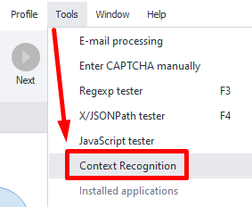
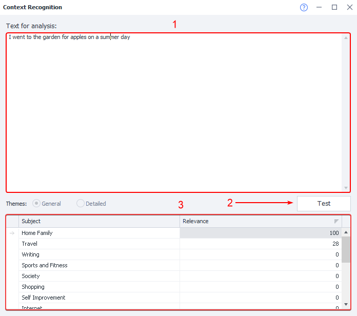

:::info **Please check out the [*Resource Content Usage Guidelines*](../Disclaimer).**
:::
_______________________________________________ 
## Description  
This tool lets you check if the [**Content Creation**](../Data/ContentCreator) action is working properly before you use it in your project. It defines the topic of a text and sets basic relevance limits.

:::info *Works with English language **only**.*
:::
### How to open it?
#### Through the Toolbar  
   

_______________________________________________  
## How to use the tool  
### Window overview  
   

**1**. Enter the text you want analyzed in the corresponding field.  
**2**. Click the **Test** button to start processing the text.  
**3**. The results will show below, listing different topics and how relevant the text is to each one, in percentages.  
_______________________________________________  
## Useful links  
- [**Content Creation Modules**](../Settings/Creator_and_GoogleSheets).  
- [**Content Creation**](../Data/ContentCreator).   
- [**Content Analysis**](../Project%20Editor/ContextRecognition).