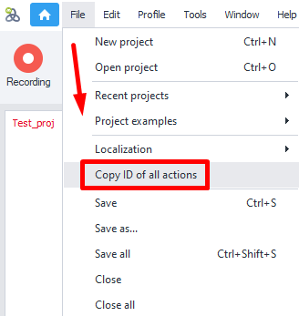

---
sidebar_position: 13
title: Copy ID of All Actions
description: Get comments and IDs for all actions in a project.
---
:::info **Please read the [*Material Usage Rules on this site*](../Disclaimer).**
:::
_______________________________________________  
## Description  
This feature lets you get comments and IDs for every action in a project.

### How does it work?  


All you need to do is select **Copy ID of all actions** from the **File** menu at the top, and all the data will be copied to your clipboard automatically. After that, you can just paste it into any text editor.
_______________________________________________
## Data Format  
Information for each action is put on a new line. First goes the **comment**, then a **tab** character, and then the **action ID**.

Below is a sample output for a project called **`Simple registration.zp`**.

:::tip **This project comes with every copy of ZennoDroid.**  
You can find it on the [**Welcome Page**](../pm/Welcome_PM).
:::  
```js
Clear cookies	cca-6467
http://lessons.zennolab.com/en/index	2a4729be-c63c-4c43-b955-c30fd3c7aabd
click	1431f77f-064c-43e8-82af-1034b3175b35
Spintax	63250dd2-3d78-4e20-8ae7-7c45a8b40772
email	8facc19e-465f-450d-989e-5293be48263d
Password	5ef8b1f4-92be-40ba-ae15-f04a295e9745
Password	7ea99429-fe9f-4048-a259-19441d0f492a
click	fa9c19ca-eef1-4a1e-ac9e-1563d8965663
Get text	tp-6515
'{check_success}' != ''	tv-4708
Registration failed	e8e3218e-9e05-4171-bf62-4a335f882a9f
Registration completed! {-Variable.email-}:{-Profile.Password-}	45b5a8fc-9240-4737-9724-be9818cce1de
```