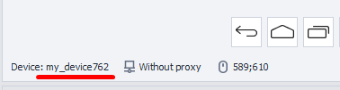

:::info **Please read the [*Material Usage Rules on this site*](../Disclaimer).**
:::
_______________________________________________  
## Memu  
  

This window shows all the virtual devices you've created in MEmu. Here, you can see some basic info about them and quickly switch between devices.  

### How do you open it?  
There are two ways:  
#### Through the Toolbar  
  

#### From the drop-down menu in the "Tools" section  

### Description of available elements  
  

#### Columns:  
- **Index**: The device's number in the list.  
- **Name**: By default, all devices are named `MEmu+Index`. To make it easier to tell them apart, you can give each one a specific name. You can do this by:
    - selecting the desired cell and pressing F2,
    - or using the [**Rename**](../Android/ProLite/action#how-do-i-rename-a-device) action.
- **Model**: Shows the phone model. This info is displayed only for devices that are currently connected.  
- **Status**: Shows if the emulator is connected.
    - *Connected*: Everything's fine; you can use this device.
    - *Disconnected*: The emulator is running, but ZennoDroid can't interact with it.
    Possible fixes for this:
        - *restart the device*,
        - *delete the device*,
        - *create a new device*.
    - *Unknown*: The emulator is stopped.

#### Buttons:  
- **Select**: Makes the chosen device in the list active.  
Use this to quickly switch between connected devices.  
The name of the selected device also appears on the status bar:  
  
- **Release**: Stops the current active device and fully disconnects it.  
The panel status line goes blank after this.  
This is useful if you see the **Device busy in ProjectMaker** error and can't switch to another device.  
- **Stop**: Stops the current active device, but it still stays marked as selected.  
This is an alternative to the [**Stop**](../Android/ProLite/action#how-do-i-stop-a-device) action.
_______________________________________________  
## Useful links  
- [**Device actions**](../Android/ProLite/action)
- [**Device window**](../pm/Interface/DeviceWindow)