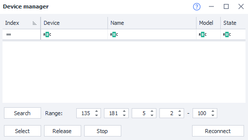

---
sidebar_position: 2
title: Device Manager (Enterprise)
description: Working with connected devices.
---
:::info **Please read the [*Material Usage Rules on this site*](../Disclaimer).**
:::
_______________________________________________  
## Description
  

This window lists all the real devices connected to your computer, as well as any running emulators. Here you can get a quick overview of them and easily switch between devices.  

### How do you open it?  
There are two ways:  
#### Through the Toolbar  
  

#### From the "Tools" dropdown menu  
  

### Description of available elements  
#### Columns:  
- **Index**. The device's serial number. Indexes are assigned alphabetically, based on device ID.  
- **Device**. The device identifier, serial number, or its IP address on your local network.  
- **Name**. By default, matches the device identifier. But for convenience, you can give it a more specific name. To do this:  
    - Select the desired cell and press F2,  
    - or use the [**Rename**](../Android/Enterprise/action#how-to-rename-a-device) action.  
- **Model**. Shows the phone model. This info is only shown for devices that are currently connected.  
- **State**. Device connection status:  
    - *Connected.* Everything's good, you can work with the device.  
    - *Disconnected.* The computer sees the device but can't interact with it.  
        Possible solutions:  
            - *Press the reconnect button,*  
            - *unplug and replug the cable,*  
            - *restart the device.*  
    - *Unauthorized.* You need to allow the computer to interact with your phone by confirming the pop-up prompt on the device.  

#### Buttons:  
- **Select**. Makes the device you selected in the table active.  
Used for quickly switching between connected devices.  
The selected device name also shows up in the status bar:  
  
- **Release**. Stops the active device and disconnects it completely.  
The status bar line will then be empty.  
Use this to fix the **Device busy in ProjectMaker** error when you can't switch to another device.  
- **Stop**. Stops the active device, but it's still considered selected.  
This is an alternative to the [**Stop**](../Android/Enterprise/action#how-to-stop-a-device) action.  
- **Search**. Scans your local network for devices connected via ADB. This is an alternative to the adb connect `192.168.x.x:5555` command.  
- **Reconnect**. Tries to reconnect any devices shown in the list that have the **Disconnected** status.
_______________________________________________  
## Useful links  
- [**Device Actions**](../Android/Enterprise/action)  
- [**Device Window**](../pm/Interface/DeviceWindow)  
- [**Connecting a real device (ZDE)**](../Enterprise/Connection)