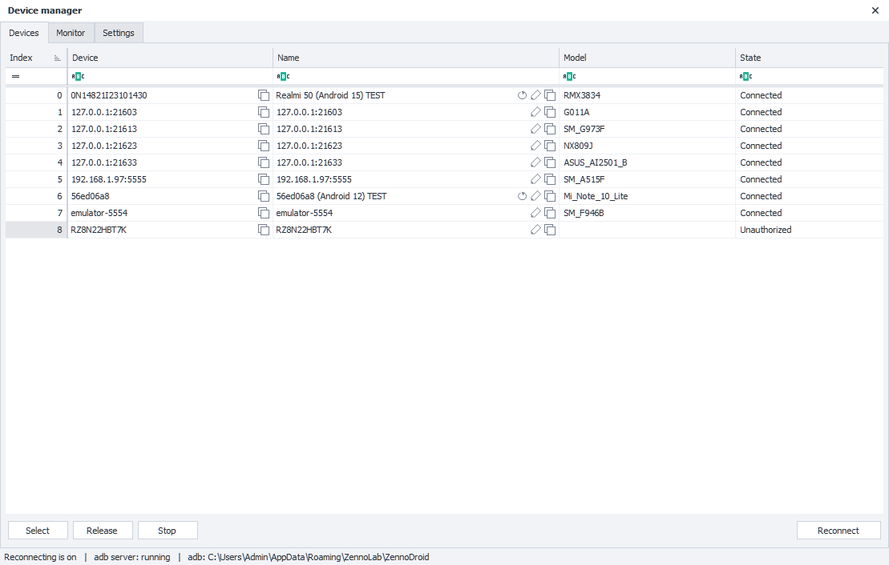
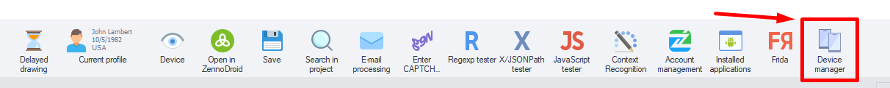
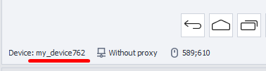
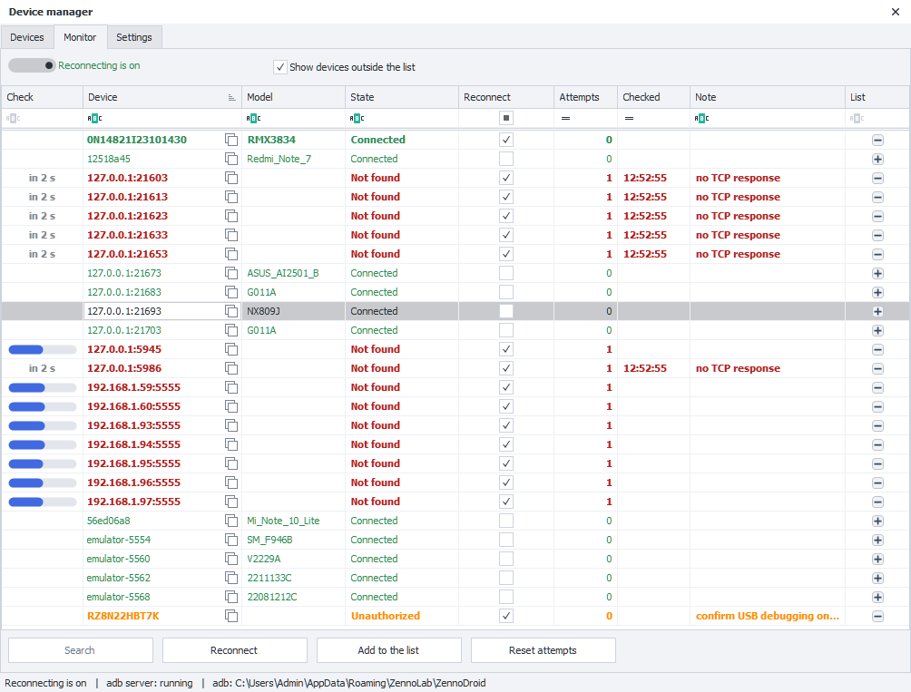
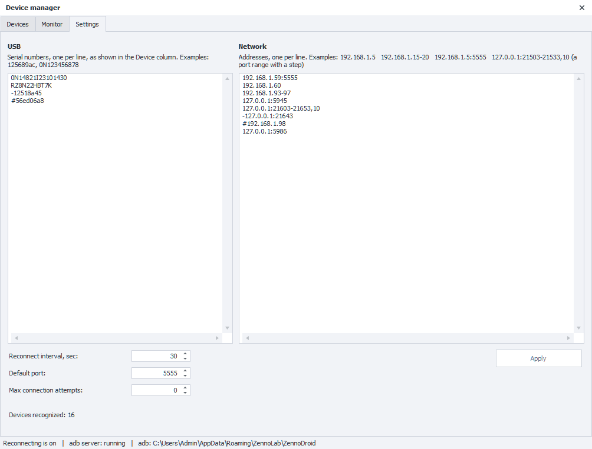

import DisclaimerNotice from '@site/src/components/DisclaimerNotice';

# Device Manager (Enterprise)
<DisclaimerNotice />

## Description
  

This window lists all the real devices connected to your computer, as well as any running emulators. Here you can get a quick overview of them and easily switch between devices.  

The window has three tabs:  
- **Devices** — the list of available devices and switching between them.  
- **Monitor** — watching the devices and reconnecting the ones that dropped out.  
- **Settings** — the list of devices the monitor watches.  
:::info **The "Monitor" and "Settings" tabs appeared in ZennoDroid 2.6.1.0**
:::

### How do you open it?  
There are two ways:  
#### Through the Toolbar  
  

#### From the "Tools" dropdown menu  
  

_______________________________________________  
## The "Devices" tab  
### Description of available elements  
#### Columns:  
- **Index**. The device's serial number. Indexes are assigned alphabetically, based on device ID.  
- **Device**. The device identifier, serial number, or its IP address on your local network.  
- **Name**. By default, matches the device identifier. But for convenience, you can give it a more specific name. To do this:  
    - Select the desired cell and press F2,  
    - or use the [**Rename**](../Android/Enterprise/action#how-to-rename-a-device) action.  
- **Model**. Shows the phone model. This info is only shown for devices that are currently connected.  
- **State**. Device connection status:  
    - *Connected.* Everything's good, you can work with the device.  
    - *Disconnected.* The computer sees the device but can't interact with it.  
        Possible solutions:  
            - *Press the reconnect button,*  
            - *unplug and replug the cable,*  
            - *restart the device.*  
    - *Unauthorized.* You need to allow the computer to interact with your phone by confirming the pop-up prompt on the device.  

#### Buttons inside the cells:  
Hovering over a cell brings up buttons on its right side:  
- **Copy to the clipboard** — in the "Device" and "Name" columns. A *Copied* hint appears next to the cursor afterwards.  
- **Edit (F2)** — in the "Name" column.  
- **Restore title** — in the "Name" column, to the left of the edit button. It is only drawn on devices that were renamed, so the button itself answers the question "has this been renamed". It puts the device identifier back into the column.  

#### Buttons:  
- **Select**. Makes the device you selected in the table active.  
Used for quickly switching between connected devices.  
The selected device name also shows up in the ProjectMaker status bar:  
  
- **Release**. Stops the active device and disconnects it completely.  
The status bar line will then be empty.  
Use this to fix the **Device busy in ProjectMaker** error when you can't switch to another device.  
- **Stop**. Stops the active device, but it's still considered selected.  
This is an alternative to the [**Stop**](../Android/Enterprise/action#how-to-stop-a-device) action.  
- **Reconnect**. Tries to reconnect any devices shown in the list that have the **Disconnected** status.  

:::info **The "Search" button has moved to the "Monitor" tab**  
Scanning the network now goes through the address list from the "Settings" tab, instead of one range typed at the time of the search.
:::

_______________________________________________  
## The "Monitor" tab  
  

The monitor polls the devices from the list at a given interval and reconnects the ones that dropped out on its own. This is the main tool for working with a pool of network devices: the addresses are listed once on the "Settings" tab, and from there the monitor keeps them connected without any manual work.  

Every device counts the interval from its own last attempt rather than from a shared tick, so the rows of the table update independently of each other.  

### How to use it  
1. On the **Settings** tab, list the devices: serial numbers in the **USB** column, addresses in the **Network** one. Press **Apply**.  
2. Go back to **Monitor** and switch **Reconnection** on.  
3. Make sure the devices you need have the **Reconnect** checkbox ticked — it decides whether the monitor brings that particular device back.  

### Description of available elements  
#### Columns:  
- **Check**. What is happening to the device right now. While an attempt runs the cell draws a progress bar, and between attempts a countdown to the next one: *in 13 s*, or *in 2:05* when the wait is over a minute.  
- **Device**. The serial number of the device (USB) or its address with a port (network). The cell has a copy button.  
- **Model**. The phone model. Filled in for connected devices only: there is nobody to ask about a device that was not found.  
- **State**. *Connected*, *Not found*, *Unauthorized*, *Checking…*  
- **Reconnect**. The checkbox switches automatic reconnection on for that one device. It is ticked by default for every new device. An unticked box is remembered, but only while the device stays in the list: take it out and add it again, and the tick comes back.  
- **Attempts**. How many attempts in a row did not end in a connection. Resets as soon as the device connects.  
- **Checked**. When the last attempt ended. An empty cell means an attempt is running right now, or that none was ever needed.  
- **Note**. Why the attempt failed:  
    - *no TCP response* — nobody answers at that address: the device is switched off, it left the network, or debugging over the network is not enabled on it;  
    - *confirm USB debugging on the device* — the debugging prompt is waiting to be confirmed on the phone;  
    - *adb connect failed*, *adb reconnect failed* — adb refused;  
    - *the device is not connected* — there is nothing to reconnect.  
- **List**. The **+** button adds the device to the list from the "Settings" tab, **−** takes it out. **+** is only shown for devices that can be written into the list: an address goes into the "Network" column, a serial number into the "USB" one.  

#### Row colour and weight:  
- **green** — the device is connected,  
- **red** — not found,  
- **orange** — unauthorized,  
- **bold** — a device the monitor is actually keeping alive (the "Reconnect" box is ticked). Everything else stays regular, devices outside the list included: there is nothing to bring back for them yet.  

#### Switches:  
- **Reconnection**. The main switch. It keeps running after this window is closed, for as long as the application runs, and its state is remembered: reconnecting is on at the next launch if the switch is left on. The switch is shared between ZennoDroid and ProjectMaker — the devices in the pool are the same ones, so switching it in one window switches it for both.  
- **Show devices outside the list**. Shows the devices adb knows about that are in neither the "USB" nor the "Network" column. On by default: a device has to be seen before it can be taken into the list.  

#### Buttons:  
- **Search**. Scans the ranges from the "Settings" tab once and switches on showing devices outside the list. Available while reconnecting is off — otherwise the monitor is doing the scanning itself.  
- **Reconnect**. Reconnects every offline device without waiting out their intervals.  
- **Add to the list**. Writes every device found into the list at once, so you do not have to press **+** on each row.  

_______________________________________________  
## The "Settings" tab  
  

This is where the list of devices the monitor watches is set. The list survives a restart of the program exactly as you wrote it.  

#### The "USB" column:  
Serial numbers, one per line — exactly as they are shown in the "Device" column. For example: `125689ac`, `0N123456878`.  

Case matters: adb compares a serial byte for byte, so `56ED06A8` and `56ed06a8` are two different devices to it. An address with a port is not accepted here, it belongs in the "Network" column. At most 512 devices are allowed in the list.  

#### The "Network" column:  
Addresses, one per line. The following forms are supported:  

| Line                          | What it means                                                        |
| :---------------------------: | :------------------------------------------------------------------- |
| `192.168.1.5`                 | one address, the port comes from the "Default port" field            |
| `192.168.1.5:5555`            | an address with an explicit port                                      |
| `192.168.1.15-20`             | a range over the last octet: from `192.168.1.15` to `192.168.1.20`   |
| `192.168.1.15-192.168.1.20`   | the same range written out in full                                    |
| `127.0.0.1:21503-21533`       | a range of ports on one address                                       |
| `127.0.0.1:21503-21533,10`    | the same with a step: 21503, 21513, 21523, 21533                      |

A range is only allowed over the last octet. An address range and a port range on the same line are not supported. The port has to be within 1000–65535: adb will not connect to ports shorter than four digits. One line may yield at most 1024 addresses, and the whole list at most 4096.  

#### Line syntax (the same for both columns):  
- `-` at the start of a line excludes the device: after `192.168.1.1-20`, the line `-192.168.1.5` leaves nineteen addresses under watch.  
- `#` or `//` at the start of a line is a comment, the line is not read.  
- If several lines name the same device, the lowest one wins. A plain line written below an excluding one therefore puts the device back into the list.  

Bad lines do not abort the parse: the program reads the rest and reports below the field what exactly it did not understand, and on which line.  

#### The remaining elements:  
- **Reconnect interval, sec**. How many seconds after a failed attempt the monitor tries again. 30 by default, anything from 1 to 3600 is allowed.  
- **Default port**. Appended to the addresses written without a port. 5555 by default.  
- **Devices recognized**. How many devices came out of both columns after parsing — a handy number for checking that a range says what you meant it to.  
- **Apply**. Saves the lists and the settings and hands them to the monitor.  

_______________________________________________  
## The status bar of the window  
The bottom of the window shows:  
- whether **reconnecting** is on,  
- whether the **adb server** is running,  
- the path to the **adb** in use.  

_______________________________________________  
## Useful links  
- [**Device Actions**](../Android/Enterprise/action)  
- [**Device Window**](../pm/Interface/DeviceWindow)  
- [**Connecting a real device (ZDE)**](../Enterprise/Connection)