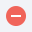

:::info **Please read the [*Material Usage Rules on this site*](../Disclaimer).**
:::
_______________________________________________  
## Description  
Lets you work with email accounts without having to use a browser window. With this tool, you can find the email you need and get info about it. It's good for handling lots of incoming emails at once.  

### What is it used for?  
- **Quick access to your inbox**  
- **Extracting data from emails**  
- **Activating accounts on websites**  
- **Deleting unnecessary emails from your inbox**  
- **Deleting downloaded emails**  
_______________________________________________
## How to set it up  
:::info **Before setting up the tool, make sure your account has IMAP access enabled.**
:::

### Logging in to your mailbox  
  

**1.** Enter your account username and password. You can use variables to store these details.  
**2.** If you tick this box, ZennoDroid will try to figure out the necessary server settings for you.  
:::warning **This doesn't work with every service.** 
:::  
**3.** Use this button to set up third-party proxies if needed.  
**4.** Enter your IMAP connection details if ZennoDroid can't detect them by itself. You can get these values from your email service's website.  
**5.** Once everything’s filled in, hit **Log in to mail** to move on to the next step.  
:::info **If an error pops up at this stage, you’ll see a comment in the bottom left corner.**  
  

Fix the error by following the suggestions.
:::  
_______________________________________________
## Finding the right email  
  

### Available settings  
#### Intervals for downloading mail 
Sometimes emails from services arrive with a delay, so it's important to set a wait time in seconds for the program to pause for new emails.

Separate attempts with `;`. For example, in the screenshot: first try after 15 seconds, then 30, then 60.

#### Load from a directory not more than  
Set how many emails you want to download.

#### Remove downloaded 
If you turn this on, all downloaded emails will be deleted from the inbox after downloading.

#### Update list  
This lets you get the latest list of folders in your mailbox.

#### Imap folders  
Tick the boxes for the folders you want to search in. For example: *Inbox*, *Spam*, *Sent*, *Drafts*, etc.

If you leave the field blank, only emails from *INBOX* and *Spam* will be downloaded.

### Load mail 
Clicking this button will make ZennoDroid download all emails matching your set criteria.

  

#### 1. List of downloaded emails  
Shows all downloaded emails with their *Subject*, plus the *Sender’s name* and *Email address*.

#### 2. Email content display options  
Choose how you want to see the email content:  
- *in original HTML code*,  
- *text only*,  
- *hide headers (show or hide service headers)*.  

#### 3. Email body  
This is where you can read the actual content of the selected email.

#### 4. Email search criteria  
Set your search criteria here if you're looking for a specific email. It's easiest to use a [**regular expression**](./RegEx_Tester) here.

If the criteria match, the email you need will be marked *green* in the **List of downloaded emails**.

#### 5. Delete found email  
If this is turned on, the found email will be deleted from your inbox after processing.
_______________________________________________
## Finding an element in a selected email  
### List of regular expressions and found elements  
  

#### Name of the regular expression  
Displays the expression’s name.  
#### Result  
Shows the data found by this expression.  
#### Match number  
A single regular expression can often return several results, so this shows the index number of the found item (starting from zero).

:::warning **We recommend not tying your projects to a specific match number.**  
Since the email structure can change, and the order of the links might as well. 
:::  

Try to make your regular expression so that it finds just one match as a result.

#### Save to variable  
In this column, you can pick an existing variable or create a new one to save the regex result.

#### Buttons for copying variables to clipboard  
Use the special buttons on the right to copy a variable's macro to your clipboard.

:::tip **You can save the results from several regular expressions at once.**  
For example, in one go, you could pull an activation code, website link, phone number, and the sender’s first and last name from an email. Just make a separate regular expression for each one in advance, and then add the variables where the results will be saved.   
:::  

### Editing regular expressions  
  

If none of the preset regular expressions work, you can create your own.

####  Creating from scratch  
Click this button to open the [**RegEx Builder**](./RegEx_Tester), and the email content will already be in the text field. All you need to do is write your expression and give it a name (to tell it apart from others), then click **OK**. It will appear in the overall list.

####  Deleting  
Click this to remove a user-created expression from the list.
:::warning **You can only delete expressions you’ve created yourself.**   
:::  

####  Editing  
With this, you can edit the selected expression.

If you edit a preset expression, it will create a new one, since built-in parameters can't be changed. The new expression will appear in the overall list.

But if you change a user-created expression, the value gets updated right in place, no new expression is created.
_______________________________________________
## Finishing up  
Once you’ve found the info you need, click **Finish**.

ZennoDroid will suggest adding an action [**Receive mail**](../Project%20Editor/RecieveEmails) to the project so you can use it later.

:::warning **If there are two identical emails in your mailbox, the action will pick the newest one for processing.**   
::: 
_______________________________________________  
## Useful links  
- [**Receive mail**](../Project%20Editor/RecieveEmails)  
- [**Send mail**](../Project%20Editor/SendEmails)  
- [**Email service settings**](../Settings/Mailbox)