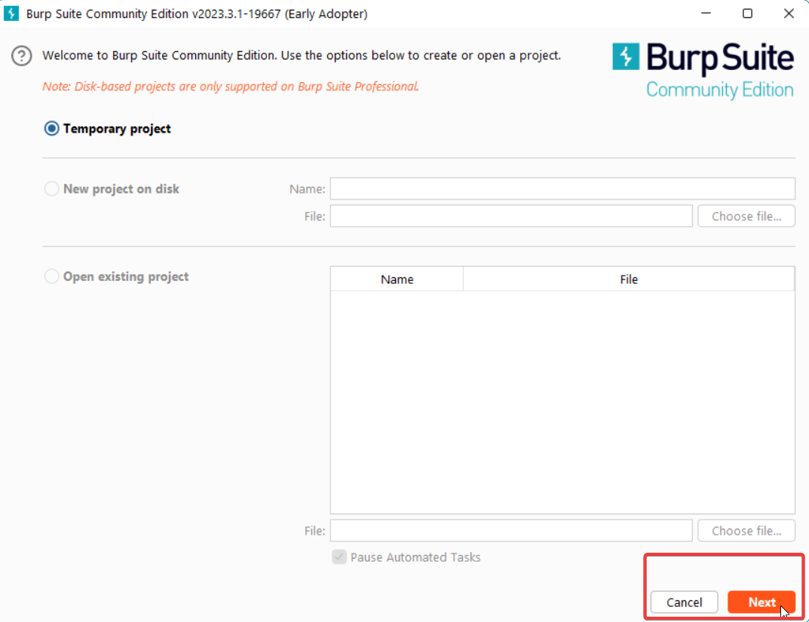
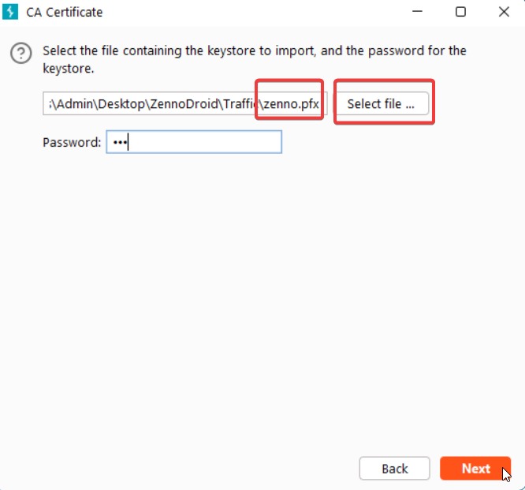
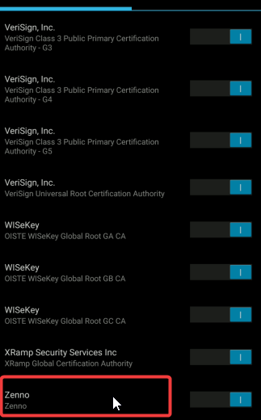

:::info **Please make sure to read [*the Terms of Use for materials on this resource*](../Disclaimer).**
:::
_______________________________________________
export const VideoSample = ({source}) => (
  <video controls playsInline muted preload="auto" className='docsVideo'>
    <source src={source} type="video/mp4" />
</video>
);  

## What is Frida?  
[**Frida**](https://frida.re/) is a toolkit for dynamic code instrumentation. It lets you easily inject your own code into other apps.  
Frida works with apps made for all popular OS’s, including Windows, Linux, macOS, iOS, and even QNX.  
Here, we’ll be using it to modify Android apps.  
:::info **Note: Frida needs Root access to work on a real device.**
::: 
_________________

## How do you open the Frida Toolkit?  
   

In the app’s top left panel, find ***Tools → Frida toolkit*** at the very bottom.  

 
:::info **You need to start your device or emulator before you begin.**
:::  
_________________
## Description of Available Windows  
   
### Devices (1):  
A list of all devices connected via ADB. It automatically updates when you connect or disconnect devices or emulators.  
In ZennoDroid Enterprise, you can switch between different devices. In other versions, you can only work with the emulator running in the main window.  
#### Available buttons:  
- **Refresh**: Force updates the list of devices.  
- **Start frida**: Launches the Frida server on the device. After pressing it, wait for the info window to say “*Server started*”. The first time you run it, the server will install to the device, which takes a few seconds (about 5-10 sec).  
- **Stop frida**: Stops the server but doesn’t uninstall it, so starting it again after will be much faster than the first run.  
_________________  
### Apps (2):  
Shows a list of all installed apps you can launch. Apps that can’t be launched (no launcher activity) aren’t shown.  
#### Columns:  
-  **Id**: You can see the app’s unique identifier (package name).  
- **Name**: The app’s display name, usually shown on its icon.  
#### Available buttons:  
- **Refresh**: Updates the app list. Use this after installing or uninstalling apps.  
- **Active**: After clicking, selects the app currently showing on your device’s screen.  
- **Start**: Launches the selected app and automatically connects to its process. If the app was already running, it’s killed and relaunched.  
- **Resume**: Unpauses an app you previously paused.  
_________________  
### Processes (3):  
Here you’ll see all running processes on the device.  
#### Columns:  
- **Pid**: The process ID.  
- **Name**: The process name. Since one app can have several processes, the name usually gives you more details. For example, **com.android.settings** tells you it’s the **Settings** app.  
#### Available buttons:  
- **Refresh**: Updates the list of running processes. Use this after launching or stopping apps.  
- **Topmost**: Selects the main process of the app currently visible on your device.  
- **Connect**: Connects to the selected process. Once you connect, you can load or create scripts.  
- **Disconnect**: Disconnects from the process. If the app has closed, you’ll be automatically disconnected.  
_________________  
### Script (4):  
The script management window. Supports macros.  
#### Available buttons:  
- **Select**: Opens a file selection dialog. The script file should have a *.js* extension  
- **Save**: Saves the window content to a *.js* file  
- **Create**: Compiles the script. If there are errors (usually syntax-related), you’ll get a message in the info window.  
(*This action becomes available after you’ve connected to an app process.*)  
- **Load**: Loads the script. If there are errors (often due to missing classes in the app code), you’ll get a message in the info window.  
(*You can only load after a successful **Create** press.*)  
 - **Unload**: Unloads the script. Scripts are also unloaded automatically when the app process closes.  
 _________________  
 ### Info (5):  
 This window shows service info, messages during scripts, errors, etc.  
 #### Hotkeys:  
 - **(Ctrl + C)**: Copy highlighted messages.  
 - **(Del)**: Delete highlighted messages.  
 - **(Ctrl + Del)**: Delete all messages.  
 _________________  

 ## How to check if the Frida server is up and running  
 1. Hit **“Start frida”** and wait for a “*Server started*” notification in the info window.  
 2. On the *Processes* panel, press **“Topmost”**. This will select the active process.  
 3. Click **“Connect”**.  
 4. On the *Script* panel, enter this code: `console.log('Hello, World!');`  
 5. Hit **“Create”**, then **“Load”**.  
 6. If everything worked, you’ll see the message: `["type":"log","level":"info","payload":"Hello, World!"]` in the info window.  
 7. You can then click **“Unload”**. Frida server is working!  
 _________________

 ## Typical scenarios  
 ### The app will be restarted even if it’s already running  
 1. On the *Apps* panel, select the one you need (by name or using the **“Active”** button).  
 2. Press **“Start”**. The app will start (or restart if it was open), then pause. It’ll auto-connect to its process.  
 3. On the *Script* panel, click **“Select”** and open your desired script (*.js* file) in the dialog.  
 4. Press **“Resume”**. The app will keep running.  
 ### Connect to a running app process  
 1. On the *Processes* panel, hit **“Topmost”** to select the active process.  
 2. Click **“Connect”**.  
 3. On the *Script* panel, press **“Select”** and open your script (*.js* file).  
 4. Press **“Create”**, then **“Load”**.  
 _________________  

 ## Intercepting traffic with Frida and Burp Suite  

<VideoSample source={require("@site/static/video/Перехват трафика, Frida и Burp.mp4").default}/>  
_________________
 ### 1. Download and install  
 

1. Choose **Burp Suite Community Edition** and click **“Download”**
  

  

 

2. Create a **Temporary** project.
  

  

   

 

3. Use **Burp defaults** for the project.
  

  

 

 ### 2. Set up Burp Suite to process traffic from your computer’s local network  

1. Go to **Settings**
  

 

  

2. Select **Tools → Proxy** and click **“Import / Export CA certificate”**. 
  

 

  

3. Then pick ***Certificate and private key from PKCS#12 keystore*** → select the **zenno.pfx** file (*password: **123***).
  

  
_________________  
 

    
 ### 3. Choose your device and launch in Project Maker  
   
:::info **Important**
*In ZennoDroid Enterprise, make sure Android is set to use computer’s internet connection or set up Proxifier.*
::: 
_________________  
### 4. Forward the device’s traffic to Burp Suite  
  

Run the *Forward traffic to Burp* action. To confirm it’s working, use the action to open **http://proxifier.com** in your browser (make sure it’s **http://**, not http**s**://).  
You should see the request in Burp Suite (on the *Proxy - Http history* or *Target Site map* tab).  
_________________ 
### 5. Install the certificate on the device  
First, run the *Install certificate* action. After that, the Zenno certificate will appear in the **Trusted credentials** list.  

  

If you’re using LDPlayer emulator, you need to **enable Root** and allow ADB access.
  

 

### 6. Run the Frida script to bypass SSL pinning  
1. Start **Frida** from the toolbar.  
2. Hit **“Start frida”**.  
3. On the *Apps* panel, pick the app you need.  
4. Click **“Start”**.  
5. On the *Script* panel, click **“Select”** and open the `[*sslUnpin.js*]` script.  
6. Click **“Create”**, then **“Load”**.  
7. Press **“Resume”**.  

  

The app’s requests should show up in Burp Suite. In the info window, you’ll see: `[*"type":"log","level":"info","payload":"Bypassing SSL Pinning"*]`.     
_________________
### 7. Wrap up the traffic analysis  
1. Click **“Unload”** in the *Script* panel.  
2. Click **“Disconnect”** in the *Processes* panel.  
3. Run the *Disable traffic forwarding to Burp* action.  
_________________
## Useful links  
- Official [**Frida scripts source**](https://codeshare.frida.re/)  
- [**Template and all required files**](https://www.dropbox.com/scl/fi/2d61v0e0rnsiwz8rww06x/Frida-Burp.zip?rlkey=asbr6w5eqlarbbfjoq4lc34e8&dl=0) (zenno.pfx password is 123)  
- [**Connecting a real device to ZennoDroid**](../Enterprise/Connection)