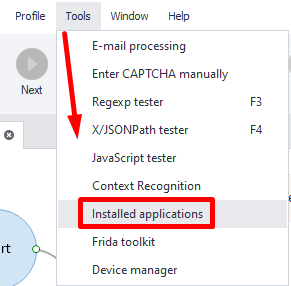
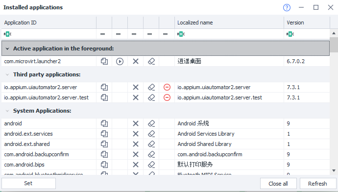

:::info **Please read the [*Terms of Use for materials on this resource*](../Disclaimer).**
:::
_______________________________________________
You can open the window from the top menu at **Tools → Installed Apps**.

Here you'll see all the apps installed on your system, along with their clear names, usually shown on the icons.

You can copy an app’s identifier to the clipboard and use it with the [**App Actions**](../Android/ProLite/App) feature to launch, stop, or uninstall apps. You can also use it to back up and restore app data. All these actions will be saved to your project.

:::tip **You can get a list of apps using [adb shell](../Android/ProLite/ADB_Shell#adb-shell).**
The command is `pm list packages`
:::
_______________________________________________  
## Useful links   
- [**App Actions**](../Android/ProLite/App).  
- [**Automating tasks in apps**](../get-started/apps).