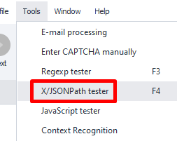
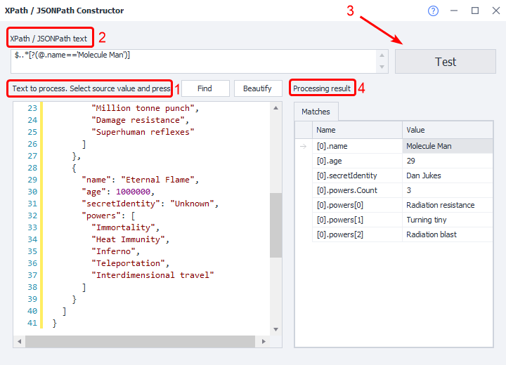
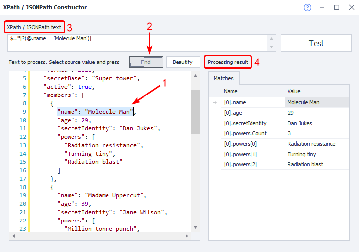

---
sidebar_position: 7
title: X/JSON Path Tester
description: Check the correctness of your XML and JSON data.
---
:::info **Please read the [*Material Usage Rules on this site*](../Disclaimer).**
:::
_______________________________________________

## Description
This tool is meant to help you check if your **XML** or **JSON** data is valid and to help you create the right expressions for parsing data.

### How to open it?
#### From the Toolbar


_______________________________________________

## How do you use this tool?
### How can you check if your XPath/JSONPath expression is correct?


**1.** Paste the code you want to work with into the input field.  
**2.** Enter the XPath/JSONPath expression you want to check above it.  
**3.** Click the **Test** button.  
**4.** After processing, the **Result** section will show you the matches. If your expression is correct, you’ll see the values you needed.

### How can you quickly make an XPath/JSONPath expression?


**1.** Paste your code into the input field, then highlight the fragment you want to base your expression on.  
**2.** Click the **Find** button.  
**3.** The field with XPath/JSONPath will now show a ready-to-use expression for your needs.  
**4.** You can check if the expression works with the matches it returns.

You can use the resulting expression later in the [**JSON and XML Processing**](../Data/JSON_XML) action.

:::tip The "Beautify" Button  
This button automatically formats your code to make it easier to read.
:::
_______________________________________________

## Basic Syntax

### XPath
| Expression      | Result                                         |
| :-------------: | :--------------------------------------------- |
| `node_name`     | Selects all nodes named `node_name`            |
| `/`             | Selects from the root node                     |
| `//`            | Selects nodes anywhere under the selection     |
| `.`             | Selects the current node                       |
| `..`            | Selects the parent of the current node         |
| `@`             | Selects attributes                             |

**To search for unknown nodes, use these special symbols:**
| Special Symbol  | Description                                    |
| :-------------: | :--------------------------------------------- |
| `*`             | Any element                                    |
| `@*`            | All attributes                                 |
| `node()`        | Any node of any type                           |

### JSONPath
| Expression      | Result                                         |
| :-------------: | :--------------------------------------------- |
| `$`             | Selects from the root node                     |
| `..`            | Parent operator                                |
| `[]`            | Child operators                                |
| `.`             | Selects from the current node                  |
| `@`             | Selects the current node                       |
| `?()`           | Applies a filter expression                    |
_______________________________________________

## Example

### Example Code
```js
{ "store": {
    "book": [ 
      { "category": "reference",
        "author": "Nigel Rees",
        "title": "Sayings of the Century",
        "price": 8.95
      },
      { "category": "fiction",
        "author": "Evelyn Waugh",
        "title": "Sword of Honour",
        "price": 12.99
      },
      { "category": "fiction",
        "author": "Herman Melville",
        "title": "Moby Dick",
        "isbn": "0-553-21311-3",
        "price": 8.99
      },
      { "category": "fiction",
        "author": "J. R. R. Tolkien",
        "title": "The Lord of the Rings",
        "isbn": "0-395-19395-8",
        "price": 22.99
      }
    ],
    "bicycle": {
      "color": "red",
      "price": 19.95
    }
  }
}
```

### Example Expressions
| XPath                | JSONPath                 | Result                                                                                     |
| :------------------- | :---------------------- | :---------------------------------------------------------------------------------------- |
| `/store/book/author` |   `$.store.book[*].author`   | Find all `author` elements in all `book` entries inside `store`.                         |
| `//author`           |   `$..author`                | Every `author` element.                                                                   |
| `/store/*`           |   `$.store.*`                | Get everything inside `store`.                                                            |
| `/store//price`      |   `$.store..price`           | Grab the `price` value from every element called `price` in `store`.                      |
| `//book[3]`          |   `$..book[2]`               | Get the third `book` element. (Index starts at 0 in JSONPath)                            |
| `//book[last()]`     |   `$..book[(@.length-1)]` or `$..book[-1:]` | The last `book` element.                                              |
| `//book[position()<3]` |   `$..book[0,1]` or `$..book[:2]`  | The first **2** `book` elements.                                                       |
| `//book[isbn]`       |   `$..book[?(@.isbn)]`           | Filter for all `book` elements that have an `isbn`.                                     |
| `//book[price<10]`   |   `$..book[?(@.price<10)]`       | Filter for all `book` elements with a `price` less than **10**.                        |
| `//*`                |   `$..*`                        | Select all elements in the XML or all members of the JSON structure.                    |
_______________________________________________

## Useful links
- [**JSON and XML Processing**](../Data/JSON_XML)
- [**Element Tree**](../pm/Interface/ElementTree)