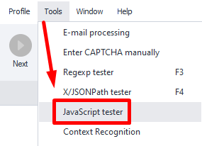
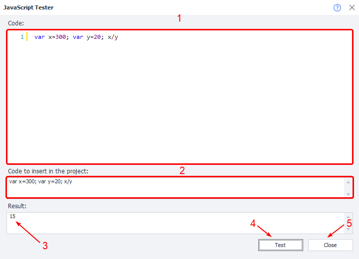
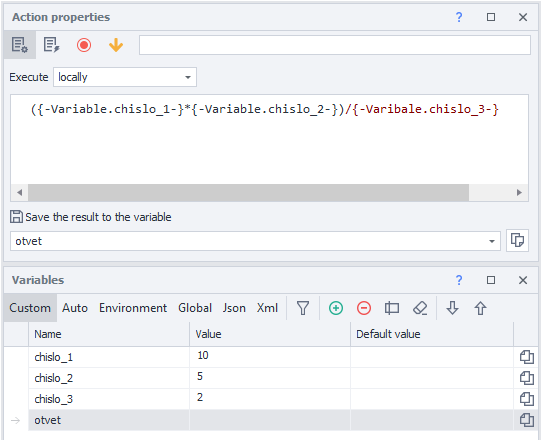
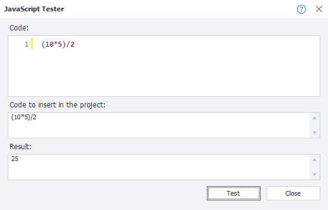
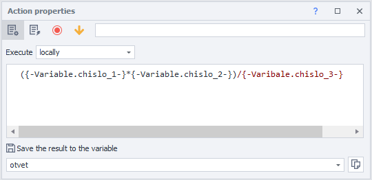
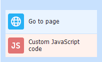

:::info **Please read the [*Rules for using materials on this resource*](../Disclaimer).**
:::
_______________________________________________   
## Description  
This tool lets you check if your local JavaScript code works correctly. The code you create here can later be inserted into an action and used in your template.

:::info *Works with **only** locally executed code.*
:::
### How do you open it?  
#### Through the Toolbar  
   

_______________________________________________  
## How to use the tool?  
### Window Overview  
  

**1**. Paste the code you want to test into this field.  
**2**. Select the format you want for using the code in a [**JavaScript**](../Project%20Editor/CustomCode/JS) action.  
**3**. The result of your code’s execution will appear here.  
**4**. Button to run (test) your code.  
**5**. Exit the tester.  
_______________________________________________
### Example #1  
Let’s say you want to use JavaScript and variables to do some math.

  

Before using your code in a project, it’s a good idea to run it in the tester and make sure it’s correct.

  

Now that you’ve made sure your code works, just replace the static values with your variables and add it to a [**JavaScript**](../Project%20Editor/CustomCode/JS) action.

  
_______________________________________________
### Example #2  
Suppose you need to open a web page and run some JavaScript code.

  

1. Go to the website.  
2. Paste the code you need into the tester and check if it works.  
3. Copy the working code and paste it into your project.  
4. Add a [**JavaScript**](../Project%20Editor/CustomCode/JS) action, using the format suggested by the tester.  

So, along with checking your actual code before you use it in a project, ZennoDroid will also show you the correct format for adding it to the action.
_______________________________________________  
## Useful Links  
- [**Custom JavaScript code**](../Project%20Editor/CustomCode/JS)  
- [**Variables Window**](../pm/Interface/Variables)