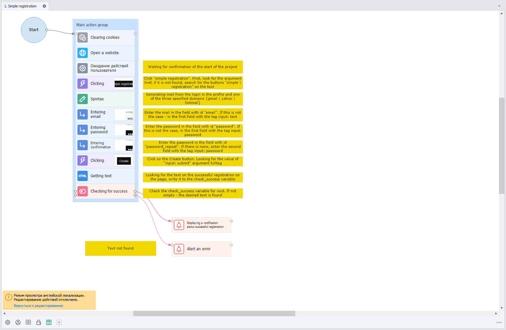

:::info **Please take a look at the [*Rules for using materials on this site*](../Disclaimer).**
:::
_______________________________________________ 
## Overview  
The localization feature lets you adapt your projects for foreign audiences. It works by replacing the project's text fields with translations provided in a special file.   

### What is a translation file?
It's a table in `.csv` format with a comma as the separator. You can open it with any text editor.  

You can add the translation file to your project as a static [**Table**](../Project%20Editor/Lists%20and%20Google%20Sheets/Tables) block or a [**Google Sheet**](../Project%20Editor/Lists%20and%20Google%20Sheets/Google_Sheet) after importing it to Google Docs.  

:::tip **Alternative way to translate your project**
You can also do an automatic **table text translation** using the **Text Processing → [Text Translation](../Data/Text#translation)** action.
:::

### How do you create it?  
To make a table, use the top menu in ProjectMaker: File → Create translation file:  

  

Once you click this button, **the following project text fields will be collected and saved into the file:**  
- **Entries in notes**  
- **Messages from the "Wait for user actions" action**  
- **Notification content**  
- **Comments for actions**  
- **Comments for action groups**
:::info **Localized notifications and messages**
These will also be translated during ZennoDroid project execution.
:::

| This is your project    | This is its translation table |
| -------- | ------- |
|   |     |  

:::tip **Current project values will be written into the column.**
The column matches your program’s current language.
:::  
_______________________________________________ 
## Editing the Table
### Table Structure  
The table has five columns:  

| Column Name    | Description |
| :--------: | :------- |
| **ID**  | **Element ID** you’re translating. This is used to apply the translation.    |
| **Status** | **Translation status.** Lets you keep track of whether each entry is up-to-date.     |
| **RU**    | The element’s **Russian** localization text.    |
| **EN**    | The element’s **English** localization text.    |
| **CN**    | The element’s **Chinese** localization text.    |  

You can freely edit just the text columns for other localizations and the status column.  

:::tip **Any changes to the file are applied right away — no need to reload the project or program.**
::: 

#### Possible statuses:  
- **Need update**. Set when:    
    - By default, for all items  
    - The element has no translated text in other languages  
    - The text in the project was changed and the file hasn’t been updated yet  
- **Ok**.  
Used when there’s at least one translated text for an element  
- **Not found**.  
Set when a file contains an ID that doesn’t exist in the project  

#### Notes  
- If you change the **ID** column, the element can't be found in the project and gets the **Not found** status (same as if you delete it). So, **you shouldn't change this parameter**.
- If you change the **current localization** in the table but not in the project itself, the file will be marked outdated and the element won’t count as translated. Next time you try to view another localization, **you’ll be prompted to update the file**.  

:::warning **To avoid errors loading translation files.**
We recommend making all table changes only with special editors.
:::  
_______________________________________________ 
## Working with Translations  
### Updating the Translation File  
You need this function to record new values to the file and refresh the translation texts for elements.  

When you have a translation file next to your project, the menu will include a **Localization** section with buttons to update the file and view other languages:  

  

When you press **Update translation file**, the current values from all of the project's text fields will be collected and matched with entries in the file. Existing elements get their texts and status refreshed. New ones get added with **Need update** status. If there are items in the file that don’t exist in the project anymore, they’ll get **Not found** status.
_______________________________________________ 
### Translating the Project
Translation works by replacing the translated elements’ texts with the values from the translation file. It matches up element IDs and their current values between the project and the file.  

If you’ve changed some text in the project and haven’t updated the translation file, the element is marked as outdated and won’t be translated when you open the project. But if you try to view its localization, you’ll be asked to update the file, otherwise the view isn’t available.  

This setup helps you avoid mismatches between the source text and the translation file, while still translating as many elements as possible when opening the project.  

:::info **If an element doesn’t have translated text for the language you're viewing**
It won't be changed and will just show up as it is in the original project localization.
:::  
_______________________________________________ 
### Previewing the Translation
This function simulates exactly how the project would look if you opened it with another localization.  

:::warning **When previewing a translation, you can’t run or record the project, or save or change it.**
:::   

 

To exit translation preview, just click **Return to editing** on the information panel. Or in the menu, select **Preview translation** and choose your program’s current localization.  

If the translation table file gets damaged or deleted during preview, the project will go back to its original state and show an error message.  

Keep in mind that unlike action groups and comments, notes don't resize depending on the length of the text.
_______________________________________________  
## Useful links  
- [**Notes**](../Project%20Editor/Project/Notes)  
- [**Run event**](../Android/ProLite/RunEvent)  
- [**Text processing**](../Data/Text)