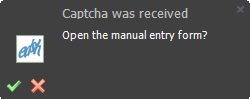

:::info **Please read the [*Material Usage Rules on this site*](../Disclaimer).**
:::
_______________________________________________   
## Description  
Day by day, captchas on websites and apps are getting tougher, making it harder to automate tasks on a large scale. If you don't have a service for solving them, or if you only need to solve a few, you can do it by hand.

:::tip **[CapMonster Cloud](https://capmonster.cloud/Dashboard)**
Can help you with **HCaptcha**, **Cloudflare**, **ReCaptcha Enterprise**, and other tough captchas. This method only works with simple text-based ones.
:::

### How to Open?  
There are two ways.  
#### Through the Toolbar.  
  

#### Through the Pop-up Window in the Lower Right Corner.  
  

*This shows up when you send an image from the [**Solve Captcha**](../Android/ProLite/CaptchaSolving) action.*  
_______________________________________________
## How to Use the Tool?  
### Getting Ready  
First add the [**Solve Captcha**](../Android/ProLite/CaptchaSolving) action to your project and choose the **`MonkeyEnter.dll`** recognition module from the list.

  

### Solving Captchas  
  

**1.** Send the captcha you need to solve.  
**2.** Enter the answer.

Then press **Enter** to confirm. The answer will be saved in the variable you set in the [**Solve Captcha**](../Android/ProLite/CaptchaSolving) action settings.

:::tip **This method only works with text-based captchas.**
:::
_______________________________________________
## Example  
Let's sum it up. Imagine you need to send a message on a forum that uses a text captcha.

  

1. Add the [**Solve Captcha**](../Android/ProLite/CaptchaSolving) action to your project.
2. Pick the **`MonkeyEnter.dll`** recognition module.
3. Open the captcha input window.
4. Enter the answer to the challenge.
5. Confirm your answer and send the message.

So, if you run into a text captcha while working, this is how you can solve it.
_______________________________________________  
## Useful Links  
- [**Captcha Module Setup**](../Settings/Captcha)
- [**Solve Captcha**](../Android/ProLite/CaptchaSolving)
- [**Image Processing**](../Data/Images)