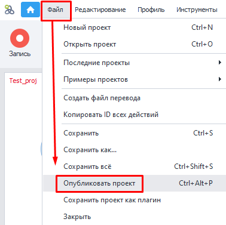
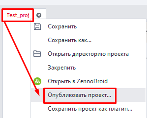
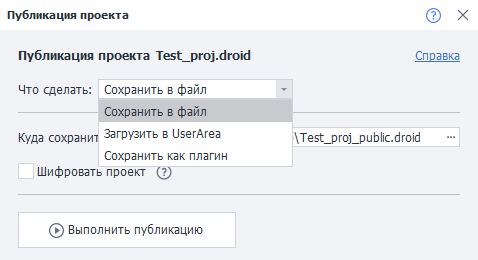
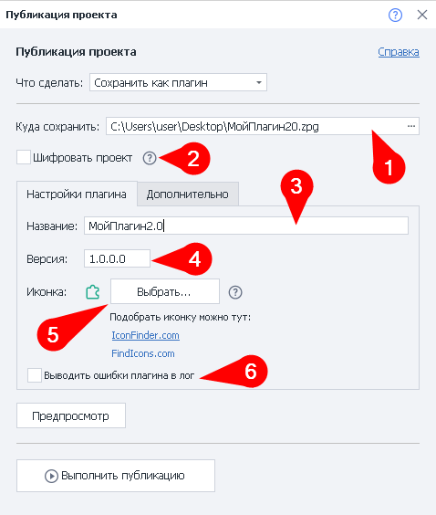
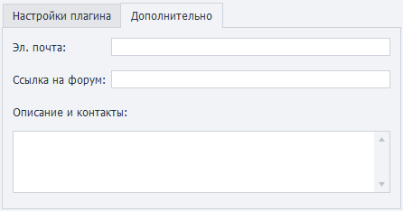
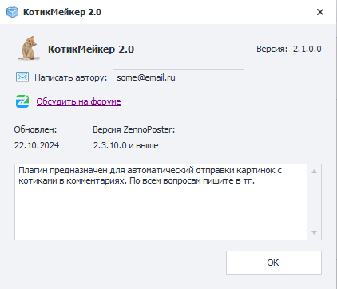
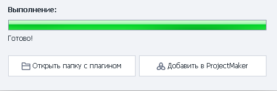

:::info **Please read the [*Terms of Use for Materials on This Resource*](../Disclaimer).**
:::
_______________________________________________  
## Description
Publishing your project collects all dependent libraries, encrypts, archives, and packages them into a ready-to-use template. You won’t need to manually gather a set of libraries or spell out where they should be—instructions aren’t needed for selling your template.

Any permissions you’ve set for the project stay the way you configured them.

There's also a **User Area Upload** feature. It saves you time on support and updates. Just upload the new version from ProjectMaker and your clients will get it automatically.

### What is it for?
- Granting users access to a template in **ZennoBox** or **ZennoPoster** via subscription.
- Saving ***plugins***.
- Encrypting projects that use third-party libraries.

### Advantages
- Packages all external dependencies into a single project.
- Lets your project run and launch faster because all code and logic are precompiled.
- Increases security. Even if your account gets stolen, nobody can open your project.
_______________________________________________
## How do you publish a project?
**There are three ways:**
#### With a keyboard shortcut
Default combo is `Ctrl+Alt+P`.

#### Through the top menu
**File → Publish Project**.

#### From the open project tab
**Right-click the desired project tab → Publish Project**.

_______________________________________________
## How to work with the tool

_______________________________________________
### What should you do?
Here you need to choose what you want to do with your project:
- **Save to a local file**
- **Upload to UserArea**
:::info **The project must already exist in UserArea for this.**
:::
- **Save as plugin**
:::warning **To save a project as a plugin, you need to use BotUI as the input settings.**
:::
_______________________________________________
### Save to file
#### Where to save
You need to set the local path on your computer where you want the project saved.

#### Embed external libraries
:::info **This option only appears if you use external libraries.**
:::

If you've added external libraries using the [**References from GAC**](../Project%20Editor/CustomCode/GAC_reference) block, you have to pick which of them to pack into the project.

:::warning **If you get errors, try placing the libraries next to your project’s .zp file.**
:::

#### Encrypt project
We recommend turning this on, especially if you use third-party libraries.
_______________________________________________
### Upload to UserArea
In this case, just select the project’s name from the dropdown list.

Read more about [**Selling Bots**](https://zennolab.atlassian.net/wiki/spaces/RU/pages/494895200) and [Using ZennoBox](https://zennolab.atlassian.net/wiki/spaces/RU/pages/495386651).
_______________________________________________
### Save project as plugin

#### Name
Come up with a name for your plugin. This is what will be shown in ProjectMaker.

:::tip **You can make several plugins with the same name.**
But it’s not recommended—give them unique names so you don’t get mixed up.
:::

#### Version
Set the current version of your plugin.

#### Icon
Upload an icon for your plugin to make it easier to spot among other actions.
- **Supported formats** — `png`, `ico`, `bmp`
- **Sizes** — from *16x16* to *128x128*

#### Log plugin errors
If you turn this on, logs will include the plugin error text that caused the template to stop.

If it’s off, you’ll only see this message: `Plugin processing error`.

#### "Advanced" tab

This tab is handy if you’re selling your plugin or just sharing it with others.

You can add your email for feedback, a description of your plugin, and other contact info here. It’s also useful to add a link to your plugin topic on our [**forum**](https://zenno.club/discussion/).

#### Preview and publish
Before saving your plugin, you can click **Preview** to see how it’ll look for others.

Once you click **Publish**, the project check and build process will begin. If everything’s fine, you’ll see this window:

_______________________________________________
## Limitations
You need to include all libraries required for publishing as dependent assemblies. If `library 1` relies on `library 2`, both must be in **`Reference`**. Sometimes this isn’t possible—some third-party assemblies might cause packaging or encryption errors, or even make the template unusable.

Always test your project with external dependencies. If something isn’t working, the first step is to try removing assemblies from the bundle.