---
sidebar_position: 3
title: Regexp Tester
description: Find text strings by set conditions.
---
:::info **Please read the [*Material Usage Rules on this site*](../Disclaimer).**
:::
_______________________________________________  
## Description  
**Regular expressions** are a kind of filter for searching text strings that match the conditions you set.  

Our built-in builder lets you quickly create rules without digging into all the nitty-gritty details.  

### Where are regular expressions used?  
- **Extracting info from website pages**  
- **Filtering data in lists and tables**  
- **Finding registration confirmation emails or links**  
- **Locating specific parts of text**  
- **Identifying rows to delete in lists**  
- **And tons of other handy uses**  
_______________________________________________
## Regular Expression Builder  
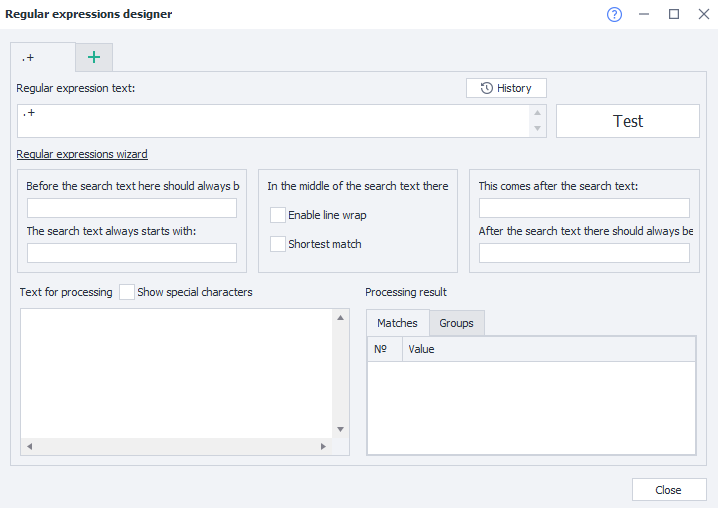  

### How to open it  
There are two ways:  
#### Using the Toolbar  
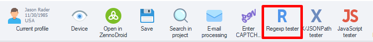  

#### From the Tools dropdown  
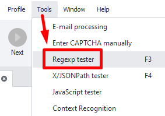
_______________________________________________
### Working with the window  
#### Tabs  
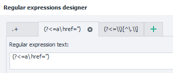  

You can work on several regular expressions at once in different tabs. The tab name is based on the expression’s text.  

#### History  
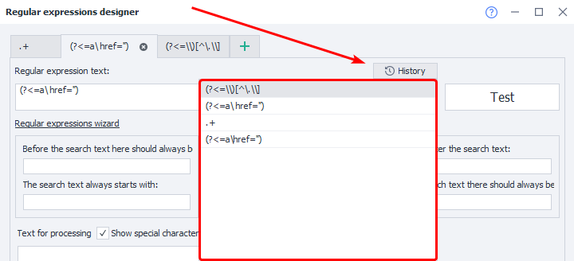  

All expressions you’ve previously tested with the **Test** button are saved here.  

#### Regular expression text  
This field holds the expression text built from your parameters. You can also edit it manually.  

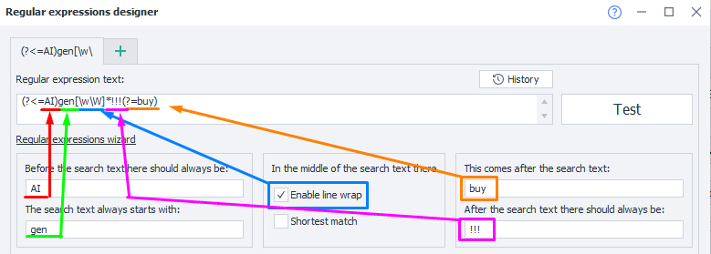  

:::warning **If you change anything in the “Helper” sections**  
All manual edits you made in the expression field will be lost forever.
:::  

#### The “Test” button  
When you press this button, your expression will be applied to the **Text to process**, and the result will show up in the **Processed result**.  

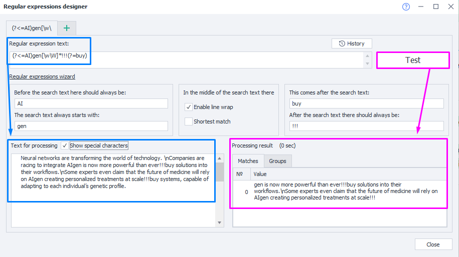  

#### The text before/after the target text  
Set what comes **before** and **after** the text you want to find. This content won’t be included in the expression’s result.  

#### The target text always starts with/ends with  
Here you specify what the found text should start or end with. This content will be included in the result.  

#### Enable line wrap
Lets you search multi-line text. Otherwise, the search only works on the first line.  

#### Shortest match  
If you turn on this option, you’ll get the shortest possible match for your expression.  

#### Text for processing
Paste in the text you want to extract your fragment from.  

:::tip **You can insert a value here right from a variable**  
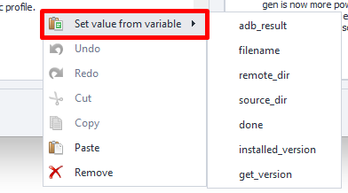  

The dropdown will only show variables from the current project.
:::  

#### Show special characters  
This setting determines if line breaks, tabs, etc., will be displayed as special symbols.

| Off    | On |
| :--------: | :-------: |
| 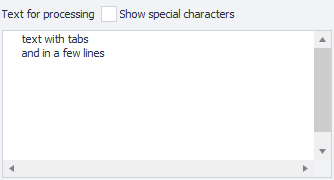   | 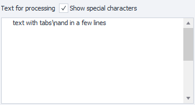     |  

#### Processing result  
- **“Matches” tab**  
Shows the result of applying your regex to the text.  
- **“Groups” tab**  
Shows results when your regex uses groups.  
_______________________________________________
## Usage example  
Let’s take a common task as an example—parsing links. Say you have the HTML of a page and want to grab all links from the code, then save them in a ***List***.  

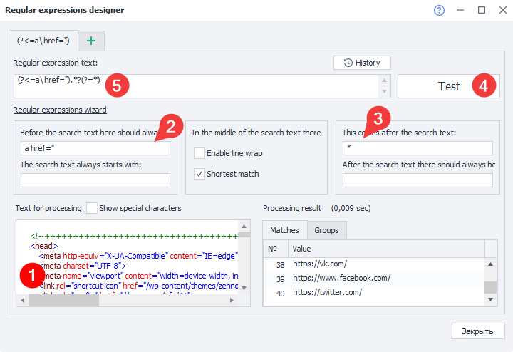  

**1**. Paste your source code in the field—the one you’ll be extracting links from.  
**2**. Indicate the tag that usually comes before a link—`a href=”`.  
**3**. Add the closing quote after the link and enable **Shortest match**, since you only want the string between two quotes.  
**4**. Test the new expression and check out the link list you get. If nothing shows up, try changing the search conditions.  
**5**. Now you can copy the finished regex and use it in your own template.  

:::tip **A regex searches as many substrings as are in the text**  
If you need a specific match, look at ***ranges***.
::: 
_______________________________________________
## Special characters  
Most characters in regular expressions mean themselves, but some are **special characters**.  
For example: `[` `]` `\` `/` `^` `$` `.` `|` `?` `*` `+` `(` `)` `{` `}`.  

You can escape them with a backslash `\` to make them literal in your regex.  

So, a very simple regex looks like this: `abc`. It matches the string *abc*.  

| Special character | Meaning | Example | Match |
| :----------------: | :------ | :----: |----: |
| `*`       |   Repeat previous character (0 or more times)   | `ab*c` |`abc`, `abbc`, `ac` |
| `.`           |   Matches any character (except newline)   | `a.c` |`aac`, `abc`, `acc` |
| `+`    |  Repeat previous character (1 or more times)   | `ab+c` |`abc`, `abbc`, `abbbbc` |
| `?` |  Repeat previous character (0 or 1 time)   | `a?c` |`abc`, `ac` |  
| &#124; |  OR operator   | a &#124; b &#124; c |`a`, `b`, `c` |
| `()` |  Grouping   | `zennolab(com)+` |`zennolabcom`, `zennolabcomcom` |
| `[]` |  Character set, matches one character   | `zennoposter[57]` |`zennoposter5`, `zennoposter7` |
| `[^]` |  Exclude characters in set   | `[^0-9]` |`abc` 123 |
| `-` |  Character range (inside square brackets)   | `[3-7]`, `[а-д]` |`3`, `4`, `5`, `6`, `7`, `а`, `б`, `в`, `г`, `д` |
| `^` |  Start of line   | `^a` |`a`aa aaa |
| `$` |  End of line   | `a$` |aaa aa`a` |
| `{}` |  Number of repeats of previous character—`{n}` exactly **n** times; `{m,n}` from **m** to **n**; `{m,}` at least **m** times; `{,n}` not more than n times.   | `zen{2}oposter`, `(abc){2,3}`    |`zennoposter`, `abcabc abcabcabc` |  
| `\` |  Escape special characters   | `a\.b\.c` |`a.b.c` |
| `\b` |  Word boundary   | `a\b`, `\ba`  |`zennola`, `ab` |
| `\B` |  Not a word boundary   | `\Ba` |zennol`a`b |
| `\s` |  Whitespace character   | `aaa\s?bbb` (one or zero spaces)  |`aaa bbb`, `aaabbb` |
| `\S` |  Non-whitespace character   | `a\S+bc` |`aaabc` |
| `\d` |  Digit   | `abc\d+` |`abc123` |
| `\D` |  Non-digit   | `abc123\D+` |`abc` |
| `\w` |  Any letter, digit, or underscore   | `\w+` |`abc_123` |
| `\W` |  Any non-letter, non-digit, non-underscore (spaces or others)   | `\W+` |`₽ @$ &` |
| `\r` |  Carriage return. Moves the cursor to the start of line, doesn’t start a new line.   | `Hello, World!\n This is a test.\r` |`This is a test.` |
| `\n` |  New line.   | `This is a test.\r Another line.\n` |`Another line.` |
| `\t` |  Tab/indentation.   | `Name\tAge\tCity` |`Name   Age     City` |
_______________________________________________
## Modifiers  
They take effect from where you specify them to the end of the regex or until you turn them off.

| Modifier  | What it does | 
| :----------------: | :------ | 
| `(?i)`  |  Ignore case  | 
| `(?-i)` |  Make case matter again   | 
| `(?s)`  |  Dot matches line breaks  | 
| `(?-s)` |  Dot does not match line breaks   | 
| `(?m)`  |  Multiline search. `^` and `$` match at line breaks. | 
| `(?-m)` |  Multiline search off. `^` and `$` only match at start and end of whole text.   | 
| `(?x)`  |  Ignores whitespace in regex; `#` starts comments.  | 
| `(?-x)` |  Whitespace matters in regex; `#` isn’t allowed for comments. | 
_______________________________________________
## Lookahead and lookbehind
Search for text fragments by checking what’s around them (before or after), but not including that in the result.

Negative lookarounds are less common—they make sure something does *not* appear right before or after your target fragment.

| Pattern | Type | Example | Match |
| :----------------: | :------ | :----: |----: |
| `(?=pattern)` |   Positive lookahead   | `Louis(?=XVI)` | LouisXV, `Louis`XVI, `Louis`XVIII, LouisLXVII, LouisXXL |
| `(?!pattern)` |   Negative lookahead   | `Louis(?!XVI)` |`Louis`XV, LouisXVI, LouisXVIII, `Louis`LXVII, `Louis`XXL |
| `(?<=pattern)`    |  Positive lookbehind   | `(?<=Sergey )Ivanov` |Sergey `Ivanov`, Igor Ivanov |
| `(?<!pattern)` |  Negative lookbehind   | `(?<!Sergey )Ivanov` |Sergey Ivanov, Igor `Ivanov` |  
_______________________________________________
## Collection of handy regex patterns
### E-mail address  
```
(?i)[A-Z0-9._%+-]+@[A-Z0-9-]+.+.[A-Z]{2,4}
```
### Phone number  
```
+?(\d{1,3})?[- .]?(?(?:\d{2,4}))?[- .]?[\d-]{5,9}
```
### IP address  
```
(?:(?:25[0-5]|2[0-4][0-9]|[01]?[0-9][0-9]?)\.){3}(?:25[0-5]|2[0-4][0-9]|[01]?[0-9][0-9]?)
```
### URL address  
```
(https?:\/\/)?([\w\.]+)\.([a-z]{2,6}\.?)(\/[\w\.]*)*\/?
```
### Extract file name and extension from path  
```
(?<=\\)[^\.\\]*(\.[^\.]+){1,}$
```
_______________________________________________
## Useful links  
- [**Regular Expressions for Every Situation**](https://zenno.club/discussion/threads/reguljarnye-vyrazhenija-na-vse-sluchai-zhizni.20829/)
- [**Text processing**](../Data/Text)