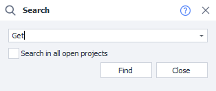
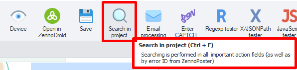
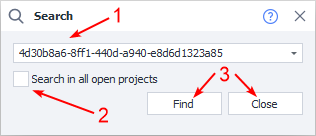
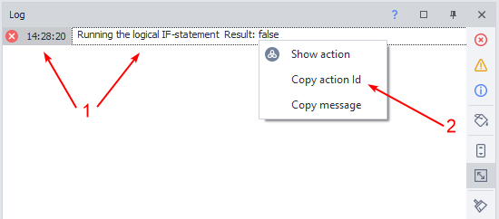

---
sidebar_position: 11
title: Search by Project
description: Searching for errors, variables, and actions.
---
:::info **Please read the [*Material Usage Rules on this site*](../Disclaimer).**
:::
_______________________________________________   
## Description  
This tool helps you find an action in your project by its id or by a variable it uses.

It can come in handy for:
- *debugging your project*;
- *searching for errors, variables, and actions*;
- *quickly jumping to a specific project element*.

### How do you start searching?
**There are two ways:**
- Using the keyboard shortcut **`CTRL+F`**.
- Through the Toolbar, if you’ve added the relevant button there.  

_______________________________________________
## Working with Search
### Steps to follow

**1**. Enter the action id or variable name in the field.  
**2**. Check the box if you have more than one project open and want to search through all of them.  
**3**. Start the search, or close the window if you’ve changed your mind.  

:::tip **In our example, we’re entering an error id.**
We’ll explain how to get it in a bit.
:::

### How to get an action id
:::info **Where do errors come from?**
They appear in the [**Log**](../pm/Interface/Log_window) when running a template if something goes wrong.
:::

**1**. Right-click on the error you’re interested in.  
**2**. Click **Copy Action Id**.  

:::tip **You can copy an id from any log message.**
Not just errors.
::: 
_______________________________________________
## Example of Use
Let’s say that after creating your project in ProjectMaker, you decide to run it in ZennoDroid. During execution, you get an error that you need to find and fix. Here’s how you’d do it:
1. Copy the error code.
2. Open **Project Search**.
3. Paste in the error id you got earlier.
4. You’ll be taken to the action where the error occurred.
5. Now you can fix the error or change the logic for that particular flow.

You can use this method for paid templates too. Authors often sell products in closed format. You won’t be able to just look inside and fix the problem yourself. You’ll need to copy the error code and send it to the developer.
_______________________________________________  
## Useful Links
- [**Log Window**](../pm/Interface/Log_window)
- [**The “Log” Tab in ZD**](../Execution/Log)
- [**Element Search**](../pm/Creating/ElementSearch)