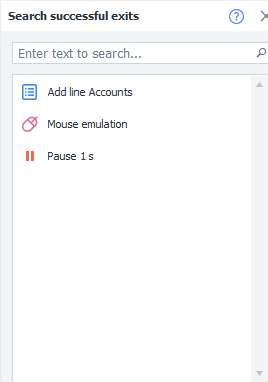
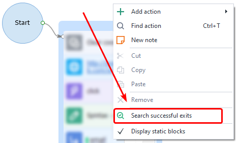
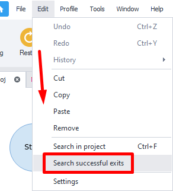
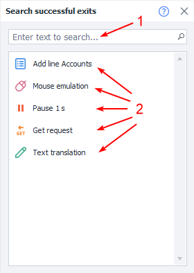
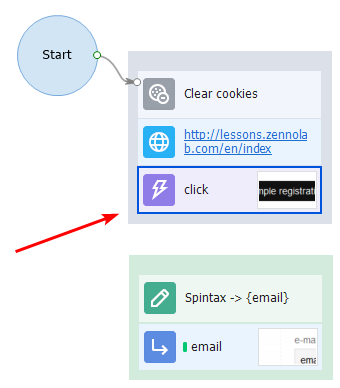

---
sidebar_position: 12
title: Finding Successful Exits
description: Searching for unplanned successful project completions.
---
:::info **Please read the [*Material Usage Rules on this site*](../Disclaimer).**
:::
_______________________________________________  
## Description  
This tool helps you find any unplanned **successful** project completions, as well as breaks in its workflow.

### How to open it?  
**You’ve got two ways:**  
#### Through the Context Menu  
Right-click anywhere on the canvas → Find Successful Exits.

  

#### Via the Top Menu  
Edit → Find Successful Exits.

  
_______________________________________________  
## Working with the window  
### Let’s take a closer look  

*1*. Quick search bar for finding the right action.  
*2*. A list of actions that can lead to the successful completion of your project.

If you double-click on one of the actions, the project view will jump right to it.

:::tip **The search only finds a function if it’s used inside an action.**
:::

### How can you use this?  
Sometimes you might accidentally forget to connect two actions with logic arrows. When that happens, your project ends up finishing early with a success, after only doing part of what you wanted—it won’t throw any errors, though.

#### Example of early completion  
  

In the project shown, it will finish successfully on the **click** action, because it’s not connected to any other actions.

If your project has 10 blocks or fewer, this isn’t a big deal. But searching for this kind of break by hand in big templates can take forever.

### Example workflow  
1. Open up the **Find Successful Exits** window.  
2. Compare the list of successful completions with the logic you’d planned.  
3. Fix your template if needed.

So if you made a mistake somewhere, this tool will help you spot any trouble spots.

:::info **We recommend using this after you finish each template, to properly debug your work.**
:::
_______________________________________________  
## Helpful links  
- [**Run Event**](../Android/ProLite/RunEvent)  
- [**Text Processing**](../Data/Text)  
- [**Pause**](../Project%20Editor/Logic/Pause)