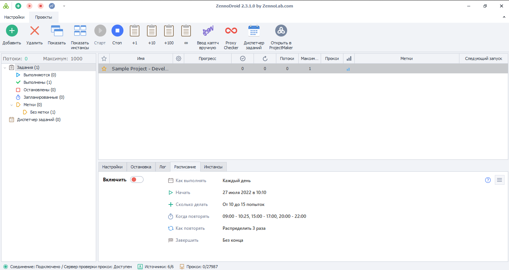

---
sidebar_position: 1
title: What is ZennoDroid?
description: Introduction to the program.
---  
:::info **Please review the [*Rules for using materials on this site*](../Disclaimer).**
:::

export const VideoSample = ({source}) => (
  <video controls playsInline muted preload="auto" className='docsVideo'>
    <source src={source} type="video/mp4" />
</video>
);

_______________________________________________  
## Description  
This is a software suite for automating tasks and performing actions on Android devices (virtual or real).

You do things on the device, and the program records them into a project. Then you can edit it and add new steps.

<VideoSample source={require("@site/static/video/Screen-2-ru.mp4").default}/>  
_______________________________________________
## Main features  
### Repeating actions  
Easily record and play back your actions in Android apps.

-  **Full Android automation**    
Fill out forms, collect data, and explore apps in a special device window.  
-  **Multithreading**   
Run projects across multiple threads at the same time (parallel work on several Android devices).  
-  **Bot interface**   
Design nice and user-friendly interfaces for your bots.  
_______________________________________________
### Form filling  
Automatically fill out forms with the needed data.

-  **Scheduled tasks**    
Set your tasks to run whenever you need them.  
-  **User data generation**   
Automatically generate user data, anything from names to addresses.  
-  **Proxy support**   
Set up a proxy for your Android virtual machine if needed.
_______________________________________________
### Button clicking  
Automate button and link clicks.

-  **User emulation system**   
Interact with the screen using your keyboard: Tap, Long Tap, and Swipe. The actions will look just like what a real person would do.  
-  **Virtual machine control**   
Everything from creating a virtual Android device to fully resetting it.
_______________________________________________
### Data collection  
Extract data from any apps you like.

-  **App structure analysis**   
Use special tools to analyze the XML code of apps.  
-  **Parsing tools**   
Collect, process, and save data in any format you prefer. 
-  **Email**   
Work with mailboxes: find, analyze, and extract info from emails.
_______________________________________________
### Device emulation  
Emulate any device you want and its settings: model, IMEI, and so on.

-  **Parameter emulation**   
Emulate any settings and fingerprints of an Android device, from model type to cellular operator.  
-  **Superuser mode (root)**   
Get unlimited permissions on the emulated device by enabling root access.  
-  **Working with apps**   
Install APKs, get a list of installed apps, or remove them if needed.
_______________________________________________
### Handling any kind of data  
Work with texts, tables, images, databases, and more.

-  **Data management**   
Work with any type of data, from text and images to Google spreadsheets and databases.  
-  **HTTP and FTP work**   
Speed up your projects with HTTP and FTP requests.  
-  **Integration with 35 services**   
Connect services like captcha solving, SMS activation, content creation, or proxies—all in one click.
_______________________________________________
### Bonus features  
-  **Custom code**   
Expand what the program can do using C#, JavaScript, and command line.  
-  **Logic operations**   
Set up different actions depending on conditions.  
-  **Proxy checker**   
Check proxies for functionality, speed, anonymity level, country, type, and 10+ other parameters.  
_______________________________________________
## Useful links  
- [**Installing ZennoDroid**](../Installation/ZD_Install)  
- [**ZennoDroid demo version**](../Installation/ZD_Demo)  
- [**Key concepts**](../basicterms)