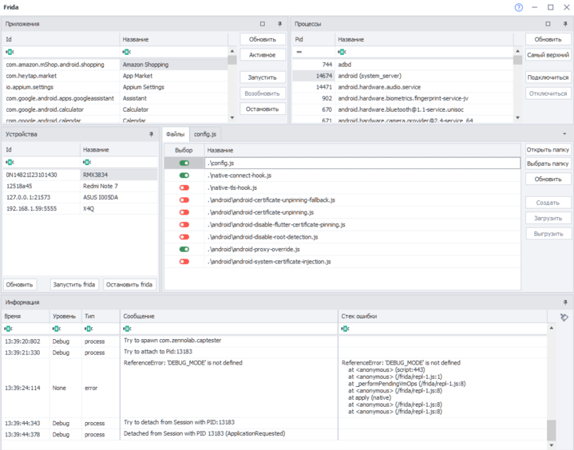

import DisclaimerNotice from '@site/src/components/DisclaimerNotice';

<DisclaimerNotice />

_______________________________________________  
12.01.2026

**Added:**

[+] **ZD ENTERPRISE.** Device data for correct generation of the kernel and communication module (baseband/radio) has been added to the device generator used in the **Generate device** action and the **C# API** `GenerateRandomLSPosedSettings/SetRandomLSPosedSettings`.

[+] The **Get device list** action, when executed in ProjectMaker, now retrieves data about all occupied devices, including those used in projects running in ZennoDroid. Previously, ProjectMaker could not see threads running in ZennoDroid.

[+] An option to select very low **image capture quality** has been added to the settings tab. This helps reduce load on the connection channel when working with a large number of threads.

[+] **Frida** has been updated to version 17.5.1.  
Support has been added for running scripts after critical changes (breaking changes) were introduced in [Frida 17](https://frida.re/news/2025/05/17/frida-17-0-0-released/), which previously removed the ability to run scripts in CLR.

[+] Instructions for intercepting traffic via **Burp** have been updated. [New video tutorials on setting up traffic interception with Frida and Burp Suite](/zennodroid/Tools/Frida#обновлённая-видеоинструкция-для-zennodroid-2470-и-выше).

[+] The **Frida Toolkit** window has been redesigned. You can now select multiple scripts at once to apply them simultaneously within a single application. The information window has been divided into columns, and filters for different event types have been added.

[+] Links to the new **Wiki documentation** and **Video tutorials** have been added to the main program page.

[+] **ZD ENTERPRISE.** The **ZennoDroid Module** has been updated to version 1.11.5.  
Kernel version and baseband/radio version spoofing have been added.  
Cellular operator spoofing has been improved.  
Improved hiding of enabled **USB Debugging** and **Developer Mode**.

[+] **ZD ENTERPRISE.** Improved **device name spoofing** (marketing name).

[+] **ZD ENTERPRISE.** Added **Bluetooth name synchronization** with the marketing name.

[+] **ZD ENTERPRISE.** Improved **cellular operator country spoofing**.

**Fixed:**

[\] **ZD ENTERPRISE.** Fixed an error when sending characters in **Native Input** mode.

[\] **ZD ENTERPRISE.** Fixed an issue where the **GPU Vendor** field value disappeared in the **GPU Settings** action.

[\] Fixed **APK installation** with caching enabled in MEmu.

[\] Fixed an error when clearing an input field using the `{AndroidKeys.Clear}` macro (LDPlayer).

[\] Fixed an error when **sending and receiving files** with superuser permissions.

[\] **ZD ENTERPRISE.** Fixed an **app crash/page closure** in some applications when navigating to the SMS sending page.

[\] Fixed an issue that caused slow **command execution** when running a large number of threads.

[\] **ZD ENTERPRISE.** Fixed an error when **setting a proxy** and **saving app data** on some firmware versions.