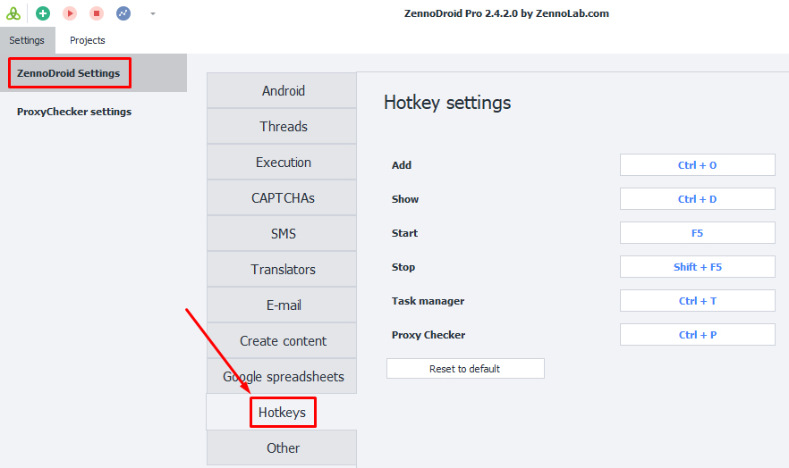
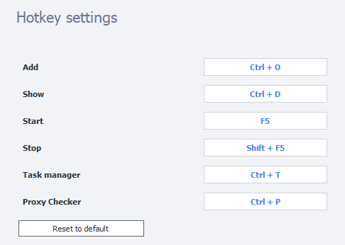

:::info Please read the [*Terms of Use for Materials on This Resource*](../Disclaimer).
:::
_______________________________________________
You can set up hotkeys in **ZennoDroid Settings**. Here, we’ll go through the default hotkey options, but you can also change them to whatever combinations you like.

_______________________________________________
## Description
- **Add `Ctrl + O`**. Opens the window for adding a new project to the program.
- **Show `Ctrl + D`**. Switches to the **Instances** tab for the selected project.
- **Start `F5`**. Starts the selected project.
- **Stop `Shift + F5`**. Stops the selected project.
- **Task Manager `Ctrl + T`**. Opens the Task Manager window.
- **Proxy Checker `Ctrl + P`**. Opens the Proxy Checker control window.
_______________________________________________
## Changing Hotkeys
To change a combination, just click the field you want and hold down your preferred keys on the keyboard. If you want to go back to the default settings, just click **Reset to Default**.

_______________________________________________
## Useful Links
- [**Task Manager**](./Task_Manager)
- [**ProxyChecker for ZD**](./ProxyCheckerZD)
- [**What settings are there?**](../category/настройки)