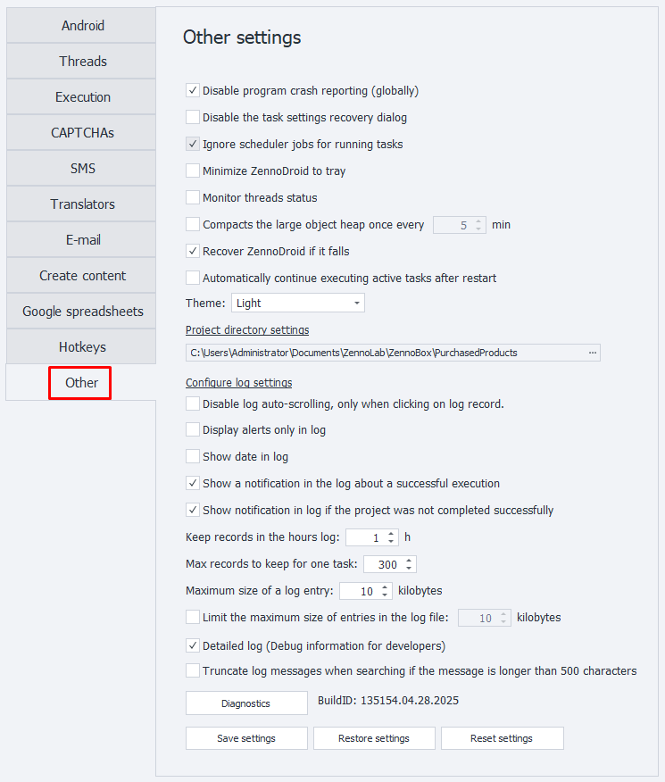
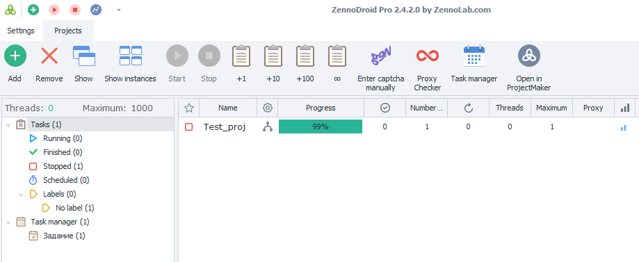
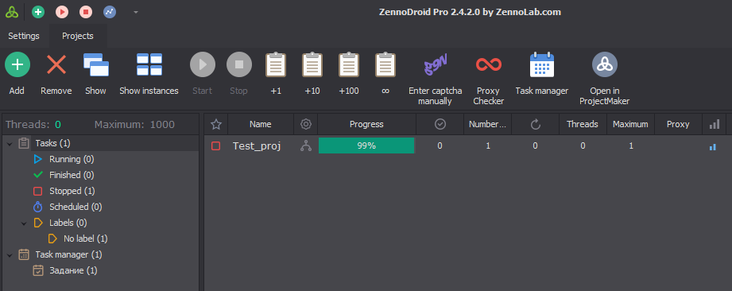
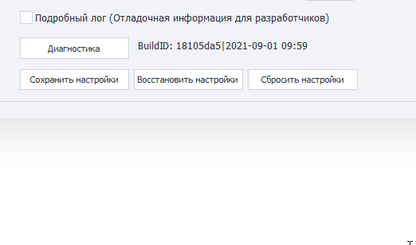

:::info **Please read the [*Terms of Use for materials on this resource*](../Disclaimer).**
:::
_______________________________________________
## Settings from the "Other" tab.

### Disable program error reports (globally).
Sometimes if an app crashes, the emulator freezes up. ZennoDroid keeps an eye on this and tries to recover. If an error message window stays open after the emulator crashes, it's very likely it won't restart.

_______________________________________________
### Disable project settings recovery dialog.
This turns off the option to recover your settings if the program crashes. We don’t recommend checking this box. But it might help in some cases, like if the recovery window blocks ZennoPoster’s auto-start.

_______________________________________________
### Skip scheduler task for running tasks.
When this is on, the running project gets priority in the queue and will finish first before a scheduled task starts, if by chance they overlap.

_______________________________________________
### Minimize ZennoDroid to the tray.
When you minimize the app window, it will go to the tray.

:::tip **What's the tray?**
*The tray is a part of the Windows taskbar that pops up when you click the arrow on the bottom right. It’s used for programs that are running in the background but aren’t used all the time.*
:::

_______________________________________________
### Track thread status.
This is only for collecting stats, which can be useful if you contact [support](https://helpdesk.zennolab.com/ru/conversation/new). It starts tracking the status of threads in the app.

_______________________________________________
### Compact large object heap.
Sets an interval (in minutes) after which the *large object heap* will be compacted. This is useful when you’re working with large strings, for example, when auto-search is on in ProxyChecker.

_______________________________________________
### Auto-continue active tasks after restart.
Decides whether tasks that were running before you closed the app should automatically continue when you open it again.

_______________________________________________
### Theme (Light/Dark)

_______________________________________________
### Project downloads folder.
Projects you get from other users will be saved here. The folder names will use either the project developer’s email or their ZennoLab ID.

:::warning **Do NOT copy projects into this folder by hand!**
:::

_______________________________________________
## Log [Settings](../pm/Interface/Log_window).

### Disable log autoscroll only on log entry click.
Autoscroll in the log will turn off only after you click an entry.

_______________________________________________
### Show notifications in the log only.
Notifications sent using the [**Notification**](../Project%20Editor/Logic/Notification) action will just go to the log, with no pop-up window, no matter how the action is set.

_______________________________________________
### Show date in the log.
Shows the current date in the log, on top of everything else.

_______________________________________________
### Log notifications of successful project completion.
A log notification when a project finishes successfully.

_______________________________________________
### Log notifications of unsuccessful project completion.
Info in the log about projects that didn’t finish successfully.

_______________________________________________
### Log record retention time (hours).
Specifies the max amount of time (in hours) log entries will be stored.

_______________________________________________
### Max entries per task in the log.
How many log entries for a single task. **Maximum is 9999.**

_______________________________________________
### Max log entry size.
Limits the max size (in kilobytes) of a log entry that can be *shown* in the log window.

_______________________________________________
### Limit max log entry size in log files.

:::tip **Recommended to turn on.**
*If you work with big data and don’t need full logs, **we recommend turning this on**. This will boost performance and lower memory use.*
:::

This sets a limit for the size of entries that can be *saved* in the log file.

:::info **Logs.**
Log files are stored in the ZennoDroid installation folder, in the **Logs** directory.
For example: `C:\Program Files\ZennoLab\RU\ZennoDroid Pro\2.3.8.0\Progs\Logs\`
:::

:::warning **The program needs to be restarted for changes to take effect.**
:::

_______________________________________________
### Detailed log (Debug info for developers)
Starts detailed recording of what’s going on. Might come in handy for support requests.

_______________________________________________
### BuildID
This line shows the current program version and release date, using letters and numbers.

:::tip **You can select and copy the value here using the context menu.**
:::

_______________________________________________
## Available buttons.

### Diagnostics.
Opens the `diagnostic.exe` utility, which gives you info if there’s a problem. When it finishes, you’ll find a `report.zip` file in your ZennoDroid folder.

_______________________________________________
### Save settings.
Saves your current program settings. You’ll need to hit this button first, then close the app.

_______________________________________________
### Restore settings.
Lets you put your settings back to the last version you saved. Same deal—hit the button, then restart the app.

_______________________________________________
### Reset settings.
Resets all settings to their defaults.

_______________________________________________
## Useful links.
- [**Log window**](../pm/Interface/Log_window)
- [**What settings are there?**](../category/настройки)