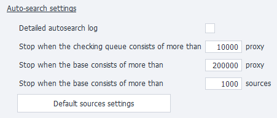
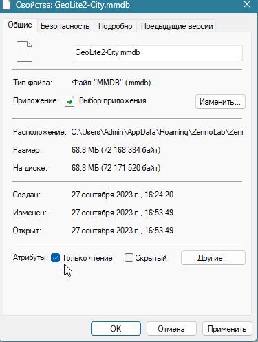

:::info **Please review the [*Terms of Use for materials on this resource*](../Disclaimer).**
:::
_______________________________________________
## What is **ZennoProxyChecker**?
This is our tool for loading, storing, automatically re-checking, and supplying proxies in various ways based on flexible criteria.
It comes both as a standalone app and is built right into **ZennoDroid**.
### Key features:

**Adding**

You can add proxies in several ways: manually by entering the proxy addresses, or automatically—the program can search for and collect (parse) proxy addresses from web pages or local files with proxy lists.

 

**Checking**

ProxyChecker can check proxies by about 20 parameters, filtering out the risky ones and picking only the best and fastest. You can also check proxies for specific URLs, selecting those that work with certain web resources.

 

**Supply**

You can set up several channels for supplying proxies, so different templates get proxies with different parameters. Proxy lists can also be saved to local files or shared over the network, providing fresh proxies on a schedule.

  
_______________________________________________
## Quick start.
The main goal of the program is to check your proxies and pick out working ones for use in your projects.
Here are the main steps:

**1.** Open the **Sources** tab → **Add proxies**.  
Proxies should be in `ip:port` format for regular proxies, or `login:password@ip:port` for proxies with authentication.

**2.** Go to the **Management** tab → click **Load proxies** and **Check proxies** → start with the **Start** button.

  

**3.** Get your checked proxies in the **Proxies** tab. There you can also set up *Rules* for selecting suitable proxies.

**4.** You can **Copy to clipboard** or **Save to file** your proxies.

_______________________________________________
## ProxyChecker settings.

### Proxy checking server address.
  

Here you choose which servers from the list will be used to check your proxies.
#### List.
URLs that the program uses to check proxies. By default, there are five addresses but you can add your own.
#### **Test** Button.
When you click it, the program will sequentially check each address in the **List** for availability. The test stops when the first working check server is found, or when the list runs out.
#### Selected.
Here you'll see the address that checks whether all the proxies are alive or not. This will be the first working address from the **List**.
_________________
### Behavior settings.

#### Treat non-anonymous proxies as dead.
The program will filter out non-anonymous proxies and only provide anonymous ones.
#### Delete proxies on program exit.
Cleans out the proxy list on program exit.
#### Threads per process.
Sets the number of threads used for checking.
:::warning **You’ll need to restart the program for changes to take effect.**
:::  
_______________________________________________
### Proxy parsing settings.
  
With the builder, you can add new structures (regular expressions) for parsing proxies or edit existing ones. Click **Open Builder** to get started.

 
#### **Structure list** tab.
By default, there are already 2 regular expressions here. You can also **Add (1)** or **Delete (2)** your own structures. With the **Field help (3)** button you can see the purpose of different fields.

  

Some sites might use a different proxy format, so if needed, you can create your own parsing structure for almost any format and test it on a specific source using the tester.
#### **Test source** tab.
 
- **Source address.** Enter the website address where proxies will be parsed.
- **Selected structure.** Choose a previously added parsing rule from the **Structure list** tab.
- **Test button.** Starts the test.
- **Test result window.** Shows the proxies found based on your parsing rule.
:::warning **Parsing results are not saved.**
They’ll be lost when you close the **Builder** window or hit **Cancel**.
:::  
_______________________________________________
### Auto-search settings.

#### Detailed auto-search log.
Check this to see a detailed report of ZennoProxyChecker in auto-search mode.
#### Stop if over *XXX* proxies are in the check queue.
If there are more proxies in the queue than this number, auto-search will stop.
#### Stop if over *XXX* proxies are in the database.
If there are more proxies in the database than this number, auto-search will stop.
#### Stop if over *XXX* sources are in the database.
If there are more sources in the database than this number, auto-search will stop.
#### Default source settings.
These settings are applied to every newly added source.
_________________
### Proxy checking settings.

#### Use .NET process for proxy checking.
If enabled, proxies will be checked using the .NET version of CheckingProcessor (***requires restart***).
_________________
## How to get the latest GeoIP database?
### 1. [Register on the website](https://www.maxmind.com/en/account/login)
### 2. Go to the ‘Downloads’ section.

### 3. Download the ‘GeoLite2 City’ database.

### 4. Unzip it and place the `GeoLite2-City.mmdb` file in:
`C:\Users\{username}\AppData\Roaming\ZennoLab\ZennoDroid\2\Data\`
### 5. Set the `GeoLite2-City.mmdb` file to read-only.

_________________
## Useful Links
- [**ZennoProxyChecker Homepage**](https://zennolab.com/ru/products/zennoproxychecker/)
- [**What is a proxy? For complete beginners**](https://habr.com/ru/articles/866406/).
- [**Detailed ZennoProxyChecker Manual**](https://zennolab.atlassian.net/wiki/spaces/RU/pages/475365507/ZennoProxyChecker).