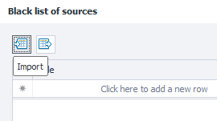

:::info **Please review the [*Terms of Use for content on this site*](../Disclaimer).**
:::
_______________________________________________

## Control Panel
This window opens up by default. Here’s where you manage proxy collection and set up each stage.

- **Start/Stop**. You use these buttons to start or stop collecting and checking proxies.
- **Filters**. A set of rules applied to proxies after they’re grabbed from the source but before they go into the program’s database.
- **Rules**. These are conditions for picking proxies from the "live" list.
- **Network Monitor**. With this built-in tool, you can test your internet connection for the maximum number of simultaneous threads.
- **Help**. Opens the product manual in your browser.
_________________
### Proxy Sources

This is where you set up loading proxies from sources. You can click the globe icon to go straight to the **Sources** tab.
_________________
#### Number of Sources

The top number shows how many active (working) sources there are, the bottom one is the total number.
#### Load Proxies Button
When you click this, proxy collection from the sources will start.

With the gear button, you can choose how many threads will be used to load proxies from the sources.
#### Enable Auto Search

:::warning **This button is only active when proxy loading is enabled.**
:::
After clicking it, ProxyChecker will start searching the internet for proxy sources all by itself. If you click the gear, you can fine-tune the auto search settings.
_________________
### Proxy Database

Here’s where you actually start checking proxies. You can click the round cell icon to go to the **Sources** tab.
#### Check Proxies Button

This starts the checking process. Next to it is the familiar gear icon for check settings. Here you can set the number of checking threads and a limit for live proxies — once you hit that, checking stops.
_________________
### Live Proxies

Here you can see the number of live proxies and set the amount of time they’ll keep their live status. You can click the monitor icon to go to the **Proxies** tab.
#### Clear List Button

When you click this, the live proxies list gets cleared according to the set live-time, which you can set by clicking the gear.
_________________
## Sources Panel

### Wizard

This helps you add **parsing sources** into the program more easily.
#### What do you want to add?

There are four options:
- **Paste proxies straight into the program.** When you choose this, an empty window opens for you to add proxies.
- **Proxy source.** Here you can specify a **file path** or a **URL (web page)** to collect proxies from.
- **List of proxy sources.** It’s basically the first option, but lets you add several sources at once.
- **Path to a list of proxy sources.** Like option two, but you can enter multiple paths.
_________________
### Main Sources Window
This tab shows all the proxy sources you’ve added. You’ll also find controls to tweak source settings, delete or add sources, see proxy counts, and more.

#### Available Buttons:
- **Add Proxies.** Lets you add a list of proxies.
- **Add Source.** Lets you add a new proxy source.
- **Source Settings.** This button changes the settings for already added sources.
- **Delete.** Use this to delete unwanted sources.
:::warning **Deleting a source will also remove all proxies from that source.**
:::
- **Save.** This button saves source addresses to a file.
- **Load Proxies.** Loads proxies from a source.
- **Check Proxies.** Starts checking proxies for live ones.
- **Recheck Live.** Lets you recheck already found live proxies from sources.
- **Expand.** Expands the group with the source list if it was collapsed before.
- **Collapse.** Collapses the list.
- **Auto Mode Panel.** With this button, you turn on a panel for quick loading and checking control. This panel shows up above the source list:

The left side of the panel shows source count (live/total). On the right you have buttons for loading, searching, and checking proxies.
- **Load Time.** Adds three new columns to the table.

- **Delete All Proxies.** Wipes all proxies from the program.
- **Blacklist.** If proxies don’t fit your project or you don’t trust the source, you can add it to the blacklist.

_________________
## Useful Links
- [**ZennoProxyChecker Main Page**](https://zennolab.com/en/products/zennoproxychecker/)
- [**ProjectMaker Interface**](../category/интерфейс)
- [**Detailed ZennoProxyChecker Help**](https://zennolab.atlassian.net/wiki/spaces/EN/pages/475365507/ZennoProxyChecker)