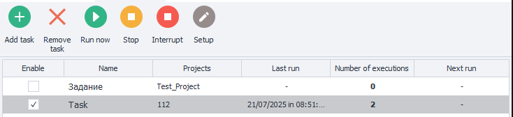

:::info **Please read the [*Rules for Using Materials on This Resource*](../Disclaimer).**
:::
_______________________________________________
This tool lets you set up your projects to run on a schedule or in response to a trigger. It works a lot like the **Scheduler**, but with one key difference: you can set up a schedule for several projects at once, not just one at a time. Projects will run in order, from top to bottom.
_______________________________________________
## Main Menu

### Available Buttons:
- **Add Task**. Creates a new task from scratch.
- **Delete Task**. Deletes the selected task.
- **Run Now**. Instantly runs the selected task one time.
- **Stop**. Graceful stop — the current task will finish whatever it’s doing, and then the execution stops, even if there are more projects waiting in the queue.
:::info **This also disables the schedule.**
To start it up again, just check the box next to the desired task in the ***Enable*** column.
:::
- **Abort**. Force stop — immediately interrupts whatever is running.
- **Edit**. Opens the settings for the selected task.
_______________________________________________
## Creating a New Task

_______________________________________________
## Schedule Setup Window
Click the **Add Task** button. A new window with scheduling options pops up. Set up the schedule, then click **Next**.

**You can flexibly set how often to run the tasks:**
- *Once a day;*
- *Every day;*
- *Every week (choose specific days);*
- *Every month (set a range of days);*
- *Or by trigger (attach a trigger file).*

_______________________________________________
## Add Projects Window

### Available Buttons:
- **Add**. Opens the file picker. You can select multiple templates at once.
- **Delete**. Removes the selected template from the task.
- **Up/Down**. Changes the order of templates in the queue. The higher it is, the higher the priority.
- **Continue on Errors**. If this is enabled, execution moves to the next template in the queue, even if the current one finished with errors.
- **Executions per Project**. Sets how many times each project in the task will run consecutively.

### "Group" Column:

This lets you group projects inside a task. Templates with the same group name next to each other will run in parallel. Only after all projects in the current group finish does it move on to the next group (or template).
:::info **Note:**
*You can type anything you want into this column.*
:::
_______________________________________________
## Task Table

### Columns
All your tasks show up in the Task Table, which has these columns:
- **Enable**. Switches scheduled execution of the task on or off.
- **Name**. Task name. By default, every new one is called “Task.”
- **Projects**. The list of projects inside this task.
- **Last Run**. When the task last ran.
- **Executions**. How many times this task has run so far.
- **Next Run**. When it’s scheduled to run next.
- **Sort Icon**. You can sort tasks by any column; just click its title.
_______________________________________________
## Task Settings

### How to Open Them
There are a few ways:
- Select a task, then click **Edit** in the main menu.
- Right-click the task to open the context menu.
- Double-click the task.

### Task Name
You can give your task a new name in this field.

### The “Projects in Task” Tab

- **Edit Project List**. Same as before: you can **Add** or **Delete** projects, change their order, or assign groups.
:::tip **Double-click a project to open its Input Settings.**
:::

### The “Settings” Tab

:::warning **These settings are for each individual project, NOT for the whole task!**
:::
- **How Many to Run**. Number of times to run the project. If set to `-1`, it will run endlessly — it’ll keep running until the number you set under **Success Count** in the **Stop** tab is reached.
- **Max Threads**. Max number of threads that can be used for this template.
- **Proxy**. Whether or not to use proxies from the built-in **ProxyChecker**.
- **Rules**. How proxies will be chosen.

### The “Stop” Tab

- **Success Count**
By default, this is the number you set under **Executions per Project** when creating the task. If set to `-1`, it runs endlessly — as many times as set under **How Many to Run** in the **Settings** tab.
- **Consecutive Failures**
How many errors in a row are allowed before switching to the next template in the list. The task can also be stopped if the **Continue on Errors** box isn’t checked.
:::warning **Don’t set this to `-1`.**
Otherwise, if an error happens, the template will never finish.
:::
- **Execution Timeout (seconds)**
If the project doesn’t finish in time, it gets force-stopped.
- **Run BadEnd on Project Abort**
**BadEnd** is an action in **ProjectMaker** that runs extra steps if a template ends with an error. This setting lets you trigger that on abort (manual or by timeout).
  

### The “Execution Conditions” Tab

This is where you edit the schedule for running a project.
_______________________________________________
## How to View a Project’s Log
Go to the “Projects” tab → select a task → pick one or more projects (hold Ctrl) → the **Log** will show up.

_______________________________________________
## Useful Links
- [**BadEnd**](../Project%20Editor/Logic/BadEnd)
- [**Log Window**](../pm/Interface/Log_window)