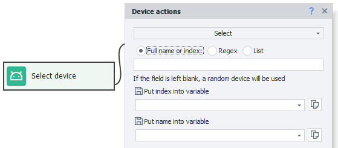
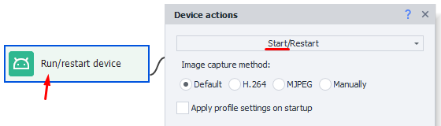

:::info **Please read the [*Terms of Use for Materials on This Resource*](../../Disclaimer).**
:::
_______________________________________________
Let’s go over how to properly choose and start a virtual machine when working with Zennodroid.
_______________________________________________
## How Virtual Machines Work in ZD
If you don’t specify a name or index in the **Choose** action, ZennoDroid will always pick a random virtual machine that’s not busy at the moment. If you set a specific VM, you can avoid cases where different threads pick the same one at the same time.
#### Example:
A virtual machine named ***Memu_1*** is available, and there are two projects: ***Project1*** and ***Project2***, both working with it.
***Project1*** starts first and grabs ***Memu_1***. Then ***Project2*** starts and will wait 60 seconds. If the VM doesn’t free up, the project will fail with an error. But if the first project lets go before those 60 seconds are up, the second will grab it.

The same rule works within a single project that uses multiple threads. If you specify just one machine, the thread that starts first takes it, and the rest will get an error.
_______________________________________________
## Choosing a Virtual Machine

First, you need to choose a VM for your current thread. Do this with the [**Choose**](../../Android/ProLite/action#как-выбрать-устройство) action shown in the screenshot above.
_______________________________________________
### How to Choose a VM Correctly
The simplest option is random choice. For that, leave the *“Full name or index”* field empty in the [**Choose**](../../Android/ProLite/action#как-выбрать-устройство) action settings. In the name and index fields below, enter variables they’ll be saved to.

With this approach, ZennoDroid will look for available VMs that aren’t busy right now.
:::warning **Important**
The virtual machine set as **default** in [**Settings**](../../Settings/Settings_for_Android#использовать-устройство-по-умолчанию) always counts as busy and will be skipped during random selection.
:::
_______________________________________________
## Starting a Virtual Machine

Once you’ve chosen a VM, you need to start it. Use the [**Start\Restart**](../../Android/ProLite/action#как-запустить-или-перезапустить-устройство) action for that.
_______________________________________________
## Useful links
- [**Device Actions**](../../Android/ProLite/action)
- [**Installing Memu**](../../ProLite/Memu_Install)