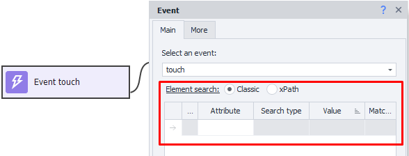
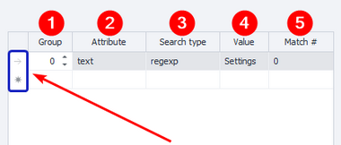
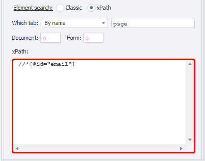

:::info **Please familiarize yourself with the [*Rules for using materials on this resource*](../../Disclaimer).**
:::
_______________________________________________  
## Description.  
You'll need to find an element before you can start interacting with it.  

In this article, we're not talking about a specific action, but about the search section that you'll find in different program actions. For example:  
- [**Getting a value**](../../Android/ProLite/GetValue)  
- [**Setting a value**](../../Android/ProLite/SetValue)  
- [**Triggering an event**](../../Android/ProLite/RunEvent)  
_______________________________________________
## Classic Search  
The search is done by the HTML element’s parameters: tag, attribute, and its value.  

  

### Search conditions  
  

**1. Group**. This sets the priority of a particular condition. The higher the number, the lower the priority. So, **0** is the most important condition.  

If no element is found using the highest priority, the search moves to the next one in the list. This process continues until an element is found or all search conditions have been checked.  

You can add several conditions with the same priority, and then they'll be used at the same time.  

**2. Attribute**. Here you specify the HTML tag’s attribute to search by.  
**3. Search type**:  
    - *text*. Search for a full or partial text match  
    - *notext*. Looks for elements that don't have the specified text  
    - *regexp*. Search using [**regular expressions**](../../Tools/RegEx_Tester)  
    *By default, the last search type is case-sensitive.  
    To make it case-insensitive, add `(?-i)` to the start of the expression*  
**4. Value**. Enter the value of the relevant HTML tag attribute here.  
**5. Match number**. The ordinal number of the found element, starting from zero! Here you can use [**Ranges**](./Value_Ranges) and [**Variable macros**](./Variables).  

:::info **We recommend setting up your search conditions in such a way**  
that only one element remains in the results, which will have the index `0`.
:::  

**To delete a condition**, click the left mouse button to the left of the table (highlighted in blue in the screenshot above), then press Delete on your keyboard.  

Sometimes you'll need **several conditions at once** to find the right element.  
_______________________________________________
## xPath (XML Path Language)  
  

Searching is done using [**xPath expressions**](../../Tools/JSON_Tester). This option is more universal and robust to changes in the structure of sites and apps.  

:::tip **This is a language for searching and extracting data from XML documents.**  
It lets you search for and select nodes in an XML document based on their hierarchical structure, using paths or expressions. XPath is widely used for automation, web scraping, testing, and data processing.
:::  

### Advantages of xPath  
- **Flexibility**  
Lets you precisely select elements and attributes, and apply complex filters and conditions.  
- **Widely used**  
Supported by many tools and programming languages, and used in libraries like Selenium.  
- **Complex queries**  
Can extract data considering hierarchy, attributes, and text values.  
- **Time saving**  
Reduces the time needed to extract the required data from complex documents.  
_______________________________________________
## Useful links  
- [**Search by image**](./SearchByPic)  
- [**Text processing**](../../Data/Text)  
- [**Element properties**](../Interface/ElementProp)