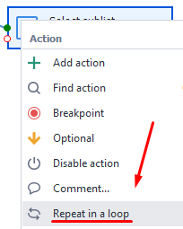
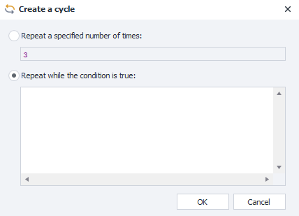
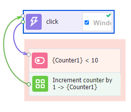
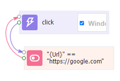
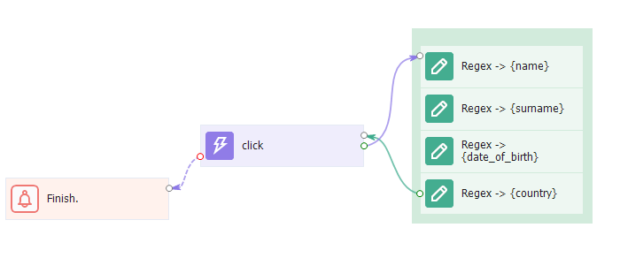

:::info **Please read the [*Rules for using materials on this resource*](../../Disclaimer).**
:::
_______________________________________________  
## Description.
**Loops** are a programming construct that repeats a set of instructions a certain number of times while a given condition is met.  
:::tip **Don’t use loops too often.**  
This is a complex construct where a number of unexpected errors can occur. Especially if you’re not familiar with programming.
:::
_______________________________________________
## Automatic creation.  
Right-click on any action (or select a group of actions) → ***Repeat in loop***.  

Then a window will pop up where you choose the reason to end the loop:

_______________________________________________
### Repeat a specified number of times.
When you select this option, you need to enter the desired number of repetitions. After confirming, a **counter variable**, an **action to compare** with the specified number, and an **action to increment** the counter value will be created.

_______________________________________________
### Repeat while condition is true.
Here you need to set the condition for the loop to keep running *(True)*. As soon as the condition is no longer met and returns *False*, the loop will stop.
After clicking *OK*, the data from the condition field moves to [**IF action**](../../Project%20Editor/Logic/IF), so be sure to stick to proper expression syntax.

|     | 
| -------- | 
| *While the current URL equals https://google.com, a click will happen.*   | 

_______________________________________________
## Manual creation.
The two options above are for automatic creation of loops. But you can also do it manually.

***Example:*** You need to scrape data from a website with many pages. To go to each next page, you have to click the ***Next*** button. But when you reach the last page, the button disappears.

In this case, the condition to finish the loop will be the error finding the ***Next*** element. So as soon as the button disappears, the loop stops.

_______________________________________________
:::warning **Do not create endless loops and don’t put the entire project in a loop.**  
Always add a counter in your loops. Otherwise, your template can freeze due to infinite execution.
And putting the whole project in a loop can cause unpredictable errors.
:::
_______________________________________________
## Useful links.
- [**Logic in ZennoDroid**](../../category/логика-в-zd). 
- [**Writing code in ZennoDroid**](../../category/свой-код).     
- [**Run event**](../../Android/ProLite/RunEvent).