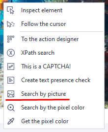
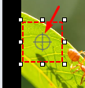
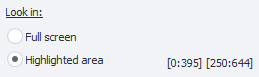

:::info **Please get familiar with [*Rules for using materials on this site*](../../Disclaimer).**
:::
_______________________________________________  
## Description.
This action lets you click on an element using visual search.  
We recommend using it only if you can't find the element in other ways,  
since **this operation uses a lot of your computer's resources**. It's also useful  
for clicking on elements you can't reach using the [**Run Event**](../../Android/ProLite/RunEvent) action.
_______________________________________________ 
## How does this action work?  

_______________________________________________   
### Adding to your project.  
In the emulator window, **hover your mouse over the element** **→ right-click → Search by image**.

  
_______________________________________________ 
### Search area.  
  

You can change the area with a special dashed square. Move your cursor over the white dots, hold and drag to resize as needed. The bigger the search area, the more resources are needed. **You should highlight a unique part of the element**, something that stands out in color. For example, if you're highlighting a button, you don't need to highlight the whole thing—it usually has a lot of flat color.

  

With the **round crosshair** you can also **set the click point** with some random offset. It can even be outside the search area.
_______________________________________________    
### Copy hash.  
   

This button copies the image hash to the clipboard. You can use it in C# methods for image search.
_______________________________________________ 
### Search method.  
  

Here you can pick how the image will be searched:
- **Entire screen**. The search covers the whole screen.
- **Selected area**. This mode lets you pick the search area in the [Device window](../Interface/DeviceWindow), like shown earlier. Use this if you know the element will show up in a certain part of the screen.
:::tip **Searching in a specified area is faster and loads the CPU less.**
:::
_______________________________________________  
### Search.  
  
- **Match accuracy**. Adjusts the search accuracy. The higher it is, the more resources and time it uses.
- **Search button**. Tests the search operation.
- **Yes**. Click if search was successful.
- **No**. Click if it didn't find what you're looking for. Then change the search settings and try again.
_______________________________________________  
### Color mode.  
  

Choose the color mode for the image search.  
- **RGB**. Searches by colored image.  
- **Gray**. Image with gray shades only.  
- **Black**. Black and white mode. It's best to keep *Match accuracy* at 90% or lower here.
:::tip **Search in Gray and Black modes is faster and loads the CPU less.**
::: 
  
:::info **Threshold option.**
The image is converted to GrayScale, where each point gets a value **from 0 - black, to 255 - white**. Pixels with brightness above the threshold are considered white, below it—black. This setting is only available **in Black mode**.
:::
_______________________________________________ 
### Click type.  
- **Touch**. Quick tap on the element.
- **Long touch**. Press and hold the element.
- **None**. Don't do anything, just check if the element is in the emulator window.
_______________________________________________  
## Testing the search.  
Once you've highlighted the area you want, click “Search”. If the target fragment is found, a green check will appear next to the button showing success, and the element will be highlighted in the emulator window.

  

If the search fails, a red X will appear.
  

### Hiding part of the image.  
To make sure the search doesn't find anything extra, you can hide part of the image. Just click **the butterfly button** at the bottom of the emulator window, then click the area you want to hide, and run the search again.

## "Advanced" tab.  
  
This tab shows up once you've added the action to your project. The options:
- **Don't wait for the element more than**. Time (in seconds) the action will wait for the element to appear. In [*Recording settings*](../../Settings/Record_and_InputMethods) you can set the default search time for all new actions.
- **Search area**. Here you can set the area manually or using variables.
- **Save found coordinates.** This section lets you save the coordinates of the top-left corner of the found element as variables.
_______________________________________________
## Example of use.  
Let's say you need to make a new note in the **Notes** app:
1. Highlight a unique area on the new note button. The left screenshot shows a good selection, the right one shows what you shouldn't do.
 
2. Use the **“Search”** button to test if the object can be found. Click **“Yes”** if it works.
3. Add the action to your project.

:::warning **Important.**
*Image search can break if you recorded the action in, say, OpenGL render mode and then switched to DirectX.*
:::
_______________________________________________
## Useful links.  
- [**Action builder**](../Interface/ActionBuilder).
- [**Project recording settings**](../../Settings/Record_and_InputMethods).
- [**Run event**](../../Android/ProLite/RunEvent).