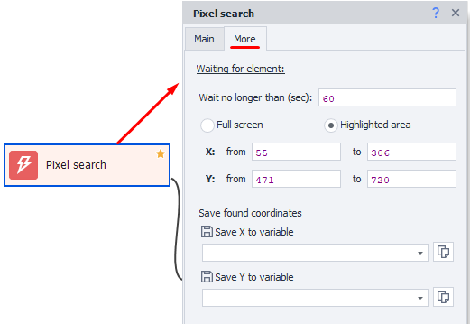

:::info **Please read [*Material Usage Rules for this resource*](../../Disclaimer).**
:::
_______________________________________________  
## Description.  
Lets you click on an element using visual search by pixel color. We recommend using this when you can't [**find the element**](./ElementSearch) in other ways.  

  

:::danger **This action uses a lot of your computer’s resources.**
:::

#### What’s this for?   
To click on an element that you can’t reach through the [**Run Event**](../../Android/ProLite/RunEvent) action.  

### How do I add this to my project?  
To add this action, in the [Device Window](../Interface/DeviceWindow) hover your mouse over the area of the image you need, open the context menu with the right mouse button and select **Pixel Search**.  

  

_______________________________________________

## Window elements.  
  

### Pixel color.  
  

This field is automatically filled in when you use *Pixel Search* from the context menu. The color itself is specified in [HTML format](https://ru.wikipedia.org/wiki/HTML-%D1%86%D0%B2%D0%B5%D1%82%D0%B0).  

If you need to search for **several** pixels of different colors at the same time, just specify those colors here. To do that, without closing this window, click **Pixel Search** in the context menu again in another place on the screen. The new color will be added to the table.  

### Search area.  
  

In this section you can set the area where the pixel search will be performed.  

- **Whole screen**. Search for the pixel throughout the available screen.  
- **Selected area**. When you activate this mode in the [Device Window](../Interface/DeviceWindow), you’ll be able to select an area to restrict the search. Use this if you know for sure that the element will appear in a certain part of the screen.  

:::tip **Searching in a set area is much faster and lowers the CPU load.**
:::

You can set the default search area in [**Recording Settings**](../../Settings/Record_and_InputMethods#область-поиска).  

#### How do you set the area?  
After selecting **Selected area** mode, a frame will appear in the [Emulator Window](../Interface/DeviceWindow). You can use this frame to select the area in which the search will be done.  

  

### Search.  
**Color tolerance**. This setting determines the search accuracy. The higher the value, the more difference from the exact color is allowed.  

If you set the value to *0*, it will search only for the exact color.  

  

Click **Search** to start a test run. If everything works, click **Yes**.  

If the search wasn't correct, click **No**, update the search parameters and try again.  

If the needed pixel was found, a checkmark will appear next to the **Search** button to show success, and the element in the device window will be marked with a cross.  

  

If the search ends with an error, a red cross will appear next to the **Search** button.  

  

### Hiding parts of the image.  
You can hide part of the image to make sure the search doesn’t pick up anything extra. To do this, click the butterfly button at the bottom of the [Device Window](../Interface/DeviceWindow). Then click on the area you want to hide, and click **Search** again.  

To exit this mode, just click the butterfly button again.  
_______________________________________________

## Adding to your project.  
Once you’ve found the needed pixel and clicked **Yes**, an extra menu appears:  

### Click type.  
  

- *Regular click* — quick press on the selected element.  
- *Long press* — hold down on the element.
- *No click* — don’t do anything, just check for the element.  

If the fragment is found, the action goes through the green branch; if not found — through the red one.

### Click offset.  
  

Use this if you need to click with an offset from the pixel’s detected coordinates (for example, above or below).  

### Test.  
Depending on your settings, this will click on the screen at the found coordinates (including the specified offset).

### Add to Project.  
When everything is set up, you can click this button to add this action to the project.  
_______________________________________________
## The “Advanced” tab.  
This tab appears after you add the action to your project.  

  

### Available settings:  
#### Wait for element.  
Set the number of seconds for the action to wait for the element to appear.  

In [**Recording Settings**](../../Settings/Record_and_InputMethods) there’s a default search time you can set for all new actions.  

#### Search area.  
Here you can manually (or using variables) set the search area.

#### Save found coordinates.  
This section lets you save the found pixel’s X and Y coordinates into separate variables.  
_______________________________________________
## Useful links.
- [**Image Search**](./SearchByPic)  
- [**Run Emulator**](../../ProLite/Memu_Start)
- [**Run Event**](../../Android/ProLite/RunEvent)