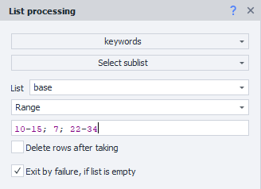
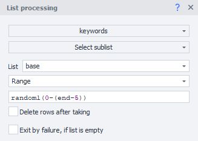
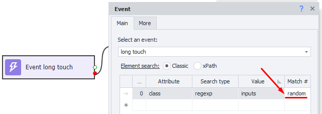

---
sidebar_position: 3
title: Value Ranges
description: How do you use ranges?
--- 
:::info **Please read the [*Rules for using materials on this resource*](../../Disclaimer).**
:::
_______________________________________________  
## Description.
Pretty often, when setting up a project, you’ll come across spots where you need to specify match numbers, lines, cells, etc. And most of the time, you can’t just put in a specific number. That’s what ranges are for – they let you number stuff more flexibly.

The article uses examples with lists, but remember, you can use the same approach anywhere you need to put in some kind of number.

### When do you use ranges?  
- To get a range of lines. For example, from the fifth to the seventh, and so on.  
- To grab the last line, even if you don’t know how many there are in total.  
- To pick a random line or several random lines, either from the whole thing or from a range you specify.  
- To get even/odd lines from a certain interval.  
- To grab random lines from even/odd lines in a range.  
- As the match number when running actions: [**Run Event**](../../Android/ProLite/RunEvent), [**Set Values**](../../Android/ProLite/SetValue), [**Get Values**](../../Android/ProLite/GetValue).  
_______________________________________________  
## More details on each one. 
### Getting lines from one or several ranges.  
    

If you want to get lines from the fifth to the seventh, for example, you’d write the line number like this:

**`4-6`** *(it’s one less because numbering starts from 0)*.  

You can put in a few ranges, separated by **`;`** or **`,`**  
For example, **`10-15; 7; 22-34`**   
_______________________________________________ 
### Picking a random element.  
This is useful if there are several identical elements on a page and you don’t really care which one you interact with. To click one of them at random, just put **`random`** as the match number.

  
_______________________________________________ 
### Don’t know the length of the list but need to go to the end.  
The end of the list is written as **`end`**. So just set the interval as needed: for example, **`10-end`** will get lines 11 through the last one in the file.  
:::info **Getting all lines from the list**
You can grab all the lines using the **`all`** keyword.
:::  
_______________________________________________ 
### Grab a random line, or several random lines from an interval.  
For this, write **`random`** and how many lines you need. Then in parentheses, add which lines to pick from.  
:::tip **EXAMPLES.**
**`random1(1, 12-15, 35-end)`** – pick ***one line*** from those listed.  
**`random15(1, 12-15, 35-end)`** – get ***15 lines*** from those listed.  
**`randomAll(1, 12-15, 35-end)`** – to grab ***all lines*** from those listed, in random order.
:::
_______________________________________________ 
### Excluding ranges.  
Sometimes you need to skip the last few options. For example, if you want to leave out the last 5 lines and grab one random item, it would look like this: **`random1(0-(end-5))`**.

  
_______________________________________________ 
### Get only_even or only odd values.  
#### Even:
- **`even(1,12-15,35-end)`** or **`even1(1,12-15,35-end)`**.  
Get the first even value from the range.  
- **`even5(1,12-15,35-end)`**.  
Grab the first 5 even values from the range.  
- **`evenAll(1,12-15,35-end)`**.  
Get all the even values in the range.  
#### Odd:
- **`odd(1,12-15,35-end)`**.  
Get the first odd value from the range.  
- **`odd5(1,12-15,35-end)`**.  
Grab the first 5 odd values from the range.  
- **`oddAll(1,12-15,35-end)`**.  
Get all the odd values in the range.   
_______________________________________________ 
### Combining operators.  
You can combine the **`random`**, **`even`** and **`odd`** operators.  
For example, if you need to get all even lines in random order from a range:  
**`randomAll(evenAll(1,12-15,35-end))`**.  
_______________________________________________
## Useful links.    
- [**Device actions**](../../Android/ProLite/action).  
- [**ZD Logic**](../../category/логика-в-zd).  
- [**Lists and Tables**](../../category/списки-и-таблицы).