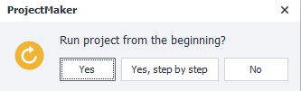
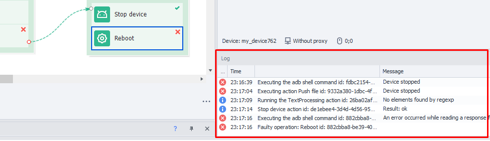

:::info **Please read the [*Material Usage Rules on this site*](../Disclaimer).**
:::
_______________________________________________
## Starting Debugging.


Let's look at the recording and debugging panel in more detail.
_______________________________________________
### From the top.
Clicking this button starts the project from scratch. A new profile will be generated.

_______________________________________________
### Step by step.
When you click *From the top*, you'll be offered to run the whole project *Step by step*. In this mode, each next action will only be performed after you hit ***Next***.



If you click **Yes** instead of **"Yes, step by step"**, then the project will run straight through to the end or until it hits the next *Breakpoint*. To set a breakpoint, just right-click any action.


You can switch between these two modes while debugging: use ***Next*** (step by step) and ***Resume*** (to breakpoint), one after another as you need.

_______________________________________________
### From cursor.
You can also click any action in your project and then use the buttons described above – in that case, the template will start running right from that spot. This is especially handy when you're hunting for buggy parts of your project during debugging. You tweak the action's settings and test it right away, no need to run the whole template every time.


_______________________________________________
### Regenerating the profile.
While testing a template, you can generate new persona values by hitting the special button. For example, this lets you check how a website or app reacts to specific values.


_______________________________________________
## Debugging errors.
You'll sometimes run into errors while creating or editing a project. To fix them, you'll need to *Debug*—in other words, make changes to certain actions in your template. The *Log*, which we've already covered, is your friend in tracking down the problem spots.




Errors get marked red in the *Log*. To find exactly which action is causing trouble, double-click the message in the *Log*. That'll take you straight to the action.

Or you can right-click on the error message, copy the action's ID, and then find it through ***Edit → Search Project → paste the ID in the input field***.


Once you've found the action, fix its settings and start *Debugging* from there.
_______________________________________________
## Project tracing.
:::tip **The word *tracing* comes from the French *tracer*, which means *to track*.**
:::

Here, this feature means following the process of your project: recording or displaying the sequence of steps taken by the program. It helps you research your template's behavior by debugging, measuring speed, or finding where an error happened.

You start tracing in ZennoDroid using the job panel. You need to:
**Right-click the job you're interested in → *Trace execution***


Tracing starts working as soon as you enable it, recording all actions sequentially.
_______________________________________________
## Additional info.
### Result file path.
Files are found in your user directory: `C:\Users\<USERNAME>\Documents\ZennoLab\Traces` and grouped by job.
:::info **The format of a log entry is like this**
`<Event time>|<Message status>|<Action ID>|<Execution time (ms)>`
:::
### Possible message statuses.
- **`Info`** - informational message;
- **`In`** - marks the start of the action with the given ID;
- **`Good`** - successful execution of the action with the given ID and switch to the green branch;
- **`Bad`** - unsuccessful execution of the action with the given ID and switch to the red branch.

<details>
<summary>**Example of trace file contents**</summary>
<!--All you need is a blank line-->
    ```
    23-02-2021 06:08:59.3600|Info|---Project Start Execute---|
    23-02-2021 06:09:17.9110|In  |cca-1035|
    23-02-2021 06:09:20.5203|Good|cca-1035|2520
    23-02-2021 06:09:20.5525|In  |8c7d7d95-d574-43a5-a677-6ebc17490caf|
    23-02-2021 06:09:27.3366|Good|8c7d7d95-d574-43a5-a677-6ebc17490caf|6721
    23-02-2021 06:09:27.3571|In  |03aa3431-0d85-4374-ad32-2821d22f1674|
    23-02-2021 06:09:27.3708|Good|03aa3431-0d85-4374-ad32-2821d22f1674|3
    23-02-2021 06:09:27.3893|In  |re-2884|
    23-02-2021 06:09:28.3229|Good|re-2884|918
    23-02-2021 06:09:28.3356|In  |00b6f04c-711c-4362-9404-f8fb2fdf5a51|
    23-02-2021 06:09:28.3463|Good|00b6f04c-711c-4362-9404-f8fb2fdf5a51|0
    23-02-2021 06:09:28.3571|In  |re-4835|
    23-02-2021 06:09:29.0290|Good|re-4835|661
    23-02-2021 06:09:29.0455|In  |67c9448b-ebbe-4f54-8206-868f8ddc38c3|
    23-02-2021 06:09:29.0612|Good|67c9448b-ebbe-4f54-8206-868f8ddc38c3|2
    23-02-2021 06:09:29.3509|Info|---Project Executed---|  
    ```
</details>

### Example of use.
Sometimes, a job hangs on some action and it's impossible to tell visually which one got stuck. At that moment, just turn on tracing and you'll instantly see which action is currently running, as it will get recorded to the file.
_______________________________________________
## Handy links.
- [**Device actions**](../Android/ProLite/action)
- [**Profile window**](./Interface/Work_with_Profile)
- [**Log window**](../pm/Interface/Log_window)