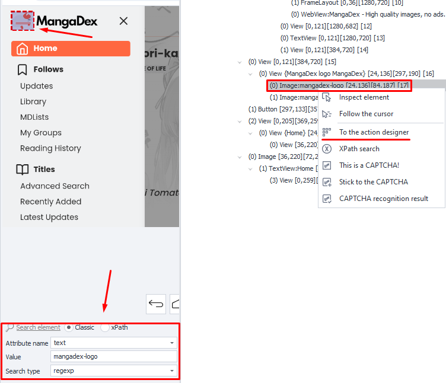

---
sidebar_position: 5
title: Action Designer
description: Working with elements in the emulator window.
---  
:::info **Please read the [*Material Usage Rules on this site*](../../Disclaimer).**
:::
_______________________________________________

This is a universal tool for working with elements in the [Device Window](./DeviceWindow) that helps you pick the best criteria for searching.  
_______________________________________________ 
## How to open it?
#### There are two ways:  
- Right-click on the desired element in the **Device Window** → **To the Action Designer** from the context menu.  

 
_______________________________________________ 
- From the [**Element Tree**](./ElementTree) window → right-click on the element you're interested in → **To the Action Designer**.  

  
_______________________________________________ 
:::info **Useful.**
When you add an element to the **Action Designer**, all its properties and attributes are automatically sent to the [**Element Properties**](./ElementProp) window.  

 
:::  
_______________________________________________ 
## Search parameters  
  
### Search types:  
- **Classic**. Fast and simple. Finds elements by different attributes.  
- **xPath**. Powerful and flexible. Allows complex queries and detailed navigation of the page structure.  
### Classic search.  
  

#### Attribute name.  
Attribute of the element you'll search by. Available attributes for the selected element can be found in the [**Element Properties**](./ElementProp) window.  
:::info **Possible attributes.**
`id`, `name`, `text`, `content-desc`, `bounds`, `center X/Y`, `checkable`, `checked`, `class`, `clickable`, `focusable`, `focused`, `height`, `index`, `long-clickable`, `packadge`, `password`, `resource-id`, `scrollable`, `selected`, `width`.            
:::  
#### Value.  
The value that the selected attribute currently has.  
#### Search type.
- **text**. Finds by full or partial text match  
- **notext**. Looks for elements that don't contain the specified text  
- **regexp**. Search using [**Regular Expressions**](../../Tools/RegEx_Tester)  
:::tip **What's RegExp (Regular Expression)?**
It's a powerful tool for working with text that allows you to find, check, replace, and pull out certain patterns in strings. These expressions consist of characters and metacharacters, which form a template for searching.  
:::

:::warning **Be careful.**
  

If you set search parameters that are too broad, they might match several elements at once. That's not great, so try to pick narrower values.
:::  
_______________________________________________ 
### xPath search  
**XPath (XML Path Language)** is a query language used to navigate and search XML documents. It lets you specify the path to elements, attributes, and text that you want to find in the XML file structure and get the data you need.

XPath offers a set of expressions, operators, and functions for setting specific ways to walk through XML trees and filtering data by various criteria. These expressions are made up of elements and operators that you can combine to get what you want.  

Two options are available for data format:  
**1.** As an expression.  

  

**2.** As a path tree (hierarchy).  

  
_______________________________________________  
## Choose an action  
You can pick one of three possible actions:  
- **Set (Set value)**  
  
    - *Attribute*. Only the "input" attribute is available. You can set a new value for it.  
    - *Value*. The text you need to insert. You can use plain text or project variables: `{-Variable.someVar-}`, `{-Profile.Name-}`, and their combos: `Hello. My name is {-Profile.Name-}`.  

- **Get (Get value)**  
   
    - *Attribute*. The attribute whose value you want to get.  
    - *Value*. The value of the found attribute will show here.  

- **Rise (Perform action)**  
   
    With this you can trigger *touch* and *long touch* events on the element.  
_______________________________________________   
## Final actions  
   
### Test  
After picking the best search parameters and needed action, you can test them by pressing this button.  
### Add to project  
Press this button at the very end, when the search result fully suits you.  
### Comment  
Here you can leave a comment for the action you're creating, since the auto-generated labels don't have much info.  

_______________________________________________
## Useful links  
- [**Set Value**](../../Android/ProLite/SetValue)
- [**Get Value**](../../Android/ProLite/GetValue)  
- [**X/JSON Path Tester**](../../Tools/JSON_Tester)