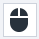

:::info **Please read the [*Material Usage Rules on this site*](../../Disclaimer).**
:::
_______________________________________________

## Getting Started
In this window, you can interact with both the emulator and a real device.  
When you launch ProjectMaker, the device window will look like this:  

To get started, you need to click **Run Device**. If **Recording** is enabled for the project, two actions will be added to the actions canvas: **Select Device** and **Start/restart Device**.
_______________________________________________
## Window Components
This is what the window looks like after a successful device launch:  

Here, you can interact with the device directly: click, swipe, open apps—everything you do will be reflected. And if recording is enabled, these actions will also show up on the canvas as corresponding actions.
_______________________________________________
### Emulator Control Buttons

| Button      | Description |
| ----------- | ----------- |
|  | Go back to the previous screen. |
|    | Return to the home screen. |
|    | Show recent apps. |
|    | Zoom in*   |
|    | Zoom out*      |
|    | Close part of the image. Used for testing image search.      |
|    | Start recording mouse movements      |  
:::info **(*) Note:**
You can also zoom by double-clicking the mouse wheel in the emulator window while holding ***Ctrl***.
:::
_______________________________________________
### Current Device/Emulator Name

This is the device that's currently active.
_______________________________________________
### Configured Proxy

Shows the currently set proxy.
_______________________________________________
### Mouse Coordinates

If the cursor is inside the device window, the current coordinates (X, Y) will be shown here.  
You can use these coordinates in the [**Swipe Emulation**](../../Android/ProLite/Swipe) and [**Touch Emulation**](../../Android/ProLite/Touch_Emulation) actions.
_______________________________________________
### Context Menu

Right-click anywhere in the window to open the context menu.
#### Available Buttons:
- **Clear Text**  
Lets you clear everything in an input field.
If recording is on, the [**Keyboard Emulation**](../../Android/ProLite/Keyboard) action will be added to your project with this content: `{AndroidKeys.CLEAR}`
- **Set Value from Profile**  
Lets you set an input field value from the project's **Profile**.
If recording is on, a [**Set Value**](../../Android/ProLite/SetValue) action with the selected profile macro will be added.
- **Set Variable Value**  
Lets you set an input field value from a user variable.
If recording is on, a [**Set Value**](../../Android/ProLite/SetValue) action with the selected variable macro will be added.
:::info **The first three buttons we've just covered show up only for input fields.**
:::
- **Inspect Element**  
Opens the [**Element Properties**](./ElementProp) window for a closer look at the element. The chosen element will also be highlighted in the [**Element Tree**](./ElementTree) window.
- **Follow the Cursor**  
When turned on, the element under the cursor will be highlighted, and its properties will show up in the [**Element Properties Window**](./ElementProp).

**Example.**

    

- **To the Action Designer**  
Sends the element to the [**Action Builder**](./ActionBuilder).
- **xPath search**  
Analyzes the element on the page and shows info in xPath format.

- **This is a CAPTCHA!**  
Lets you mark the image as a captcha and send it either for manual solving or with a special module (for example, [**CapMonster.Cloud**](https://capmonster.cloud/)).

- **Stick to the CAPTCHA**  
Lets you combine multiple images into one and send the whole thing for captcha solving.
- **CAPTCHA recognition result**  
Enters the captcha result into the field and, if **Recording** is on, adds a [**Set Value**](../../Android/ProLite/SetValue) action.
- **Create text presence check**  
Lets you check for specific text. Enter the text in the input window, then a special action will be created where you can set extra search parameters.

- **Search by picture**  
Searches by the selected image. A window opens for you to adjust the search settings.

  

- **Search by the pixel color**  
This action allows you to find a pixel by the specified HEX color code within the selected area or across the entire device screen.

 

- **Get the pixel color**  
Allows you to copy the HEX color code of the selected pixel to the clipboard.

_______________________________________________
## Useful Links
- [**Action Builder**](./ActionBuilder)
- [**Device Actions**](../../Android/ProLite/action)
- [**Keyboard Emulation**](../../Android/ProLite/Keyboard)