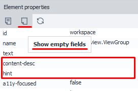

:::info **Please familiarize yourself with the [*Rules for using materials on this resource*](../../Disclaimer).**
:::
_______________________________________________  
## Description.

When analyzing a structure, you often come across elements that look the same at first glance, which can be confusing when working with them. By using the **Element Properties** window, you can take a closer look at the objects’ attributes.

  
_______________________________________________  
## How do you work with this window?  
### Turning the window on.  
To turn the window on, click **Window** in the top menu and select **Element Properties**.  
  
:::info **If the window still doesn’t show up after turning it on.**
Then you need to reset the window layout to the default. You can do this with the **“Reset Panels”** button in the program settings, under the [**Debugging**](../../Settings/Debugging) tab.
:::
_______________________________________________    
### Showing info for the right element.  
There are a few ways you can display info for the element you’re interested in:  
- add it to the [Action Builder](./ActionBuilder),
- select it in the [Element Tree Window](./ElementTree),
- right-click the desired element → Inspect, or Follow Cursor.
_______________________________________________  
### “Properties” tab.  
  

Here you’ll see the attributes of the selected element. This tab is open by default.
_______________________________________________ 
### “Show Empty Fields” button.  
  

Once you turn this on, the Properties tab will also display any empty attributes, if there are any.
_______________________________________________   
### “Refresh Fields” button.  
  

This button lets you update the element attribute values.
_______________________________________________ 
## Useful links.  
- [**Action Builder**](./ActionBuilder).
- [**Element Tree**](./ElementTree).
- [**Element Search**](../../pm/Creating/ElementSearch).