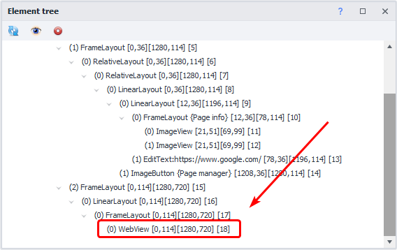

:::info **Please read the [*Material Usage Rules on this site*](../../Disclaimer).**
:::
_______________________________________________  
## Description.

  
In this article, we'll take a closer look at the window called "Element Tree". This window shows the structure of the page that's open on the main screen of the emulator, displayed as a tree. So, all elements branch out from each other in order of their relationship.

You can get the page's structure as an XML string using the  
[**Get element structure (XML)**](../../Android/ProLite/Utilities#получить-структуру-элементов-xml) action, which you'll find in Utilities.

:::info **If you select an element in the Tree, it'll also get highlighted in the Emulator Window**  
  
:::

## Features.  
### Refresh contents.  
   
This button refreshes the element structure. You'll need to click it every time you open a new app page to load the latest structure.  
_______________________________________________ 
### WebView.
:::tip **What's this?**
***WebView** is a user interface component used in mobile apps to display web content (HTML, CSS, JavaScript) right inside the app. It lets you show web pages without redirecting to a separate browser.*
:::     
If there's a similar element in the tree, after the first click on "Refresh," its contents won't be displayed – you'll need to click again. But it won't show you the HTML structure of the web page, only the standard Android layout.   

_______________________________________________ 
### Only visible elements.  
  

Shows only elements that are currently in the visible area.  
_______________________________________________   
### Auto-refresh.  
:::warning **When this feature is on, mouse swipe stops working in the emulator window.** 
But scrolling with the mouse wheel will still work.  
:::   

  

This always works when auto-recording actions is on. That means right before every action is recorded in your project, the structure will be updated to the latest version.
:::warning **Make sure.**
For Auto-refresh to work correctly, make sure you turn off  
[**Recording clicks by searching for images**](../../Settings/Record_and_InputMethods#запись-нажатий-через-поиск-по-картинкам) in the Recording tab.
:::   
_______________________________________________  
### Collapse.  
  
For convenience, you can collapse any elements in the tree.  
_______________________________________________  
## Context menu.  
   
Select an element and right-click it to open the Context Menu.
_______________________________________________    
### Inspect element.  
Let's you examine the element in detail by opening its **Properties**.  

  
_______________________________________________    
### Follow cursor.  
After turning this on, the element your cursor is hovering over will get highlighted, selected in the tree, and its properties will show up.  
  
_______________________________________________  
### To action builder.  
Sends the element to the builder, so you can interact with it within your project.  
_______________________________________________   
### This is captcha!   
On clicking, an action [**Captcha recognition**](../../Android/ProLite/CaptchaSolving) is created. Search parameters are picked automatically. After choosing **This is captcha!** two extra options appear.  
  
#### Stick to captcha.  
This option lets you combine a few separate pictures into one and send a single image to the captcha recognition service. Handy if a captcha is made up of several bits.  
#### Field for captcha recognition result.  
Enters the recognition result into the input field and, if **Recording** is on, adds a [**Set value**](../../Android/ProLite/SetValue) action.  
_______________________________________________
## Useful links.  
- [**Action builder**](./ActionBuilder).  
- [**Set value**](../../Android/ProLite/SetValue).  
- [**Recording and Input**](../../Settings/Record_and_InputMethods).