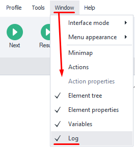
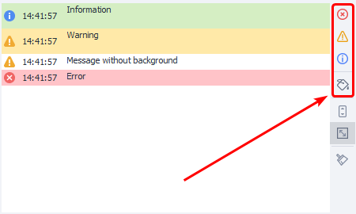
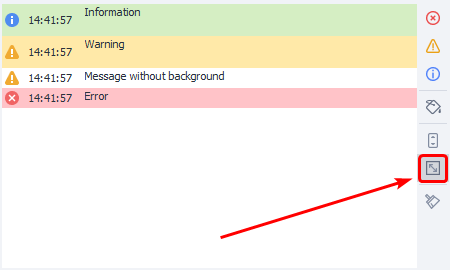
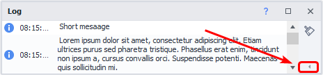
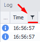
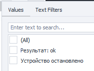
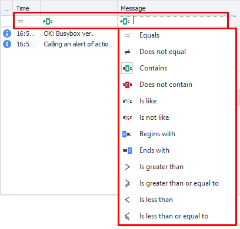

---
sidebar_position: 9
title: Log Window
description: Displaying messages to the user
---  
:::info **Please read the [*Terms of Use for materials on this resource*](../../Disclaimer).**
:::
_______________________________________________

## What is the Log and what is it for?  
  

The log is used to display notifications to the user. There are three types:  
- **Informational ( ¡ )**  
For example: `Starting work`, `Beginning registration`, `Account created successfully`,  
- **Warning ( ❕ )**  
Any non-critical errors that don't affect how the template works.  
- **Error ( ❌ )**  
These let you know that something serious has happened, and you really need to pay attention.  

The log is especially useful for tracking errors in the template, for example, ones that could slow down its execution.  

:::info **Notifications are sent to the log using the Notification action.**
 You can also uncheck **Show in ZennoDroid** so messages only show in ProjectMaker.


:::
_______________________________________________    
## Enabling the log  
**Top menu → Window → Log:**  

 

<details>
<summary>**The Log isn't showing up for me. What do I do?**</summary>
<!--All you need is a blank line-->

    Sometimes the log window just doesn't appear even though it's enabled. If it still won't show up after several tries, it's best to do a full **window settings reset** in ProjectMaker.

    **WARNING**: *The following steps will reset your window layout. If you've set up the interface to your own liking, all those settings will be wiped and things will go back to default.*

    Go to **Edit → Settings → Debug → at the very bottom, Reset panels. Then restart ProjectMaker. All settings will be reset, and the Log will work again.

    You can use this method for issues with other windows, too.
</details>
_______________________________________________ 
## Log Window appearance  
### Message output window  
 

You’ll see an icon matching the notification type, then the time, then the message itself.  
_______________________________________________ 
### Sorting by type and color  
 

You can use the buttons in this section to filter what messages are displayed.  
_______________________________________________ 
### Auto-scroll  
 

If this button is pressed, the Log window will auto-scroll to always show the latest message.  
:::info **Disabling conditions**
In Settings on the *Other* tab, you can adjust what will turn off auto-scroll.
:::
_______________________________________________ 
### Auto row height  
  

If a message is too long, the row height will be adjusted so that you can see the full thing.

 

When this option is off, you’ll only see the top line of the message.  
_______________________________________________ 
### Clear the log  
 

This button clears all messages from the window.  
_______________________________________________ 
### Double-clicking a log entry  
If you double-click a log entry you’re interested in, the project focus will jump to the action that created that message.  
_______________________________________________ 
### Small window height  


The buttons from the right block will collapse when the log window’s height is reduced. To access them, click the highlighted button.
_______________________________________________ 
## Context menu  
You get it by right-clicking a notification.

 

- **Show action** Focuses on the action that sent the selected message.  
- **Copy action Id** The unique action number will be copied. You can use it to search in the project. It looks like this: `3e6988d1-9518-4535-a6d2-f0a33420c730`.   
- **Copy message** The entire message text gets saved to the clipboard.   
_______________________________________________ 
## Features for experienced users  
### Log file on your computer  
PM and ZD also save all logs on your computer in the program folder.  
Here's how the path looks: `C:\Program Files\ZennoLab\RU\ZennoDroid Pro\2.3.8.0\Progs\Logs`  

By default, all project logs are written to one file. You can change this with some C# code at the start of your template:
```js 
// Send the log for this template to a separate file.
project.LogOptions.LogFile = @"D:\log.txt";
// Each thread will get its own log file.
// The file names (in our case, log) will have the thread id added to them.
project.LogOptions.SplitLogByThread = true;  
```  
_______________________________________________ 
## Advanced log window  
Turn on via *Edit → Settings → Debug →*  ***Advanced log window***.

 

You need to restart ProjectMaker for the changes to apply.
:::info **This setting will turn on for ZennoDroid too.**
:::
_______________________________________________   
### Headers  
  

- Type of message  
- Time  
- *Unnamed header*  
- Message  
If you click any of the headers, you can sort the messages by it.
_______________________________________________ 
### Message filters  
When you hover the mouse over any header, a filter icon appears.

 

- **Time filters**  
There are lots of options for fine-tuning the filter (by weekday, between two dates, up to a specific day, and so on).

  

- **Text filters**  
Available for the Unnamed column and Message text.

   

<details>
<summary>**A quick guide to the filters**</summary>
<!--All you need is a blank line-->

    **`Equals`** — the string matches the filter (exact match),  
    **`Does Not Equal`** — doesn’t match the filter,  
    **`Begins With`** — starts with...,  
    **`Ends With`** — ends with...,  
    **`Contains`** — contains...,  
    **`Does Not Contain`** — doesn’t contain...,  
    **`Is Blank`** — string is empty,  
    **`Is Not Blank`** — isn’t empty,  
    **`Custom`** — custom filter.
</details>   
_______________________________________________ 
### Header context menu  
  

If you right-click a header, a context menu pops up with more features: *group by column*, *hide columns*, *auto fit width*.
But the most interesting are: ***Auto-filter*** and ***Filter builder***.
_______________________________________________ 
### Auto-filter  
<details>
<summary>**Right-click a header and select *Show auto-filter row* at the very bottom.**</summary>
<!--All you need is a blank line-->

     
</details>   

When you turn this on, you'll see an extra row under the headers. Now you can make a filter with your own logic.

 

On the left of each row there’s an icon—if you click it, you get to pick the filter type.
The filter types and input values depend on the column kind. For *Time* these are comparison operators and dates, for *Message* it’s text search instead of dates.
_______________________________________________ 
### Filter builder  
<details>
<summary>**Also opens from the context menu**</summary>
<!--All you need is a blank line-->

        
</details>  

Let’s break down the available buttons.

  

**1.** Condition management button: lets you add a new condition or group, or remove all conditions.  
Available options:  
    - ***AND*** — must satisfy ALL conditions  
    - ***OR*** — must satisfy at least one  
    - ***NOT AND*** — does NOT satisfy ALL  
    - ***NOT OR*** — does NOT satisfy at least one  

**2.** This button adds another condition.  
**3.** 🟦 The blue text in square brackets shows which column the filter applies to.  
:::tip ***Unnamed column***  
*In the screenshot, it's last. It has no name, but you can filter by it anyway.*
:::
**4.** 🟩 Filter type is in green.  
**5.** ⬛ Black text — the filter data you enter.  
**6.** This button easily deletes the filter.  
_______________________________________________ 
## More on the Unnamed column
### How do you fill it in?  
For this, you’ll need to use the [**Custom C# code**](../../Project%20Editor/CustomCode/С) block and basic C# code knowledge. You can’t write to this column using the standard *Notification* action.

There are four methods for outputting messages to the log:  
- ***`project.SendInfoToLog`*** — sends info messages  
- ***`project.SendWarningToLog`*** — for non-critical error notices  
- ***`project.SendErrorToLog`*** — error that needs attention  
- ***`project.SendToLog`*** — lets you set the message color  

#### First option:  
```js 
// Arguments:
// 1st - string that goes in the "Message" column
// 2nd - bool, if the message should be logged in ZennoPoster
project.SendInfoToLog("Message", true);  
```
#### Second option: 
```js
// Arguments:
// 1st - string for the "Message" column
// 2nd - string, this will show up in the unnamed column.
// 3rd - bool, if the message should be logged in ZennoPoster
project.SendInfoToLog("Message", "Way", true);
```
#### Result:  

 
_______________________________________________ 
### Why use the Unnamed column?  
- With multi-threaded work, you can put the account name here, and in *Message*, what that account is currently doing. Then you can group or filter notifications by this column as needed.  
- In big projects, you could use it to show which part of the template is currently running, and put the specific action in *Message*. For example, during registration, profile completion, product search, parsing and processing, publishing the processed data—all within one project.
_______________________________________________
## Useful links  
- [**Project playback settings**](../../Settings/Debugging) 
- [**Notification**](../../Project%20Editor/Logic/Notification)  
- [**The “Log” tab**](../../Execution/Log)