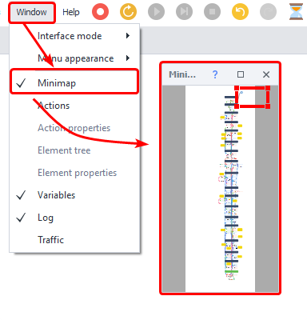
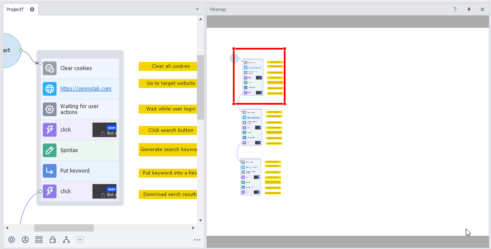
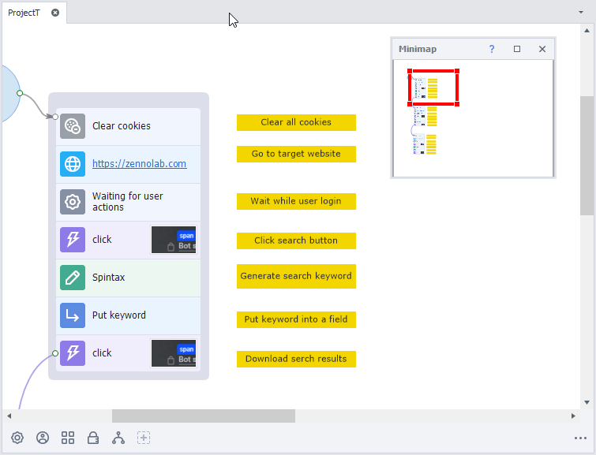
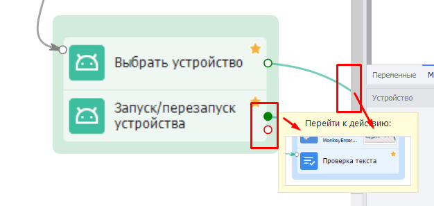
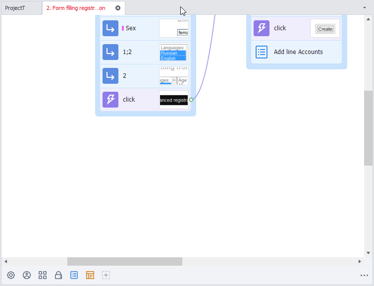
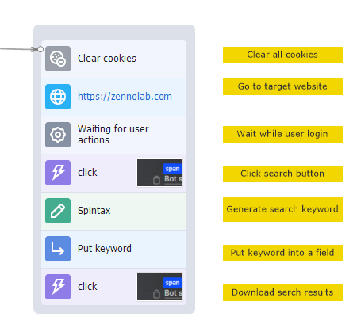
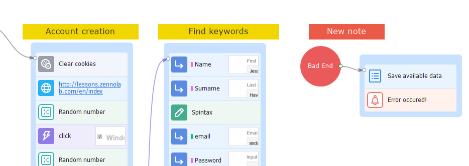
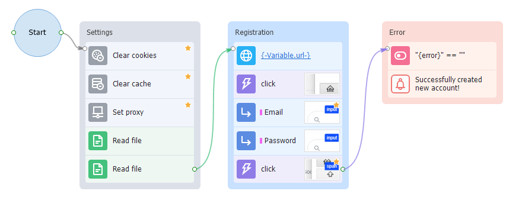

:::info **Please read the [*Terms of Use for materials on this resource*](../../Disclaimer).**
:::
_______________________________________________

## Mini Map
You can add this window via the top bar → Window → Mini Map:

### What’s it for?
When your template workspace fills up with a lot of actions, the Mini Map helps you quickly get your bearings and move around the project. Just click anywhere on the map to show that part of your project.

_______________________________________________
## Navigation tools
### Zooming
You can zoom in and out of the project window to see the part you need. Just press `Ctrl` + `Scroll the wheel` or use the `Ctrl` + `-/+` shortcuts.

### Interactive hints

If you hover over a block’s connector point and its path runs off the canvas, you’ll get a suggestion to jump to the action that this line leads to.
This is super handy when your template has lots of arrows or if actions are far apart.

_______________________________________________
### Notes
If you right-click on an empty spot on the canvas, you can add a **Note**. This is a panel where you can leave a multi-line comment.

Notes let you comment on certain sets of actions and group them by color.

_______________________________________________
### Group Color
You can mark your groups with colors for easy recognition. Right-click on an Action Group → Group Color → pick a color.

For example, you can make the settings block gray, the authorization group orange, and the registration group red. There’s also an *Adaptive* color that paints the group in the color of the most frequent actions inside that group.
_______________________________________________
## Useful links
- [**Basic concepts**](../../basicterms).
- [**Notes**](../../Project%20Editor/Project/Notes).