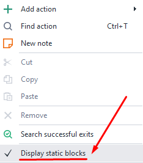
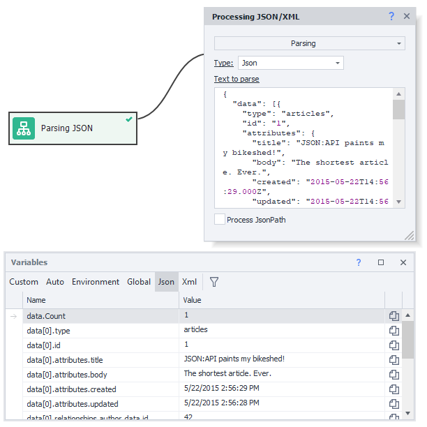
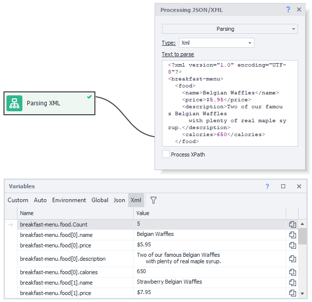
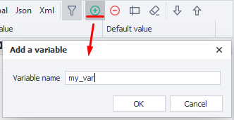

:::info **Please read the [*Material Usage Rules on this site*](../../Disclaimer).**
:::
_______________________________________________  

## What's this window for?  
It lets you do all sorts of things with variables, like create, delete, rename, and edit their values.  
This window is also handy for debugging since you can keep an eye on how variables are changing.  
_______________________________________________
## How do you open it?  
### First way.  
Click the button with four squares on the [**Static Blocks Panel**](../../category/панель-статических-блоков):  

 
  
:::info **I don't see this panel.**
Right-click on empty space and check the right box:  

:::  
_______________________________________________   
### Second way.  
Top menu **Window → Variables → ✓**:  

 
_______________________________________________ 
## Controls.
Let's go through each element of the **Variables Window**.  

_______________________________________________ 
### Variable types.  

Lets you pick which types of variables will show up in the table below.  
_______________________________________________ 
#### Available options:
- **Custom.**  
These are variables you create yourself while making your template.  
:::info **Rules for creating variables.**
They have to be written in English letters. Numbers can't be at the start. No spaces or symbols except `_` allowed.
:::  
_______________________________________________   
- **Auto.**  
Generated automatically in **Project Recording** mode or when adding some blocks (like [**Android → Get Value**](../../Android/ProLite/GetValue)).   
They usually have names like `Variable1`, `RecognitionResult0`. But you can always move them to **Custom** and give them any name you want.  
:::tip **"Move to Custom" Button.**

:::  
_______________________________________________ 
- **Environment.**  
Project environment variables. These include: 
    - instance page parameters (URL, DOM, text, domain, notification and alert texts, etc.),  
    - time and date variables,  
    - project variables (name, folder, proxy rules, last error id, etc.),  
    - lots of profile variables (email, gender, name, user agent, etc.)  
    _______________________________________________  
- **Global.**  
These are available to all projects and their threads in ZennoDroid, while regular variables exist only within a single project.  
Their unique feature is they have an extra property — ***Namespace***.  
:::info **Be careful.**
**ProjectMaker** and **ZennoDroid** have *separate global variables*. So changes you make to a global variable in PM won't show up in ZD and vice versa.
:::  
_______________________________________________ 
- **Json.**  
These get generated automatically when parsing JSON.  
In the **Parsing** mode of the [**JSON/XML Processing**](../../Data/JSON_XML) action, you can break values out into new variables with corresponding nodes right from the text.  

 

Then you can use these in your project through the `{-Json….-}` prefix or in **C#** via the `project.Json;` object.  

_______________________________________________ 
- **Xml.**  
Just like with JSON, these variables get created automatically after parsing an XML doc.  

You can also use them with the `{-XML….-}` prefix or in C# via the `project.XML;` object properties.  

_______________________________________________ 
### Buttons on the right panel.  
 
#### Filter. 
 

Opens or closes the filter field. If your project has lots of variables, finding the right one can take a while. So there's a multi-feature filter — each column can be filtered in 12 different ways.  

_______________________________________________ 
#### Clear sorting.  

This button is only active if you sorted before. Click it to reset sorting.  
_______________________________________________ 
#### Add.  

Opens a dialog where you can name the variable you want to create.  
_______________________________________________ 
#### Delete.  
 

Deletes the selected variable, but first shows a confirmation dialog.  
_______________________________________________ 
#### Rename.  
  

Available only for **Custom** and **Global** types. Brings up a dialog so you can edit the variable's name.  

You can also quickly rename by double-clicking a variable in the **Name** column.  
:::warning **The variable name will also change everywhere it's used in actions.**
:::  
_______________________________________________ 
#### Clear unused variables.  

In big projects, you often end up with variables not used anywhere anymore. You can delete them to free up memory and stop cluttering your workspace.  
Clicking this button, ZennoDroid will find all unused variables and show a list where you can delete them.   
You need to clear unused ones separately for each variable type.  
_______________________________________________ 
#### Manual sorting.  
   

You can arrange variables how you want using the **Up** and **Down** buttons. You can also drag them with your mouse.  
Your own order works only when column sorting is off.  
_______________________________________________ 
### Column headers.  
They're used both for filtering and sorting variables. Just click a column header to sort by it, ascending or descending.  
Right-click any column header to set which columns show up.  

  
_______________________________________________ 
#### Available columns.  
- **Name.**  
Names of variables used in the project. Double-click to rename.  
:::warning **Variable names are case-sensitive.**
 `Name`, `NAME`, and `name` are all different variables.
:::   
- **Value.**  
Shows the current value for the variable. Click the value to edit it right in the input field.  
- **Default Value.**  
When a project starts, all variables are empty. But if you add a value here, it will show up by default from the start.  
:::info **Environment, JSON, and XML variables never have default values.**
::: 
- **Note.**  
This column is hidden by default. You can use it for notes on the variable. For example, specify the purpose or goal so you don't forget later.  
_______________________________________________ 
### Copying and Context Menu.  
#### Copy variable macro to clipboard.  
 

A fast way to copy a macro like `{-Variable.value-}` is to just click the icon in the variable's row.  
_______________________________________________ 
#### Context menu.  
Right-click any variable to get the menu. It works in the **Custom**, **Auto**, and **Global** tabs.

| Custom, Global Tabs    | Auto tab |
| -------- | ------- |
|   |     |
_______________________________________________ 
### Copying variables between projects.  
Quite often you need to start a new project using variables from an old template. Copying one by one is inefficient, so you can copy all variables from one project and paste into another.  

**1.** Open the existing project.  
**2.** Right-click the **Variables** button (the four squares in the Static Blocks Panel) and hit **Copy variables**.  

 

**3.** Then open the new project, right-click the variables icon again but now pick **Paste variables**.  
**4.** In the window that pops up, check the variable types you want to add. They'll all be copied along with their default values.  

  
_______________________________________________ 
## Working with variables.  
### Macros  
In ProjectMaker you can use variables via macros. For example, the macro `{-Variable.myVariable-}` passes the value of `myVariable` when running the project.  
Just put the macro into any action property (where allowed) and the variable will be used when the action runs.  
:::info **Just so you know.**
For global variables you need to specify the scope in the macro: `{-GlobalVariable.someNamespace.text-}`.  
:::  

 

**Working with variables in C# and JS actions**

<!--All you need is a blank line-->

    In ZennoDroid, variables can be three types:  
    - **Numeric/ int and float** (`0`, `1`, `12.652`, `12507`).  
    - **String/ string** (`"Hello World"`, `
Hello World
`).  
    - **Boolean/ boolean** (`True`, `False`)  

    You can use variables in both **C#** and **JavaScript** blocks. But in C#, all variables come in as *text (string)* values, so if you need to use *numbers (int or float)* or *booleans (boolean)*, you'll need to convert them.  
    The screenshot below shows how to convert using addition and return:  

     

    For string operations in JavaScript, ***you have to wrap text variables in quotes***. 

   
_______________________________________________ 
### Name tips.  
Try to name your variables so their role is clear at once. Avoid meaningless short names like `f1`, `123`, `sdgtg`, because you'll just make project maintenance harder for yourself and anyone else who works with your template.  
If a variable is used a lot in your project, it should have a short but clear name — `counter`, `username`, `proxy`.  
Try to separate multiple words in names either by capital letters like `MySecondPassword` or underscores like `page_html`.  

These are standard practices that really help with readability and efficiency when working on your project.  
_______________________________________________ 
### Assigning values.  
The classic use case for variables is blending static text + your own variables + environment variables via the [**Variable Processing**](../../Data/WorkWithVariables) action.  

 

In this example, the name comes from the environment variable `{-Profile.Name-}`, the day of the week from `{-TimeNow.DayOfWeek-}`, and the age from your variable `count`. After running the block, the result is saved in the `result` variable.  
_______________________________________________ 
### Arithmetic operations over numbers.  
Using JavaScript syntax and the right block, you can do all sorts of math on numbers.  

  

Here, `value1` and `value2` are integers. You add them, then multiply by 10. The result goes into `result`.  
_______________________________________________ 
### Using variables.  
Use variables instead of hard-coding text where the value might change.  

For instance, file paths — you might have one on your computer, but your client uses another. If the needed file is in the same directory as the project (or one of its subfolders), it's best to use the macro   
`{-Project.Directory-}`. This is the path to the folder where the project is saved.  
_______________________________________________
## Useful links.  
- [**Working with JSON and XML**](../../Data/JSON_XML).  
- [**Writing code in ZD**](../../category/свой-код).  
- [**Static Blocks Panel**](../../Project%20Editor/Static%20Block%20Panel/CommonPrinciples).