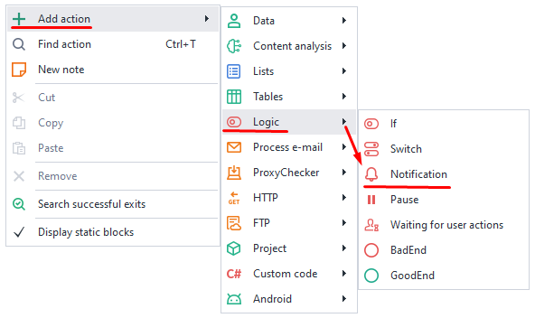

---
sidebar_position: 7
title: Action Window
description: How do you find and add an action?
---  
:::info **Please read the [*Rules for using materials on this resource*](../../Disclaimer).**
:::
_______________________________________________

**This is the action navigation window, which lets you quickly find and add them to your project.**

<!--All you need is a blank line-->

     

  

If you forgot where a certain function is, just enter some keywords to search for it. This saves you time when writing your project.
_______________________________________________ 
## How do you open it?  
### Pin it among other windows:  
Go to the top panel → Window → Actions:  

  
_______________________________________________ 
### Call up the floating window:  
Press `Ctrl`+`T` anywhere:  

   
_______________________________________________  
## How do you use this window?  
### What can you do with it?    
- Find an action by name or by its function.  
- Add an action to your project.  
- Quickly transfer actions with a double click. 
### Search by name and add to the project.  
:::tip **When the window is active, pressing `Ctrl` + `T` puts the cursor in the search bar.** 
:::  
  

Type in a rough name → Pick the action you need → Add it to your project with a double click or by dragging it in.  

You can also search not by name, but by a specific function. In this case, the action will be created right away with the chosen function:

   
_______________________________________________ 
## Another way to add an action.  
You can add any action to your project by right-clicking on any empty spot on the project canvas and choosing **Add action**.  

  
_______________________________________________
## Useful links.  
- [**Project debugging**](../Debugging). 
- [**Basic concepts**](../../basicterms).