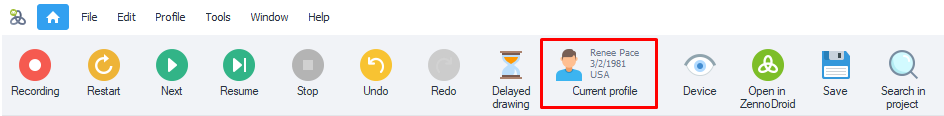
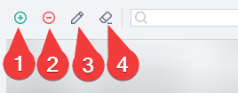

---
sidebar_position: 6
title: Profile Window 
description: Virtual identity settings.
---  
:::info **Please read the [*Material Usage Rules on this site*](../../Disclaimer).**
:::
_______________________________________________

This window is used to show information about the current identity. To open it, just click on the **Current Profile** button.
  
_______________________________________________  
## What is a Profile and what's it for?  
A **Profile** is a virtual identity that **ProjectMaker** generates. You can set up its browser, OS, platform, nationality, gender, age, emulated data, and more.

 

This feature is useful while creating or debugging a project to check how it runs with different datasets. You can quickly generate a profile with new data, or load another one from a file.  
:::info **When you save or load a profile, the browser's cookies and cache are saved/transferred as well.**
:::  
_______________________________________________   
## Working with a Profile.  
### Loading, saving, and generating.  
  

**1. Load.** Lets you load a previously saved profile. After clicking the button, a standard file selection window opens.  
**2. Save.** Saves the current profile to the path you choose.  
**3. Regenerate.** Fully updates all profile parameters.  
:::tip ***You can do it like this, too.***
*You can also do these actions while working on a project through the [**Profile Operations**](../../Data/WorkWithProfile) action. There, you can also edit some fields.*
:::   
_______________________________________________  
### "Person" Tab.  
  

Here you'll see basic info about the current profile. Most fields are read-only and can be copied, except for the profile's email and its password, which you can edit right here.  
:::tip ***How to copy?***
*Double-click the value you want to select → right-click to bring up the familiar context menu → **Copy**.*
:::  
   

:::info **Keep in mind.**
In the program settings, you can set a *Default email* and *Nationality* for all profiles.
:::  
_______________________________________________ 
### "Cookies" Tab.  
Here, you'll see all the cookies for your current profile.

     

#### Editing.  
Use these buttons to edit Cookies.

    

**1.** Add a new Cookie.  
**2.** Delete the selected one.  
**3.** Edit.  
**4.** Clear everything or just the selected cookie at once.

#### Search.  
    

Use the search bar to find Cookies by any parameter you want. Next to it is a button that sorts by domain. You can use both at the same time.
_______________________________________________ 
### "Profile" Tab.  

**Here you'll find detailed info about the generated identity.**

<!--All you need is a blank line-->

       

    
   
:::tip **Profile gender in ProjectMaker uses a logical type:**  
- male `True`  
- female `False`
:::
_______________________________________________ 
## Accessing profile data through variables.  
### Using the Variables window.  
  

In the Variables window, in the **Environment (1)** tab, you'll find a list of variables that are handy for working with Profiles. They'll start with `Profile`. You can also **copy the macro (2)** for a selected variable right here.
_______________________________________________ 
### Manually.
In any field that supports variable macros (for example, in the [**Notification**](../../Project%20Editor/Logic/Notification) action), press `Ctrl+Space`. Find `{}Profile` and click on it. Then type a dot to bring up another dropdown with all the profile variables. Double-click any variable you need and it'll insert automatically.  
   

:::info **Variables that aren't in the Profile window.**
`{-Profile.NickName-}` (its value is different from `{-Profile.Login-}`)  
`{-Profile.SecretQuestionAnswer1-}` and `{-Profile.SecretQuestionAnswer2-}`
:::  
_______________________________________________
## Handy links.  
- [**Notification**](../../Project%20Editor/Logic/Notification). 
- [**Profile**](../../Project%20Editor/Static%20Block%20Panel/Profile).
- [**Profile Operations**](../../Data/WorkWithProfile).