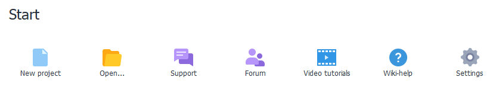

:::info **Please check out the [*Rules for using materials on this site*](../Disclaimer).**
:::
_______________________________________________
## Launching the Program.

_______________________________________________
## Start Screen.

### It has three sections:
- **Your ZennoDroid**.
- **Getting Started**.
- **Your Projects**.
_______________________________________________
## Your ZennoDroid.

Here you can see:
**1.** The current version of the program.
**2.** The date until you have updates paid for.
:::info **You can check out update prices for your version in your [**personal account**](https://account.zennolab.com/personal-area-sale/updates).**
:::
_______________________________________________
## Getting Started.

### This section lets you:
- Create a new project.
- Open a project from file.
- [Contact **support**](https://helpdesk.zennolab.com/ru)
- Go to the [**Forum**](https://zenno.club/discussion/). There you can discuss the program, ask questions, or find useful info.
- Watch [**Video tutorials**](https://www.youtube.com/@ZennoLabcom/playlists).
- Open the **Help** in your browser.
- Go to [**Settings**](../category/настройки) of the program.
_______________________________________________
## Your Projects.

The last section shows your recently opened projects. You can change how many show in **Settings → Editing → Remember number of recent projects**.
:::tip **If you use some projects a lot, you can pin them.**
|               |
| :----------------: |
| *Right-click the project and click **Pin**.*        |
:::
_______________________________________________
## Useful Links.
- [**Installing ZennoDroid**](../Installation/ZD_Install).
- [**Launching the emulator**](../ProLite/Memu_Start).
- [**Project editor**](../category/редактор-проектов).