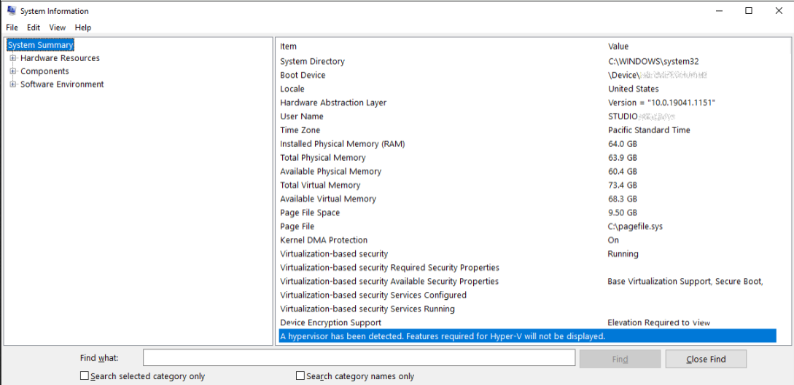
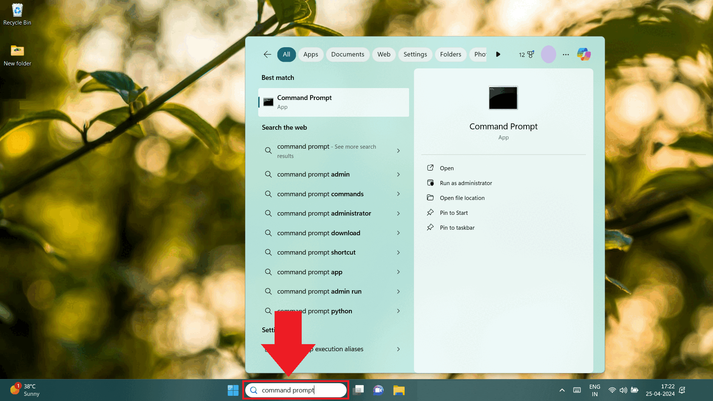
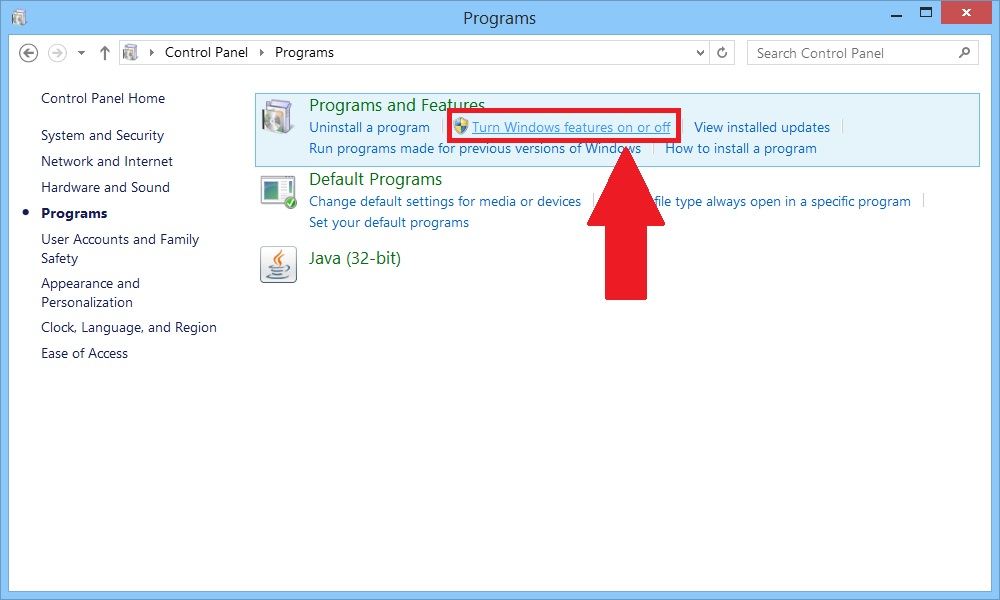
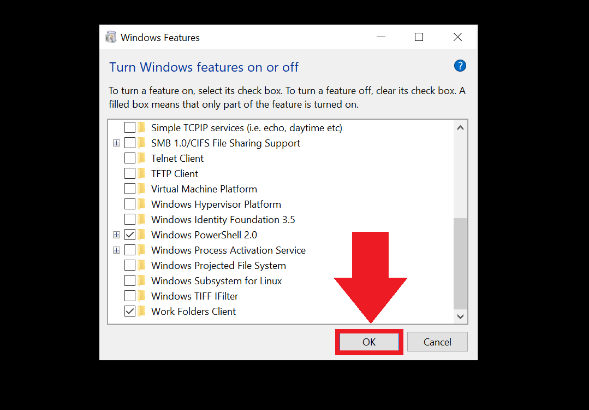

import DisclaimerNotice from '@site/src/components/DisclaimerNotice';

# Turning off Hyper-V
<DisclaimerNotice />

Hyper-V lets you run multiple operating systems as virtual machines in Windows. It also allows you to virtualize hardware. But if you’re using ZennoDroid or emulators, Hyper-V might get in the way, so in this article, let’s go over how to turn it off.  
_________________
## Is Hyper-V enabled?
First, let’s check if the low-level shell is running:  
**1.** In the app search, type ***msinfo32.exe***  
**2.** Select System Information.  
**3.** In the information window, look for this entry:  
*“A low-level shell has been detected. Features required for Hyper-V will not be displayed.”*  

  
_________________  
## Disabling it via Command Prompt
**1.** Click the search bar and type **Command Prompt**.  
> *Or press Win+R, type ***cmd*** and hit **Ok** or **Enter**.*

**2.** In the command window, type this command and press Enter:  
`bcdedit /set hypervisorlaunchtype off`  
**3.** Done, Hyper-V is off 😎  

  
_________________ 
## Disabling it through Control Panel  
**1.** Go to Control Panel → Programs → Programs and Features → click on  
**Turn Windows features on or off.**  

  

**2.** Now uncheck the following boxes:
    - *Hyper V*
    - *Windows Hypervisor Platform*
    - *Windows Sandbox*
    - *Virtual Machine Platform*
    - *Windows Subsystem for Linux*  

  

**3.** After that, click **OK** and <mark>restart your computer</mark>.  

  
_________________
## Alternative disabling method
:::warning **Tested on Windows 11 Home 24H2.**
This option may help if the other methods did not work.
:::

*Let's go through it step by step:*
#### 1. Open Registry Editor (`Regedit`) and go to:
`HKEY_LOCAL_MACHINE\SYSTEM\CurrentControlSet\Control\DeviceGuard\Scenarios\HypervisorEnforcedCodeIntegrity`

Change the **Enabled** parameter value to `0`.

#### 2. Now go to the next section:
`HKEY_LOCAL_MACHINE\SYSTEM\CurrentControlSet\Control\DeviceGuard\Scenarios\WindowsHello`

Change the **Enabled** value to `0` again.

#### 3. Restart your computer.
After that, Windows may report a problem with PIN sign-in. Just create a new PIN.

### Additionally
:::warning **Tested on Windows 11 Pro.**
:::
If the method above did not help, you can try the official Microsoft tool:
[Device Guard and Credential Guard Hardware Readiness Tool](https://www.microsoft.com/en-us/download/details.aspx?id=53337)

Usually, the PowerShell script is run with the `-Disable` parameter to turn off Device Guard and Credential Guard. After that, a restart is required, and you may need to confirm the changes during boot, for example by pressing `F3`.
_________________
## Turning off Memory Integrity  
For everything to work smoothly without Hyper-V, let’s also turn off Memory Integrity.  
1. In the Windows search, type **Core Isolation** and hit **Enter**.  
2. In Core Isolation settings, disable **Memory Integrity**.  

  
_______________________________________________
## Useful links  
- [**Hyper-V technology overview**](https://learn.microsoft.com/ru-ru/windows-server/virtualization/hyper-v/hyper-v-overview). 
- [**Enabling virtualization**](./Virtualization).
