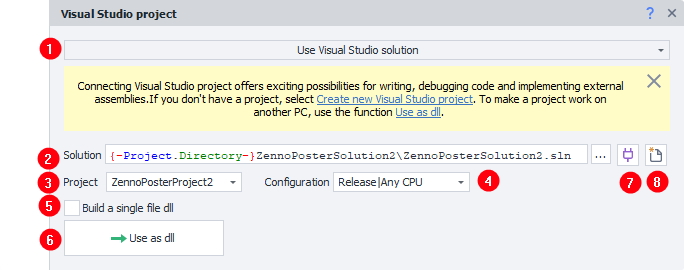
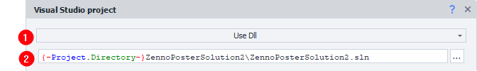
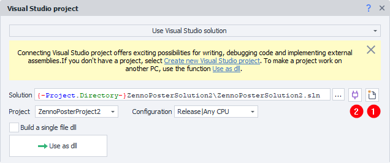
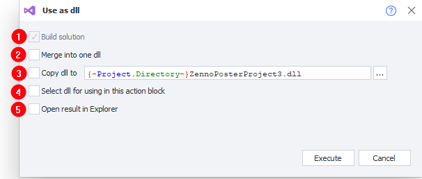
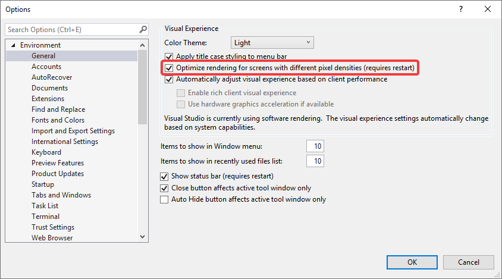

import DisclaimerNotice from '@site/src/components/DisclaimerNotice';

# Visual Studio Project
<DisclaimerNotice />

## Description.
:::info **The action is available starting from ZennoDroid 2.6.1.0.**
:::
The **Visual Studio Project** action lets you use a project created in Microsoft Visual Studio inside a ZennoDroid project. That opens up unlimited possibilities for writing and debugging code and for connecting external libraries.

Unlike the [**C# code**](./С) action, where the code is stored in the project itself, here the code lives in a regular Visual Studio solution: with classes, inheritance, NuGet packages, breakpoints and full debugging.

#### Where you can use it:
- Seamless integration of third-party libraries and their use in your code.
- Creating your own libraries for reuse across different projects.
- Debugging code in Visual Studio with access to the device and to the project.
_______________________________________________
## How do I add it to a project?
Via the context menu: **Add action → Your code → Visual Studio Project**.
_______________________________________________
## How do I work with the action?
The block can work in two modes: with a Visual Studio solution or with an already built dll.
### Use Visual Studio solution.


1. The block's operating mode.
2. Path to the solution that contains the project.
3. The project that will run when the block is executed.
4. Project configuration.
5. Flag to merge the output dll and its dependencies into a single file with **ILRepack**.
6. Button to switch to the **Use Dll** mode.
7. The **Connect to Visual Studio** button.
8. The **Create new Visual Studio project** button.
### Use Dll.


1. The block's operating mode.
2. Path to the dll that will run when the block is executed.
_______________________________________________
## Creating a project and connecting to Visual Studio.
:::warning **What has to be installed.**
- *Visual Studio 2019, 2022 or 2026. The free Community edition can be downloaded from the [official site](https://visualstudio.microsoft.com/vs/community/). If several versions are installed, the newest one is used.*
- *The developer pack for .NET Framework 4.6.2, the target platform of the project ([Download .NET SDKs for Visual Studio](https://dotnet.microsoft.com/download/visual-studio-sdks)).*
:::

1. Add the action and pick the **Use Visual Studio solution** mode.
2. Click the **Create new Visual Studio project (1)** button.

:::info **Already have a project? You can skip these steps.**
*Set the solution, the project and the configuration in the block properties and click **Connect to Visual Studio (2)**.*
:::
3. In the window that opens, fill in the project name, the location and the solution name, then click **OK**.

4. Wait while ZennoDroid creates the solution and connects to Visual Studio.

Connecting provides the interaction between ProjectMaker and Visual Studio: the [**Device Window**](../../pm/Interface/DeviceWindow) moves into Visual Studio, so the code can be debugged with access to the device and to the project. In ProjectMaker the place of the window says **Browser is used in Visual Studio solution** and offers a **Show browser here** link, while the window's toolbar in Visual Studio has a **Return to ProjectMaker** button — either of them brings the window back.

If the device window did not open in Visual Studio on its own, you can call it up with **View → Other Windows → ZennoDroidToolWindow**.
:::info **Connecting requires the ZennoDroid extension for Visual Studio.**
*If the extension is not installed, or its version does not match the version of ProjectMaker, the program offers to install the right one. Once it is installed, connect to Visual Studio again.*
:::
:::warning **No ZennoDroidToolWindow menu item?**
*Then the extension is either not installed or disabled. In Visual Studio open **Extensions → Manage Extensions**, go to **Installed** and check the state of the **ZennoDroid VisualStudio Extension**. If it is not on the list, restart ProjectMaker and connect to Visual Studio again. If the problem persists, please contact technical support.*
:::
_______________________________________________
## Project structure.
To be usable with the action, a project has to:
- reference the ZennoDroid libraries: `Global.dll`, `ZennoLab.CommandCenter.dll`, `ZennoLab.Emulation.dll`, `ZennoLab.InterfacesLibrary.dll`, `ZennoLab.Macros.dll` and `ZennoDroid.Interface.dll`. They live in the folder of the installed ZennoDroid — the template takes the path from the `ZennoDroidDllPath` environment variable, which is set when ProjectMaker or ZennoDroid starts;
- contain a class that implements the `IZennoExternalCode` interface. When the block runs, the `public int Execute(Instance instance, IZennoPosterProjectModel project)` method is called; it has to return `0` on success and any other value on an error.

A project created from ProjectMaker already meets these requirements. It holds a single **Program.cs** file with a ready implementation of the `Execute` method:
```csharp
public class Program : IZennoExternalCode
{
    public int Execute(Instance instance, IZennoPosterProjectModel project)
    {
        // The ZennoDroid device API
        IDroidInstanceAPI droid = instance.DroidInstance;

        int executionResult = 0;

        return executionResult;
    }
}
```
The `instance` and `project` objects work exactly as they do in the [**C# code**](./С) action: `instance.DroidInstance` gives you the [**device API**](../../API/DroidInstance), and `project` gives you the variables and the settings of the project.

To debug the code, use the standard **Start** button in Visual Studio.

:::tip **Device actions are not recorded into the Visual Studio code.**
*Record the project in ProjectMaker as usual, and write the code in Visual Studio by hand.*
:::
_______________________________________________
## Using a dll.
:::info **The "Use Dll" mode does not need Visual Studio installed.**
*Which makes it handy for moving a finished project between computers. All you have to do is keep the required dlls available on each of them — for example, copy them into the project folder.*
:::

Once the development in Visual Studio is over, you can switch to using the output dll directly: click the **Use as dll** button. A window opens where you pick what to do.


1. Build the solution (a required step).
2. Merge the output dll and the libraries into a single file with **ILRepack**. Cuts down the number of files you have to carry with the project.
3. Copy the dll to the given path. The project folder macro is used by default.
4. Switch the block to the **Use as dll** mode and set the path to the dll.
5. Show the built dll in Explorer.
:::info **The mode can be switched by hand as well.**
*Then the path to the dll is set in the block properties. For a dll to be executable, it has to contain a class that implements the `IZennoExternalCode` interface.*
:::
_______________________________________________
## Possible errors and how to fix them.
### Project Target Framework Not Installed.


The developer pack for .NET Framework 4.6.2 is not installed. Download it from the official site and install it: [Download .NET SDKs for Visual Studio](https://dotnet.microsoft.com/download/visual-studio-sdks).
_______________________________________________
### Call was rejected by callee (RPC_E_CALL_REJECTED).


Visual Studio is rejecting the interaction requests coming from ProjectMaker. Most often that happens when something has to be done in Visual Studio — a dialog window has appeared, for instance. Switch to Visual Studio, do what it asks, then connect to it again. If the error is still there, restart Visual Studio; if that does not help either, please contact technical support.
_______________________________________________
### Block properties render incorrectly after connecting to Visual Studio.
Notice that clicking different blocks, or a blank spot on the diagram, does not refresh the block properties correctly.


To fix this, check the Visual Studio settings — **Tools → Options… → General**.


A detailed description of this setting: [**Per-Monitor support for Visual Studio extensions**](https://learn.microsoft.com/visualstudio/extensibility/ux-guidelines/per-monitor-awareness-extenders).

If the option is unavailable, update Windows and Visual Studio, or follow the [**instructions for adding a registry key**](https://learn.microsoft.com/visualstudio/designers/disable-dpi-awareness#add-a-registry-entry).
_______________________________________________
## Useful links.
- [**C# code**](./С)
- [**Using directives and shared code**](./Directives_Using)
- [**ZennoDroid API**](../../API/DroidInstance)
- [**Official C# programming guide**](https://learn.microsoft.com/dotnet/csharp/)
- [**ILRepack utility**](https://github.com/gluck/il-repack)
